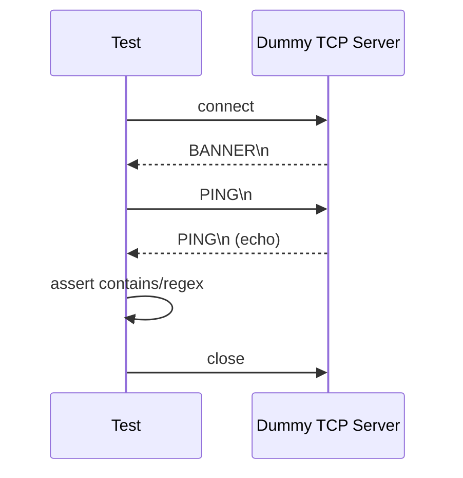
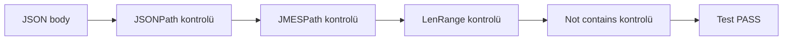
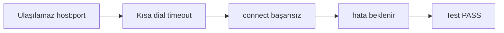
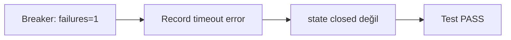

# lazytest

`lazytest`, REST mikroservisleri için **OpenAPI tabanlı kalite doğrulama** ve **Taurus uyumlu yük testi** yapan bir CLI/TUI aracıdır.

Tek uygulama içinde şunları birleştirir:
- **Smoke test** (endpoint erişilebilirliği ve temel davranış)
- **Contract drift** (gerçek response ile OpenAPI şema uyuşmazlığı)
- **A/B karşılaştırma** (iki environment çıktısının fark analizi)
- **Load test (LT mode)** (tek node, goroutine tabanlı Taurus planı koşturma)
- **TUI üzerinden canlı metrik takibi** (p50/p90/p95/p99, RPS, error rate)

---

## Neden lazytest?

Klasik akışta smoke test, contract kontrolü ve performans testi farklı araçlarla yürütülür. `lazytest` bu süreci tek bir araçta toplar:

- OpenAPI dokümanından endpoint’leri otomatik çıkarır.
- Endpoint bazlı hızlı smoke test ve toplu suite koşumu sağlar.
- Response gövdesini şema ile karşılaştırarak drift tespit eder.
- Aynı isteği iki ortama gönderip statü/header/body farklarını raporlar.
- Taurus benzeri YAML planını doğrudan çalıştırıp canlı metrik üretir.

---

## Özellikler

- ✅ OpenAPI dosyası yükleme ve endpoint keşfi
- ✅ Worker pool + rate limit ile paralel smoke test
- ✅ Contract drift bulguları: `missing`, `extra`, `type_mismatch`, `enum_violation`
- ✅ A/B compare: status, header yapısı, body structure/value farkı
- ✅ Taurus YAML parse + tek node load test yürütme
- ✅ JUnit XML ve JSON rapor üretimi
- ✅ TUI üzerinden 6 bölümlü operasyon ekranı

---

## Gereksinimler

- **Go 1.24+** (go.mod sürümü)

---

## Kurulum ve çalıştırma

### 1) Kaynaktan çalıştırma

```bash
go mod tidy
go run ./cmd/lazytest
```

### 2) Binary üretip çalıştırma

```bash
make build
./bin/lazytest
```

---

## Hızlı başlangıç

### Terminalden testleri başlat

```bash
# Tüm testler
make test

# Headless smoke koşumu
./bin/lazytest run smoke -f openapi.sample.yaml -e dev --base http://localhost:8080

# Tek endpoint drift kontrolü
./bin/lazytest run drift -f openapi.sample.yaml --path /health --method GET -e dev --base http://localhost:8080
```

### TUI başlat (OpenAPI + environment)

```bash
./bin/lazytest -f openapi.sample.yaml -e dev --base http://localhost:8080
```

### Headless smoke testi + rapor

```bash
./bin/lazytest run smoke \
  -f openapi.sample.yaml \
  -e dev \
  --base http://localhost:8080 \
  --report junit.xml \
  --json out.json
```

### Contract drift kontrolü

```bash
./bin/lazytest run drift \
  -f openapi.sample.yaml \
  --path /health \
  --method GET \
  -e dev \
  --base http://localhost:8080
```

### A/B karşılaştırma

```bash
./bin/lazytest compare \
  -f openapi.sample.yaml \
  --envA dev \
  --envB test \
  --path /users \
  --method GET
```

### LT mode (Taurus planı)

```bash
./bin/lazytest lt -f examples/taurus/checkouts.yaml
```

---

## Komutlar

| Komut | Açıklama |
|---|---|
| `lazytest` | Varsayılan olarak TUI açar |
| `lazytest load -f <openapi>` | OpenAPI yükler ve TUI’ye geçer |
| `lazytest run smoke ...` | Headless smoke test çalıştırır |
| `lazytest run drift ...` | Tek endpoint için drift kontrolü yapar |
| `lazytest compare ...` | İki environment arasında A/B karşılaştırma yapar |
| `lazytest lt -f <taurus.yaml>` | LT planını yükleyip TUI açar |

### Sık kullanılan flag’ler

- `-f, --file`: OpenAPI veya LT plan dosyası
- `-e, --env`: environment adı (`dev`, `test`, `prod`)
- `--base`: base URL override
- `--env-config`: env dosyası (varsayılan `env.yaml`)
- `--auth-config`: auth dosyası (varsayılan `auth.yaml`)

Smoke için ek:
- `--workers`: paralel worker sayısı
- `--report`: JUnit çıktı yolu
- `--json`: JSON çıktı yolu

Drift/A-B için ek:
- `--path`, `--method`

---

## TUI menüleri (6 bölüm)

1. **Endpoint Explorer**  
   Endpoint listesi, method, son durum, gecikme. Tek endpoint smoke (`r`) ve drift (`o`) tetiklenir.

2. **Test Suites**  
   Toplu suite mantığı: Smoke (critical/all), Contract, Negative, Regression. `A` ile koşum.

3. **Load Tests (LT)**  
   Yüklenen Taurus planlarının scenario/request/assertion özetini gösterir. `L` ile çalıştırma, `W` warm-up, `E` error budget.

4. **Live Metrics**  
   Son koşum metrikleri: p50/p90/p95/p99, RPS, error rate. `R` reset, `H` göster/gizle.

5. **Contract Drift**  
   Endpoint bazlı drift bulgularının özet görünümü.

6. **Environments & Settings**  
   Aktif environment, base URL, header/auth seçimleri ve çalışma parametreleri.

---

## Konfigürasyon dosyaları

### `env.yaml`
Environment bazlı ayarlar:
- `name`
- `baseURL`
- `headers`
- `rateLimitRPS`

### `auth.yaml`
Kimlik doğrulama profilleri:
- JWT (`type: jwt`, `token`)
- API key (`type: apikey`, `header`, `key`)

---

## LT mode (Taurus YAML) desteği

Desteklenen ana bloklar:
- `execution`: `concurrency`, `ramp-up`, `hold-for`, `scenario`
- `scenarios`: `base-url`, `headers`, `think-time`, `requests`
- `requests`: `method`, `url`, `body`, `extract-jsonpath`, `assertions`
- `assertions`: `status-code`, `p95-time-ms`, `jsonpath` (plan modelinde)
- `data-sources`: CSV tanımı (plan modelinde)

Örnek plan: `examples/taurus/checkouts.yaml`

---

## Raporlama

- **JUnit XML**: CI/CD pipeline’larında test sonucu yayınlamak için.
- **JSON**: Programatik analiz ve arşivleme için.

Kısayol olarak TUI’de `s` tuşu ile rapor kaydı yapılabilir.

---

## Makefile hedefleri

```bash
make build   # bin/lazytest üretir
make test    # go test ./...
make lint    # go vet + golangci-lint (varsa)
make run     # örnek TUI çalıştırma
make lt      # örnek LT planı ile çalıştırma
make clean   # bin klasörünü temizler
```

---

## Testler nasıl çalışıyor? (animasyonlu akış)

Detaylı, tek tek test anlatımı için: **`examples/testlerin-nasil-calistigi.md`**

### 1) `TestRunSuccess` akışı



### 2) `TestEvaluateAssertJSON` akışı



### 3) `TestDialTimeout` akışı



### 4) `TestBreaker` akışı



---

## Mimari dokümantasyonu

Proje mimarisi ve modül sorumlulukları için: **`help.md`**

## TCP Planları (MVP, TLS yok)

Yeni TCP domain’i ham soket senaryoları için eklendi:

```bash
lazytest plan new --kind tcp --out plans/tcp.yaml
lazytest plan edit plans/tcp.yaml
lazytest run tcp --plan plans/tcp.yaml --report junit.xml --json out.json -v
```

- Assertion türleri: `contains`, `regex`, `not`, `len_range`, `jsonpath` (basit), `jmespath`.
- Retry/backoff: `none|constant|exponential`.
- Circuit breaker: `window_sec`, `failures`, `half_open`.
- Kısıt: TLS yok, `read.until` tek byte delimiter.
