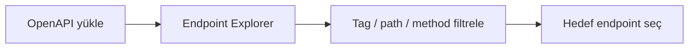
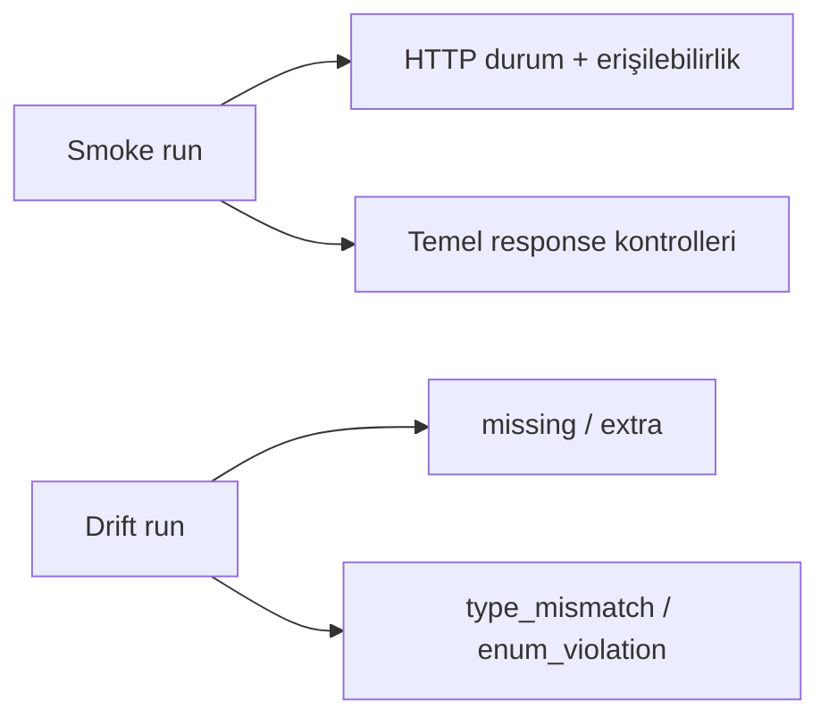
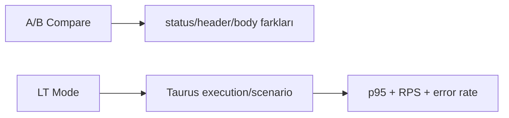

# 🚀 lazytest

> REST mikroservisleri için **OpenAPI tabanlı kalite doğrulama** + **Taurus uyumlu yük testi** yapan CLI/TUI aracı.


<p align="center">
  <em>OpenAPI içeri al → Smoke/Drift doğrula → A/B kıyasla → LT ile yük altında gözlemle → Raporla.</em>
</p>

---

## 🎯 Neden lazytest?

Klasik test zinciri çoğu ekipte parçalıdır:

- smoke test başka araçta,
- contract kontrolü başka script’te,
- load test bambaşka bir pipeline’da.

`lazytest` bu parçaları tek akışta toplar:

- ✅ OpenAPI’dan endpoint keşfi
- ✅ Paralel smoke test
- ✅ Contract drift analizi
- ✅ A/B environment karşılaştırması
- ✅ Taurus planı ile load test
- ✅ Canlı TUI metrik takibi

---

## 🎬 Ürün hikayesi (animasyonlu akış)

### 1) Endpoint’leri keşfet



### 2) Tek tuşla doğrula



### 3) Ortamları kıyasla, yük altında doğrula



<p align="center">
  
</p>

---

## 🧩 Özellik seti

- **Smoke test:** Endpoint erişilebilirliği ve temel davranış kontrolü
- **Contract drift:** `missing`, `extra`, `type_mismatch`, `enum_violation` tespiti
- **A/B compare:** status / header / body fark analizi
- **LT mode:** Taurus YAML planlarını tek node’da çalıştırma
- **Raporlama:** JUnit XML + JSON
- **TUI metrik ekranı:** p50/p90/p95/p99, RPS, error rate

---

## ⚙️ Gereksinimler

- **Go 1.24+**

---

## 🛠️ Kurulum

### 1) Kaynaktan çalıştır

```bash
go mod tidy
go run ./cmd/lazytest
```

### 2) Binary üret

```bash
make build
./bin/lazytest
```

---

## ⚡ Hızlı başlangıç

### Testleri çalıştır

```bash
make test
```

### Headless smoke

```bash
./bin/lazytest run smoke -f openapi.sample.yaml -e dev --base http://localhost:8080
```

### Tek endpoint drift

```bash
./bin/lazytest run drift -f openapi.sample.yaml --path /health --method GET -e dev --base http://localhost:8080
```

### A/B compare

```bash
./bin/lazytest compare -f openapi.sample.yaml --envA dev --envB test --path /users --method GET
```

### LT mode

```bash
./bin/lazytest lt -f examples/taurus/checkouts.yaml
```

---

## 🧪 Komutlar

| Komut | Açıklama |
|---|---|
| `lazytest` | Varsayılan olarak TUI açar |
| `lazytest load -f <openapi>` | OpenAPI yükler ve TUI’ye geçer |
| `lazytest run smoke ...` | Headless smoke test çalıştırır |
| `lazytest run drift ...` | Tek endpoint için drift kontrolü yapar |
| `lazytest compare ...` | İki environment arasında A/B karşılaştırma yapar |
| `lazytest lt -f <taurus.yaml>` | LT planını yükleyip TUI açar |

### Sık kullanılan flag’ler

- `-f, --file`: OpenAPI veya LT plan dosyası
- `-e, --env`: environment adı (`dev`, `test`, `prod`)
- `--base`: base URL override
- `--env-config`: env dosyası (varsayılan `env.yaml`)
- `--auth-config`: auth dosyası (varsayılan `auth.yaml`)

Smoke için ek:
- `--workers`
- `--report`
- `--json`

Drift/A-B için ek:
- `--path`
- `--method`

---

## 🖥️ TUI ekran haritası

1. **Endpoint Explorer** → Tek endpoint smoke (`r`) ve drift (`o`)
2. **Test Suites** → Toplu suite koşumu (`A`)
3. **Load Tests (LT)** → Plan çalıştırma (`L`), warm-up (`W`), error budget (`E`)
4. **Live Metrics** → p50/p90/p95/p99, RPS, error rate (`R`, `H`)
5. **Contract Drift** → Endpoint bazlı drift özeti
6. **Environments & Settings** → Env/baseURL/header/auth ve çalışma parametreleri

---

## 📁 Konfigürasyon

### `env.yaml`
- `name`
- `baseURL`
- `headers`
- `rateLimitRPS`

### `auth.yaml`
- JWT (`type: jwt`, `token`)
- API key (`type: apikey`, `header`, `key`)

---

## 📈 LT mode (Taurus YAML) desteği

Desteklenen alanlar:
- `execution`: `concurrency`, `ramp-up`, `hold-for`, `scenario`
- `scenarios`: `base-url`, `headers`, `think-time`, `requests`
- `requests`: `method`, `url`, `body`, `extract-jsonpath`, `assertions`
- `assertions`: `status-code`, `p95-time-ms`, `jsonpath`
- `data-sources`: CSV tanımları

Örnek plan: `examples/taurus/checkouts.yaml`

---

## 🧾 Raporlama

- **JUnit XML:** CI/CD test raporu
- **JSON:** Programatik analiz / arşivleme
- TUI’de `s` ile hızlı rapor kaydetme

---

## 🔧 Makefile hedefleri

```bash
make build   # bin/lazytest üretir
make test    # go test ./...
make lint    # go vet + golangci-lint (varsa)
make run     # örnek TUI çalıştırma
make lt      # örnek LT planı ile çalıştırma
```

---

## ✅ Demo fikri: repo içine lokal animasyon ekleme

Dış linke bağlı kalmadan uzun ömürlü bir README için:

- `docs/gifs/tui-overview.gif`
- `docs/gifs/drift-check.gif`
- `docs/gifs/lt-metrics.gif`

Bu üç GIF’i eklediğinizde README tamamen self-contained olur ve ürün demosu çok daha profesyonel görünür.
