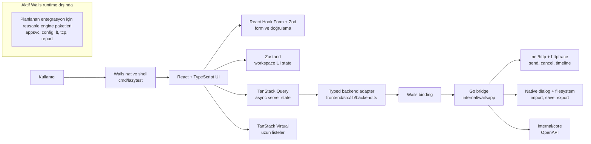

# LazyTest

LazyTest, API isteklerini hazırlamak, çalıştırmak, incelemek ve Java test koduna
dönüştürmek için geliştirilen Wails tabanlı bir masaüstü uygulamasıdır.

Depoda tek bir çalıştırılabilir ürün girişi vardır:
[`cmd/lazytest`](cmd/lazytest). Native kabuk Wails v2, arayüz ise React ve
TypeScript kullanır.

## Güncel yetenekler

### API çalışma alanı

- Sabit örnek workspace ve environment seçimi
- Collection ve history için örnek verili; environment, API ve flow için
  hazırlık durumundaki gezinme bölümleri
- Büyük collection ağaçlarında sanallaştırılmış liste
- Statik uygulama komutlarını filtreleyen komut paleti
- Açma, kapatma, sabitleme, çoğaltma, yeniden sıralama ve son kapatılanı geri
  açma destekli request sekmeleri
- Sol ve sağ panelleri gizleme, yeniden boyutlandırma ve yerleşimi sıfırlama
- Response alanını yatay veya dikey kullanma
- Örnek workspace için sekme, panel, tema ve görünüm tercihlerini localStorage
  içinde saklama
- Sistem, açık ve koyu tema

### Request ve response

- GET, POST, PUT, PATCH, DELETE, OPTIONS ve HEAD methodları
- URL, header ve body içindeki `{{variable}}` değerlerini environment ile
  çözümleme
- Aynı isimli birden fazla header’ı sırası korunarak gönderme
- Gerçek HTTP çağrısı, timeout ve çalışan isteği iptal etme
- Kullanıcıya yönelik doğrulama, ağ, timeout ve iptal hata mesajları
- JSON response biçimlendirme
- Status, süre, boyut, protokol, uzak adres, TLS, trace ID, header, cookie ve
  ham body gösterimi
- DNS, TCP, TLS, sunucu bekleme ve indirme adımlarını içeren request timeline
- cURL kopyalama

### OpenAPI ve Java kod üretimi

- Sistem dosya seçicisiyle OpenAPI 3 YAML/JSON içe aktarma
- İçe aktarılan endpoint özetini gösterme ve bir endpoint grubunu request
  sekmeleri olarak açma
- Sekmedeki gerçek request ve response verisinden Java kodu üretme
- REST Assured, MockMvc, WebTestClient, WireMock, Spring Cloud Contract,
  Java HttpClient, Spring RestClient ve Spring WebClient hedefleri
- JUnit assertion’ları, response alanlarından türetilen kontroller ve secret
  redaction
- Monaco tabanlı önizleme ve çoklu dosya sekmeleri
- Tek dosyayı native kaydetme veya Maven/Gradle proje iskeletini güvenli bir
  dizine aktarma
- Export sırasında absolute path, path traversal ve yinelenen dosya koruması

### Runner deneyimi

- Configure, Live Run ve Report aşamalarından oluşan runner akışı
- Ortam, iteration, concurrency, delay ve stop-on-failure ayarları
- Canlı progress, request sonuçları, assertion özeti ve export aksiyonları

> Runner metrikleri ve raporları şu anda arayüz demosudur; gerçek execution
> engine bağlantısı henüz tamamlanmamıştır.

## Hızlı başlangıç

Gereksinimler:

- Go 1.24 veya üzeri
- Node.js 22
- npm
- Native build için platformun Wails gereksinimleri

Geliştirme modunu aç:

```bash
make dev
```

Tüm kontrolleri çalıştır:

```bash
make test
```

Native uygulamayı üret:

```bash
make build
```

`make tools`, projede sabitlenen Wails `v2.12.0` aracını kurar. `dev` ve
`build` hedefleri bunu otomatik çağırır. macOS çıktısı
`cmd/lazytest/build/bin/LazyTest.app` altında oluşur.

## Mimari


```mermaid
flowchart LR
    USER[Kullanıcı] --> SHELL[Wails native shell<br/>cmd/lazytest]
    SHELL --> UI[React + TypeScript UI]

    UI --> FORM[React Hook Form + Zod<br/>form ve doğrulama]
    UI --> STATE[Zustand<br/>workspace UI state]
    UI --> QUERY[TanStack Query<br/>async server state]
    UI --> VIRTUAL[TanStack Virtual<br/>uzun listeler]

    QUERY --> ADAPTER[Typed backend adapter<br/>frontend/src/lib/backend.ts]
    ADAPTER --> BINDING[Wails binding]
    BINDING --> BRIDGE[Go bridge<br/>internal/wailsapp]

    BRIDGE --> HTTP[net/http + httptrace<br/>send, cancel, timeline]
    BRIDGE --> NATIVE[Native dialog + filesystem<br/>import, save, export]
    BRIDGE --> CORE[internal/core<br/>OpenAPI]

    subgraph OUTSIDE[Aktif Wails runtime dışında]
        SERVICES[Planlanan entegrasyon için reusable engine paketleri<br/>appsvc, config, lt, tcp, report]
    end
```

### Katman sorumlulukları

| Yol | Sorumluluk |
| --- | --- |
| `cmd/lazytest` | Tek uygulama girişi, Wails ayarları, native build kaynakları |
| `cmd/lazytest/frontend/src/components` | Ürün kabuğu, request/response, Runner ve generator ekranları |
| `cmd/lazytest/frontend/src/stores` | Workspace bazlı geçici ve kalıcı UI state |
| `cmd/lazytest/frontend/src/lib` | Tipler, Zod şemaları, query hook’ları ve typed backend adapter |
| `internal/wailsapp` | React ile Go arasındaki uygulama sınırı; HTTP, iptal, native dosya işlemleri |
| `internal/core` | OpenAPI yükleme ve yeniden kullanılabilir API analiz fonksiyonları |
| `internal/appsvc` | Gelecekte bridge’e bağlanabilecek uygulama servisleri |
| `internal/lt`, `internal/tcp` | Yeniden kullanılabilir load-test ve TCP engine’leri |
| `internal/config`, `internal/report` | Yapılandırma ile JSON/JUnit rapor desteği |

Frontend componentleri native runtime’a doğrudan erişmez. Tüm backend işlemleri
`frontend/src/lib/backend.ts` içindeki typed adapter üzerinden Wails bridge’e
gider. TanStack Query async işlemleri, Zustand ise yalnızca arayüz ve workspace
durumunu yönetir.

## Veri akışı

Bir request gönderildiğinde:

1. Form girdisi Zod ile doğrulanır.
2. TanStack Query mutation’ı typed backend adapter’ı çağırır.
3. Wails bridge variable’ları çözer, request context ve cancel fonksiyonunu
   oluşturur.
4. `net/http` çağrısı yapılırken `httptrace` timeline verisini toplar.
5. Normalize edilen response typed binding üzerinden arayüze döner.
6. Query cache ve aktif sekme yalnızca ilgili request sonucu ile güncellenir.

## Test ve build

`make test` şu kontrolleri tek komutta çalıştırır:

- TypeScript typecheck
- Vitest component, store/schema, Runner ve generator testleri
- Go paket testleri
- Wails build tag’i ile bridge ve uygulama testleri

CI aynı kontrolleri Linux üzerinde çalıştırır ve ayrıca macOS üzerinde gerçek
native Wails build’ini doğrular.

## Bilinen sınırlar

- Workspace, collection, environment ve history bootstrap verileri şu anda
  örnek veridir; kalıcı backend deposu henüz bağlı değildir.
- Runner arayüzü gerçek load-test engine’ine bağlı değildir.
- Authorization seçenekleri arayüzde gösterilir; backend bugün request’i URL,
  header ve body üzerinden gönderir.
- Scripts, assertions, settings ve documentation alanlarının tamamı henüz
  çalıştırılabilir değildir.
- OAuth 2.0, mTLS, işletim sistemi keychain entegrasyonu ve proxy yönetimi
  tamamlanmamıştır.
- Üretilen Java projeleri dosya seviyesinde test edilir; ayrı Maven/Gradle
  compile doğrulaması henüz CI’a eklenmemiştir.
- Native paketleme macOS CI’da doğrulanır; Windows ve Linux paketleme işleri
  henüz eklenmemiştir.
