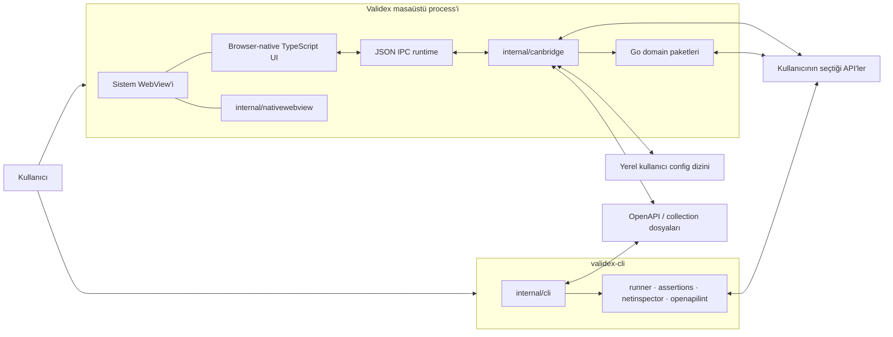
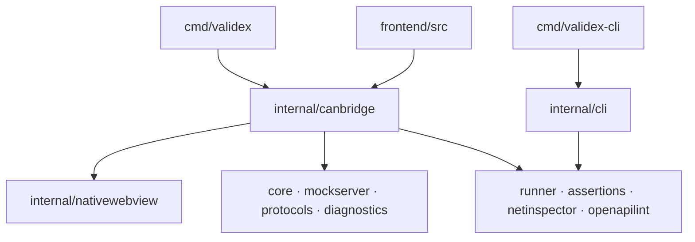
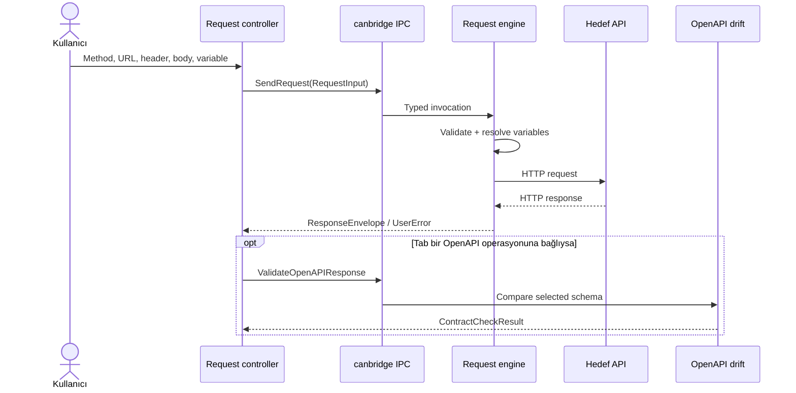

# Validex Teknik Mimarisi

Bu belge Validex'in çalışan kod tabanını tarif eder. Bir roadmap, ürün vaadi
veya idealize edilmiş hedef mimari değildir. Yeni bir domain paketi, native
bridge metodu, kalıcı state alanı ya da build bağımlılığı eklemeden önce bu
belgedeki sınırlar korunmalıdır.

## 1. Mimari ilkeler

Validex aşağıdaki kurallar etrafında tasarlanır:

1. Go tarafı ağ, dosya ve işletim sistemi I/O'sundan sorumludur. Browser
   tarafı sunum, kullanıcı etkileşimi ve JSON/JWT/Spring hata analizi gibi
   browser-local saf dönüşümleri sahiplenebilir.
2. Masaüstü uygulaması ile CLI, ilgili oldukları yerde aynı Go domain
   paketlerini kullanır.
3. Domain paketleri frontend, native pencere veya IPC ayrıntılarını bilmez.
4. Her dış girdi doğrulanır; bellek, gövde, sonuç, timeout ve queue boyutları
   sınırlıdır.
5. Uzun süren işlemler `context.Context` veya eşdeğer bir frontend lifecycle
   ile iptal edilebilir olmalıdır.
6. Native köprü yalnız açıkça kaydedilmiş metotları yayınlar.
7. Kullanıcıya gösterilen hata ile transport/programlama hatası birbirinden
   ayrılır.
8. Frontend runtime bağımlılığı eklenmez; yeni bir paket ancak açık bir mimari
   karar ve ölçülebilir faydayla değerlendirilebilir.
9. Platform motorunun tamamı Go API'sine açılmaz; yalnız Validex'in kullandığı
   dar native yüzey korunur.
10. State'in tek bir sahibi ve tanımlı bir ömrü olmalıdır.

### Bilinçli kapsam dışı alanlar

Mevcut sistem:

- genel amaçlı bir web uygulaması veya uzak web servisi değildir;
- gRPC ya da WebSocket istemcisi içermez;
- kullanıcı secret'ları için şifreli kasa değildir;
- birden fazla native pencere veya URL router kullanmaz;
- platformlar arası cross-compile edilmiş installer üretmez;
- Developer ID, Authenticode veya notarized release pipeline sağlamaz.

Desteklenen ağ protokolleri HTTP(S) ve HTTP(S) üzerinde SSE ile sınırlıdır.

## 2. Sistem bağlamı



Masaüstü ve CLI iki ayrı composition root'tur:

- `cmd/validex`, native pencereyi, frontend asset'lerini ve `canbridge`
  adaptörünü bir araya getirir.
- `cmd/validex-cli`, terminal sinyallerini ve komut satırı girdilerini domain
  paketlerine bağlar; WebView veya `canbridge` kullanmaz.

## 3. Çalışma profilleri

| Profil | Frontend kaynağı | Native bridge | Tipik komut |
| --- | --- | --- | --- |
| Development desktop | Node standart kütüphanesiyle sunulan `.dev-dist` | Var | `make dev` |
| Production desktop | Executable içine gömülü `frontend/dist` | Var | `make build` |
| Frontend-only development | `.dev-dist` | Yok; kontrollü geliştirme fallback'i | `node scripts/dev.mjs` |
| Headless CLI | Frontend yok | Yok | `make build-cli` |

### 3.1 Development desktop

`make dev` şu topolojiyi kurar:

```text
TypeScript compiler + Node stdlib dev server
        127.0.0.1:34116..34215
                    │
                    │ CANBRIDGE_DEV_URL
                    ▼
              Go native process
                    │
                    ▼
               system WebView
```

`make dev` tarafından başlatılan geliştirme sunucusu yalnız loopback üzerinde
çalışır. `scripts/dev.mjs` tek başına çağrıldığında farklı bir `--host`
alabilir; ancak `canbridge`, development URL'si için:

- `http` şeması;
- `localhost` veya loopback IP;
- `34116` ile `34215` arasında bir port

zorunlu tutar. Development build `.dev-dist` ve
`.typescript-build/dev-esm` altında kalır; production `dist` ağacını
değiştirmez. Native debug araçları bu profilde açıktır.

### 3.2 Production desktop

`cmd/validex/main.go`, production frontend çıktısını `go:embed` ile executable
içine alır. Uygulama başlarken asset'ler `file://` ile değil process içindeki
sınırlı bir HTTP sunucusuyla servis edilir:

```text
embedded frontend/dist
          │
          ▼
127.0.0.1:34117
veya boş dinamik loopback port
          │
          ▼
     system WebView
```

Asset sunucusu:

- önce `127.0.0.1:34117` adresini dener, port doluysa dinamik loopback porta
  geçer;
- yalnız beklenen `Host` değerini kabul eder;
- yalnız `GET` ve `HEAD` metotlarına izin verir;
- yalnız gerçekten gömülü dosyaları döndürür, bilinmeyen path'i
  `index.html` ile maskelemez;
- `Cache-Control: no-store` ve `X-Content-Type-Options: nosniff` header'larını
  ekler.

### 3.3 Headless CLI

CLI tek bir Go process'idir:

```text
cmd/validex-cli
      │
      ▼
internal/cli
      ├── internal/runner ──► internal/assertions
      ├── internal/netinspector
      └── internal/openapilint
```

`SIGINT` ve `SIGTERM`, root context'i iptal eder. Komutlar human-readable veya
JSON çıktı üretir. Exit code sözleşmesi:

| Kod | Anlam |
| ---: | --- |
| `0` | Başarılı |
| `1` | Domain çalışması veya kalite kapısı başarısız |
| `2` | Komut/flag kullanımı hatalı |

## 4. Repository topolojisi

```text
validex/
├── cmd/
│   ├── validex/
│   │   ├── main.go                    # desktop composition root
│   │   ├── frontend/
│   │   │   ├── src/                   # TypeScript uygulama kaynakları
│   │   │   ├── public/                # ikon ve statik asset'ler
│   │   │   ├── scripts/               # typecheck/build/dev/test araçları
│   │   │   ├── third_party/typescript # pinli TS compiler paketi
│   │   │   └── dist/                  # üretilen production frontend
│   │   └── build/                     # platform metadata ve çıktılar
│   └── validex-cli/
│       └── main.go                    # CLI composition root
├── internal/
│   ├── assertions/                    # saf assertion motoru
│   ├── canbridge/                     # desktop adapter, IPC ve request motoru
│   ├── cli/                           # test edilebilir CLI adaptörü
│   ├── core/                          # OpenAPI ve contract drift
│   ├── diagnostics/                   # backend/JVM analizleri
│   ├── mockserver/                    # loopback mock HTTP server
│   ├── nativewebview/                 # dar Go/CGO/native pencere sınırı
│   ├── netinspector/                  # DNS ve redirect analizi
│   ├── openapilint/                   # deterministik OpenAPI lint
│   ├── protocols/                     # SSE istemcisi
│   └── runner/                        # collection runner
├── .github/workflows/ci.yml
├── Makefile
├── collection.sample.json
├── openapi.sample.yaml
└── THIRD_PARTY_NOTICES.md
```

`dist`, `.dev-dist`, `.typescript-build` ve `build/bin` üretilen çıktılardır;
mimari kaynak olarak okunmamalıdır. `third_party/typescript` ve
`internal/nativewebview/third_party` ise checksum ve lisans kayıtlarıyla
version control altında tutulan build girdileridir.

## 5. Katmanlar ve bağımlılık yönü



Oklar compile-time veya runtime kullanım yönünü gösterir. Temel kurallar:

- `cmd/*` yalnız composition root olmalıdır.
- `internal/canbridge` ve `internal/cli` dış yüzey adaptörleridir.
- Domain paketleri `canbridge`, `cli` veya frontend'i import etmez.
- Platform kodu build-tag'li dosyalarda ya da `nativewebview` sınırında kalır.
- Frontend, Go struct ayrıntılarını doğrudan varsaymak yerine
  `lib/backend.ts` ve normalizer katmanını kullanır.
- Aynı domain davranışı UI controller'larında kopyalanmaz.

### Paket sorumlulukları

| Paket | Sorumluluk |
| --- | --- |
| `internal/canbridge` | Desktop lifecycle, IPC, bootstrap, HTTP request gönderimi, dosya seçici, collection persistence ve domain adaptasyonu |
| `internal/nativewebview` | Native pencere oluşturma, navigate/eval/bind/dispatch ve minimum pencere API'si |
| `internal/core` | Sınırlı OpenAPI yükleme, endpoint çıkarma ve JSON response contract drift |
| `internal/mockserver` | `127.0.0.1` üzerinde deterministic mock route ve bounded hit geçmişi |
| `internal/protocols` | Sınırlı, iptal edilebilir HTTP(S) SSE okuma |
| `internal/diagnostics` | Actuator, environment comparison, thread dump, log ve endpoint coverage analizi |
| `internal/runner` | JSON collection parse etme, variable interpolation ve sıralı request yürütme |
| `internal/assertions` | Status, header, body, JSON path ve süre assertion'larını değerlendirme |
| `internal/netinspector` | DNS çözümleme, HEAD/GET ve redirect zinciri raporlama |
| `internal/openapilint` | Sınırlı, sıralı ve makinece okunabilir OpenAPI bulguları |
| `internal/cli` | Flag, stdin/stdout, JSON çıktı ve exit code adaptasyonu |

`internal/canbridge` içinde desktop HTTP request orkestrasyonu bulunması mevcut
ve bilinçli bir durumdur. Bu kod CLI tarafından paylaşılmıyorsa sırf katman
sayısını artırmak için ayrı pakete taşınmamalıdır; paylaşılacak yeni bir domain
davranışı oluştuğunda ayrıştırılmalıdır.

## 6. Desktop lifecycle ve native pencere

### 6.1 Başlatma sırası

1. `cmd/validex`, gömülü frontend ve uygulama ikonunu hazırlar.
2. `canbridge.NewBridge()` application state'ini oluşturur.
3. Development URL yoksa loopback asset listener açılır.
4. İzin verilen origin hesaplanır ve 32 byte kriptografik random capability
   üretilir.
5. Bridge lifecycle context'i başlatılır.
6. Platform uygulama metadata'sı hazırlanır.
7. `internal/nativewebview.New` sistem WebView'ini oluşturur.
8. Uygulama/pencere ikonu platform adaptörüyle uygulanır.
9. İki düşük seviye native binding kaydedilir: dispatcher ve browser log.
10. Origin, capability ve izin verilen metot listesini içeren browser runtime
    script'i enjekte edilir.
11. Başlık, başlangıç boyutu ve minimum boyut ayarlanır.
12. WebView frontend URL'sine yönlendirilir ve native event loop çalışır.

Uygulama başlangıç boyutu `1440×900`, minimum boyutu `1080×700`'dür. Bunlar
responsive frontend davranışının yerine geçmez; yalnız native pencere
sınırıdır.

### 6.2 Native WebView sınırı

`internal/nativewebview.WebView` yalnız şu yetenekleri yayınlar:

```text
Run · Dispatch · Destroy · Window
SetTitle · SetSize · Navigate
Init · Eval · Bind
```

Paket:

- CGO ile pinlenmiş `webview` header'ını kullanır;
- macOS'ta Cocoa/WebKit, Linux'ta GTK/WebKitGTK, Windows'ta Edge WebView2
  backend'ine derlenir;
- native UI thread'ini `runtime.LockOSThread` ile korur;
- yalnız `Dispatch` çağrısının arka plandan güvenli olmasını garanti eder;
- binding ve callback `cgo.Handle` kaynaklarını `Destroy` sırasında serbest
  bırakır.

Yeni bir native özellik önce `canbridge` gereksinimi olarak tanımlanmalı,
ardından bu interface'e mümkün olan en küçük operasyon eklenmelidir.

### 6.3 Kapanış sırası

Pencere event loop'u bittiğinde:

1. yeni IPC kabulü kapatılır ve bekleyen UI callback'leri artık teslim edilmez;
2. application context iptal edilir;
3. concurrent çağrılar için waiter ve üç saniyelik ortak timer başlatılır;
4. kabul edilmiş collection yazıları FIFO kuyruğunda foreground olarak drain
   edilir; kendi süresi aşılırsa persistence context'i iptal edilir;
5. collection drain sonrasında concurrent çağrılar için timer'da kalan süre
   kadar beklenir;
6. `Bridge.Shutdown`, kayıtlı request/tool context'lerini iptal eder ve mock
   server'ı bounded graceful stop ile kapatır;
7. native WebView kaynakları yok edilir;
8. production asset server graceful shutdown ile kapatılır.

Kapanış, süresiz beklemez. Genel IPC ve collection persistence için varsayılan
drain penceresi üçer saniyedir. Context'i dikkate almayan saf CPU işi bu süre
içinde zorla durdurulamaz; runtime kapandıktan sonra ürettiği callback
sessizce düşürülür.

## 7. Frontend mimarisi

### 7.1 Teknoloji ve build modeli

Frontend application runtime kodu browser-native TypeScript'tir:

- React, JSX, component framework veya runtime paketi yoktur;
- UI, DOM ve browser standart API'leriyle çalışır;
- TypeScript 5.9.3 resmi compiler paketi repository içinde build-only olarak
  vendor edilir;
- build/test araçları Node standart kütüphanesini kullanır;
- üretim artifact'i generated `index.html`, JavaScript ES modülleri, CSS ve
  statik asset'lerden oluşur.

Klasör adındaki `frontend/src/native`, işletim sistemi native katmanı değildir;
frameworksüz DOM ekranlarını ve controller'larını ifade eder. İşletim sistemi
native sınırı yalnız `internal/nativewebview` ve `internal/canbridge` platform
adaptörleridir.

Production pipeline:

```text
src/*.ts
  │ vendored tsc
  ▼
.typescript-build/esm
  │ package-typescript.mjs
  ▼
validated staging tree
  │ atomic promotion
  ▼
dist/
```

Packager:

- yalnız relative `.js`/`.mjs` import'larını kabul eder;
- bare, remote, computed, eksik veya output dışına çıkan import'ları reddeder;
- symlink ve güvenli olmayan output çakışmalarını reddeder;
- production source map ve development bootstrap kodunu reddeder;
- eski artifact'i bozmayacak staging/rollback akışı kullanır.

### 7.2 Kaynak sınırları

```text
frontend/src/
├── app/          theme ve uygulama politikaları
├── core/         DOM, icon, overlay ve store primitive'leri
├── features/     saf feature modelleri
├── i18n/         tr/en mesaj sözleşmesi ve locale state'i
├── lib/          backend facade, DTO, normalizer ve yardımcılar
├── native/       shell, controller ve workspace mount'ları
└── stores/       workspace ve collection state'i
```

Kurallar:

- `core` feature adı bilmez.
- `features/*/model.ts` mümkün olduğunca DOM ve bridge'den bağımsızdır.
- `native/*` event delegation, render ve lifecycle orkestrasyonunu yapar.
- `lib/backend.ts`, native köprünün tek uygulama-facing facade'ıdır.
- `lib/bridge-contract.ts`, Go'dan gelen shape'leri normalize eder ve
  zorunlu collection alanlarını `null` bırakmaz.
- `stores` state sahipliğini ve persistence migration'larını tanımlar.

`core/dom.ts` içindeki `html` template helper'ı dinamik değerleri varsayılan
olarak HTML-escape eder. Yalnız `TrustedHTMLFragment` markup enjekte edebilir.
Backend, dosya, response veya kullanıcı içeriği `trustedHTML` içine doğrudan
verilmemelidir.

### 7.3 Başlatma ve shell

Frontend başlangıç akışı:

1. `main.ts`, `#root` elementine `mountApp` çağırır.
2. Locale ve tema başlatılır.
3. Eşzamanlı bootstrap talepleri aynı in-flight promise'i paylaşır.
4. İlk backend hatası otomatik olarak bir kez yeniden denenir.
5. İki deneme de başarısızsa kullanıcı retry ve teknik ayrıntı ekranını
   görür; kullanıcı Retry'si yeni bir bootstrap çağrısı başlatır.
6. Başarılı bootstrap sonrasında `mountAppShell` chrome ve request
   workspace'ini kurar.
7. Tool workspace'leri ilk seçildiklerinde mount edilir; Mock ve Diagnostics
   gibi ağır modüller dynamic import ile yüklenir.

Shell tek pencere içinde:

- top bar;
- activity bar;
- collection/OpenAPI sidebar;
- request workspace;
- context panel;
- status bar;
- command palette

bileşenlerini koordine eder. Sol ve sağ paneller pointer veya klavye ile
boyutlandırılabilir. Dar alanda overlay panele dönüşürler.

### 7.4 Frontend state

State üç ana gruba ayrılır:

| State | Sahip |
| --- | --- |
| Aktif workspace, request tab'leri, panel boyutları, tema | `workspaceStore` |
| Kaydedilmiş collection ve request'ler | `collectionLibraryStore` |
| Tool ekranına özel geçici input/result/busy state'i | İlgili mounted controller |

Custom `createStore` subscribe/get/set primitive'ini sağlar.
`createPersistedStore` version, migration, partialization ve async storage
adaptasyonunu ekler. Controller'lar event listener ve alt controller
kaynaklarını `Lifecycle` ile toplu olarak kapatır.

## 8. Native IPC sözleşmesi

### 8.1 Browser tarafı

WebView'e enjekte edilen runtime:

1. düşük seviye native dispatcher ve logger referanslarını alır;
2. bu global binding'leri `window` üzerinden siler;
3. `window.location.origin` değerini izin verilen origin ile karşılaştırır;
4. yalnız başarılıysa `window.canbridge.Bridge` facade'ını oluşturur;
5. her çağrıya benzersiz callback ID verir ve bir `Promise` döndürür;
6. Go cevabını `window.__canbridgeReceive` üzerinden ilgili promise'e bağlar.

Frontend kaynakları düşük seviye dispatcher'ı çağırmaz.

### 8.2 Go tarafı

Her çağrı şu envelope ile taşınır:

```text
capability
callback ID
method adı
JSON-encoded argument array
```

Kontroller:

- capability constant-time karşılaştırılır;
- callback ID ve metot adı uzunluğu doğrulanır;
- encoded argument boyutu 32 MiB ile sınırlıdır;
- metot, explicit `bridgeMethodRegistry` allowlist'inde olmalıdır;
- her case kendi concrete Go tipine decode edilir;
- panic, bridge metot adıyla kontrollü transport hatasına dönüştürülür.

Go sonucu tekrar JSON envelope'a çevrilir ve native UI thread'inde
`Eval` ile teslim edilir.

### 8.3 Metot grupları

| Grup | Metotlar |
| --- | --- |
| Bootstrap/persistence | `Bootstrap`, `LoadCollectionLibrary`, `SaveCollectionLibrary` |
| Requests/OpenAPI | `SendRequest`, `CancelRequest`, `ImportOpenAPI`, `ValidateOpenAPIResponse` |
| Mock | `GetMockServer`, `UpdateMockRoutes`, `StartMockServer`, `StopMockServer`, `ClearMockHits`, `ImportMockOpenAPI` |
| SSE | `RunSSE` |
| Diagnostics | `InspectActuator`, `CompareEnvironments`, `AnalyzeThreadDump`, `SearchTraceLog`, `AnalyzeEndpointCoverage` |
| Automation | `RunCollection`, `AnalyzeNetwork`, `LintOpenAPI` |
| Tool iptali | `CancelToolOperation`; SSE, collection runner ve network inspector tarafından kullanılır |

Export edilmiş yeni bir Go metodu otomatik olarak bridge'e açılmaz.

### 8.4 Result ve error ayrımı

İki hata kanalı vardır:

- JSON decode, bilinmeyen metot veya runtime kapanışı gibi IPC hataları
  promise'i reject eder.
- Kullanıcının düzeltebileceği domain sonuçları çoğunlukla DTO içindeki
  `UserError` alanıyla resolve edilir.

`UserError` alanları:

```text
code · title · message · hint · technical
```

Frontend karar vermek için serbest hata metnini parse etmemeli; stabil `code`
ve tipli result alanlarını kullanmalıdır.

### 8.5 Scheduling

- Collection load/save dışındaki metotlar background goroutine'lerde
  concurrent çalışır.
- Collection işlemleri kabul sırasını koruyan tek tüketicili FIFO kuyruğa
  girer.
- Queue en fazla 128 bekleyen çağrı ve 64 MiB encoded argument tutar.
- Queue dolduğunda kullanıcıya tipli `collection_library_busy` sonucu döner.
- Request iptali ile tool iptali ayrı operation registry'leridir.

## 9. Temel veri akışları

### 9.1 HTTP request



Request motoru:

- yalnız açık `http` veya `https` URL kabul eder;
- URL userinfo ve fragment'ini reddeder;
- `{{variable}}` değerlerini Go tarafında çözer;
- etkin header'ları ve tekrar eden header değerlerini request'e ekler;
- redirect'leri otomatik izlemez ve ilk 3xx cevabını kullanıcıya döndürür;
- timeout'u 1 ms ile 5 dakika arasında sınırlar;
- request ID üzerinden iptal sağlar;
- response gövdesini 16 MiB ile sınırlar;
- status, protokol, uzak adres, TLS, trace ID, header, cookie, raw body ve
  ölçülmüş bağlantı fazlarını döndürür.

Contract kontrolü request transport'undan ayrı ikinci aşamadır. Bu ayrım,
başarılı HTTP cevabının OpenAPI hatası yüzünden kaybolmamasını sağlar.

### 9.2 OpenAPI

Desktop import akışı:

1. Platform dosya seçici YAML/JSON path'i döndürür.
2. `internal/core` en fazla 16 MiB dosyayı parse ve validate eder.
3. Uzak `$ref` çözümlemesi açılmaz.
4. En fazla 10.000 operasyon çıkarılır.
5. Bridge frontend'e metadata ve endpoint listesini döndürür.
6. Parsed operasyonlar `specID` anahtarıyla process belleğinde tutulur.
7. Cache en fazla sekiz spec saklar; eski kayıtlar sırayla çıkarılır.
8. Endpoint'ten oluşturulan request, response sonrası ilgili operasyonla
   contract drift kontrolü yapabilir.

Drift motoru JSON response için missing, extra, type mismatch ve enum violation
bulguları üretir. Traversal depth, node sayısı, finding sayısı ve retained byte
boyutu ayrı ayrı sınırlıdır.

CLI lint akışı OpenAPI import/cache akışından bağımsızdır. Lint sonucu
deterministik code, severity, JSON Pointer path, message ve hint alanları taşır.

### 9.3 Mock Server

Mock server `internal/mockserver.Server` tarafından sahiplenilir:

- yalnız `127.0.0.1` adresine bind eder;
- port `0` ise işletim sistemi boş port seçer;
- route'lar method, path, status, header, body, delay ve enabled alanı taşır;
- path parametreleri desteklenir;
- route listesi server çalışırken güncellenebilir;
- CORS yalnız açık kullanıcı tercihiyle etkinleşir;
- son 500 hit varsayılan olarak ring buffer'da tutulur;
- route delay en fazla 10 dakikadır;
- stop işlemi context ile graceful çalışır.

Route ve hit state'i process belleğindedir; uygulama yeniden başladığında
otomatik olarak geri yüklenmez.

### 9.4 SSE

SSE için harici protokol paketi kullanılmaz. `internal/protocols.ReadSSE`:

- yalnız `http` ve `https` kabul eder;
- `Accept: text/event-stream` ve `Cache-Control: no-cache` varsayılanlarını
  eksikse ekler;
- proxy ayarlarını ortamdan alır;
- TLS minimum sürümünü 1.2 yapar;
- en fazla beş redirect izler ve şema/host değişikliğini reddeder;
- `event`, `id`, çok satırlı `data` ve `retry` alanlarını parse eder;
- context, timeout, event sayısı ve byte limitleriyle durur;
- iptal öncesi tamamlanmış event'leri sonuçta korur.

Varsayılan limitler 100 event, toplam 8 MiB ve event başına 1 MiB'dir. Hard
üst sınırlar 10.000 event, toplam 64 MiB ve 10 dakika timeout'tur.

### 9.5 Diagnostics

Diagnostics araçları iki gruptur:

| Tür | Araçlar |
| --- | --- |
| Uzak hedefe bağlanan | Actuator health/mappings/metrics, environment comparison |
| Verilen metni yerel analiz eden | Spring hata, JWT decode, thread dump, trace log, endpoint coverage |

Spring hata ve JWT araçlarının bir kısmı frontend saf modellerinde çalışır.
JWT decode imza doğrulaması yapmaz. Ağ kullanan işlemler Go tarafında timeout,
URL, response ve collection limitleriyle yürür. Actuator incelemesi varsayılan
olarak read-only endpoint'leri çağırır; diagnostics redirect politikaları
origin değişimini sınırlar.

### 9.6 Automation ve CLI paylaşımı

Desktop Automation workspace ve CLI şu domain paketlerini paylaşır:

- `runner`: collection parse, variable scope, sıralı yürütme ve bounded report;
- `assertions`: assertion değerlendirmesi;
- `netinspector`: DNS, HEAD/GET ve redirect zinciri;
- `openapilint`: OpenAPI kalite kuralları.

Runner bir request başarısız olduğunda raporu korur ve sonraki request'lere
devam eder; parent context iptali tüm çalışmayı durdurur. CLI yalnız input/output
adaptasyonudur, domain kararlarını yeniden uygulamaz.

## 10. State ve persistence

| Veri | Tek sahibi | Kalıcılık |
| --- | --- | --- |
| Açık tab'ler, panel düzeni, tema, aktif görünüm | `workspaceStore` | WebView origin `localStorage` |
| Aktif arayüz dili | `i18n/locale` | WebView origin `localStorage` |
| Kaydedilmiş collection/request ağacı | `collectionLibraryStore` + Go repository | Kullanıcı config dizininde JSON |
| Parsed OpenAPI operasyonları | `canbridge.Bridge` | Process belleği |
| Mock route/hit/server state'i | `mockserver.Server` | Process belleği |
| Çalışan request/tool cancel fonksiyonları | `canbridge.Bridge` | İşlem ömrü |
| Tool ekranı sonuçları | Mounted frontend controller | Controller ömrü |
| CLI raporu | CLI çağrısı | stdout/çağrı ömrü |

### 10.1 Collection dosyası

Kanonik konum:

```text
os.UserConfigDir()/Validex/collection-library.json
```

Repository adaptörü:

- Unix'te app data/lock dosyalarına dar POSIX izinleri uygular; Windows'ta
  kullanıcı config dizininin ACL davranışını kullanır;
- processler arası lock kullanır;
- dosyayı regular-file ve 15 MiB sınırı açısından doğrular;
- SHA-256 tabanlı revision ile compare-and-swap yapar;
- geçici dosya ve platforma özgü atomic replace uygular;
- çakışmayı sessizce overwrite etmek yerine tipli conflict döndürür;
- mümkün olan platformlarda dosya ve dizin sync'i yapar.

Frontend persistence adapter'i eski `localStorage` collection belgesini bir
kez native depoya taşıyabilir. Native kopya onaylanmadan eski kayıt silinmez.

Workspace `localStorage` state'i WebView origin'ine bağlıdır. Production asset
sunucusunun yedek porta geçmesi veya development portunun değişmesi farklı bir
workspace preference alanı görünmesine neden olabilir. Native collection
dosyası porttan bağımsızdır ve bundan etkilenmez.

### 10.2 Workspace state ve secret'lar

Workspace state version'lıdır ve migration fonksiyonuyla okunur. Persistence
öncesinde:

- çalışan request/result state'i atılır;
- imported OpenAPI cache'i atılır;
- secret benzeri environment key'leri çıkarılır;
- literal secret header değerleri boşaltılıp devre dışı bırakılır;
- güvenli `{{variable}}`, `Bearer {{token}}` veya `Basic {{token}}`
  referansları korunabilir.

Collection persistence benzer secret temizleme kuralları uygular. Dosya
şifreli değildir; Validex bir secret vault olarak kabul edilmemelidir.
Heuristik redaction URL ve request body içindeki olası secret'ları otomatik
temizlemez; bu alanlara düz metin secret yazılmamalıdır.

## 11. Concurrency, cancellation ve kaynak sahipliği

### Go tarafı

- Uygulamanın root lifecycle context'i vardır.
- Her aktif HTTP request kendi request ID ve cancel fonksiyonuna sahiptir.
- SSE, collection runner ve network inspector ayrı tool operation ID kullanır.
- Actuator/environment işlemleri application context ile; thread/log/coverage
  analizleri synchronous bridge çağrısı olarak yürür. Lint ayrı tool ID
  yayınlamaz.
- Aynı ID ile ikinci işlem ilk cancel fonksiyonunun üzerine yazamaz.
- Collection persistence sıralıdır; diğer IPC işleri concurrent'tır.
- Mock server mutex ile route, listener ve hit state'ini korur.
- Shutdown önce yeni kabulü durdurur, sonra bounded drain uygular.

### Frontend tarafı

- Her mounted controller bir `Disposable` döndürür.
- `Lifecycle`, listener ve child controller cleanup'larını ters sırada çalıştırır.
- Async stale-response koruması controller'a göre version/sequence, `disposed`,
  busy state veya tek-operation sahipliğiyle uygulanır; yeni controller kendi
  stratejisini açıkça tanımlamalıdır.
- Workspace değişimi controller state sahibini değiştirmeden görünürlüğü
  yönetir.
- UI busy/error state'i serbest boolean kümeleri yerine açık state alanlarıyla
  tutulmalıdır.

Kaynak sahibi başlatma ve durdurmadan birlikte sorumludur. Başka bir katmanın
oluşturduğu server, timer, listener veya goroutine'i örtük olarak kapatmak
yasaktır.

## 12. Güvenlik ve güven sınırları

### 12.1 Trust modeli

Kullanıcı yerel uygulamaya, seçtiği dosyalara ve bağlanmak istediği URL'lere
yetki verir. API cevapları, OpenAPI dosyaları, log metinleri ve browser'a
ulaşan her dış içerik güvenilmez girdidir.

Masaüstü bir geliştirici aracı olduğu için kullanıcının seçtiği localhost ve
intranet hedeflerine bağlanabilir. Bu bir sunucu tarafı SSRF sınırı değildir;
yetki, uygulamayı çalıştıran yerel kullanıcıdadır.

### 12.2 Bridge korumaları

- Production UI yalnız exact loopback origin'de bridge alır.
- Development UI yalnız tanımlı loopback port aralığında bridge alır.
- Her process başlangıcında yeni 256-bit capability üretilir.
- Capability native çağrıda constant-time doğrulanır.
- Düşük seviye binding referansları alındıktan hemen sonra, origin kontrolü ve
  facade kurulumundan önce global'lerden silinir.
- Metot listesi explicit allowlist'tir.
- Typed JSON decode ve size limiti uygulanır.
- Kapanmış runtime callback teslim etmez.

Bu önlemler bridge'i rastgele yüklenen web içeriğine açmamak içindir. Native
WebView genel amaçlı güvenlik sandbox'ı olarak değerlendirilmemelidir.

### 12.3 Girdi ve ağ korumaları

- URL şemaları özelliğe göre `http`/`https` ile sınırlıdır.
- Header ad ve değerlerinde satır kırılması reddedilir.
- Request, response, OpenAPI, collection, SSE ve diagnostics girdileri
  bounded okunur.
- Timeout değerlerinin hard üst sınırları vardır.
- `insecureSkipVerify` yalnız bunu yayınlayan ekran/CLI flag'inde açık opt-in
  ile kullanılabilir.
- Mock server yalnız IPv4 loopback'e bind eder.
- HTML template interpolation varsayılan olarak escape edilir.

### 12.4 Seçilmiş kaynak limitleri

| Alan | Varsayılan / hard sınır |
| --- | --- |
| IPC encoded arguments | 32 MiB hard |
| Desktop HTTP response body | 16 MiB hard |
| Desktop HTTP timeout | 1 ms–5 dakika |
| OpenAPI import | 16 MiB, 10.000 endpoint, 8 cached spec |
| Collection dosyası | 15 MiB |
| Collection IPC queue | 128 bekleyen çağrı, 64 MiB |
| SSE | 100 event / 8 MiB varsayılan; 10.000 / 64 MiB hard |
| CLI runner | 8 MiB collection, 100 request varsayılan |
| OpenAPI lint | 16 MiB, 200 bulgu varsayılan, 1.000 hard |
| Mock hit geçmişi | 500 varsayılan |
| Thread dump ve log metni | İlgili araca göre 32 MiB hard |

Bu tablo seçilmiş kullanıcı etkili limitleri özetler. Kesin ve eksiksiz
kaynak, ilgili paketteki exported/default/hard limit sabitleridir.

## 13. Bağımlılık ve vendor politikası

### 13.1 Go modülleri

Doğrudan Go bağımlılıkları:

| Modül | Kullanım |
| --- | --- |
| `github.com/getkin/kin-openapi` | OpenAPI parse, validation ve schema modeli |
| `golang.org/x/sys` | Platforma özgü sistem çağrısı yardımcıları |

HTTP, SSE, mock server, IPC JSON, CLI ve test altyapısının geri kalanı ağırlıklı
olarak Go standart kütüphanesiyle uygulanır.

### 13.2 Vendor edilen kaynaklar

| Kaynak | Konum | Runtime rolü |
| --- | --- | --- |
| TypeScript 5.9.3 resmi compiler paketi | `cmd/validex/frontend/third_party/typescript` | Build-only |
| `webview` 0.11.0 header | `internal/nativewebview/third_party/webview` | Native desktop |
| WebView2 1.0.1150.38 header | `internal/nativewebview/third_party/webview2` | Windows native desktop |
| Türetilmiş Go/C wrapper lisansı | `internal/nativewebview/third_party/webview_go` | Kaynak kökeni |

Her snapshot version, lisans ve SHA-256 kayıtlarıyla birlikte güncellenir.
Native kaynak prosedürü [internal/nativewebview/UPSTREAM.md](internal/nativewebview/UPSTREAM.md),
frontend prosedürü
[cmd/validex/frontend/TYPESCRIPT_ONLY_TOOLCHAIN.md](cmd/validex/frontend/TYPESCRIPT_ONLY_TOOLCHAIN.md)
içindedir.

`THIRD_PARTY_NOTICES.md` vendor edilen bu kaynakları kapsar; Go modül
graph'ındaki her lisans için eksiksiz bir SBOM olduğu varsayılmamalıdır.

## 14. Build ve paketleme

`make build`:

1. host platform için `validex-cli` üretir;
2. vendored TypeScript compiler ile production frontend'i derler ve paketler;
3. `canbridge` build tag'iyle masaüstü executable'ını derler;
4. frontend `dist` ve uygulama ikonunu executable/bundle'a ekler;
5. `THIRD_PARTY_NOTICES.md` dosyasını desktop artifact yanına kopyalar;
6. platform metadata ve ikon kaynaklarını uygular.

Platform sonuçları:

| Platform | Native motor | Paketleme |
| --- | --- | --- |
| macOS | Cocoa + WebKit | `.app`, ICNS, ad-hoc codesign, deep/strict verification |
| Linux | GTK 3 + WebKitGTK 4.1 | executable + optional `.desktop`/SVG kullanıcı kurulumu |
| Windows | Edge WebView2 | GUI `.exe` + `windres` icon resource |

macOS ad-hoc imza yerel bundle bütünlüğü içindir; Developer ID, hardened
runtime veya notarization yerine geçmez. Windows build Authenticode ile
imzalanmaz.

Build host işletim sistemi ve host CPU mimarisi içindir. Repository universal
macOS binary veya cross-platform installer oluşturmaz.

## 15. Test ve CI mimarisi

### 15.1 Go testleri

Domain paketleri:

- saf unit testleri;
- `httptest` ile bounded network davranışı;
- cancellation ve partial-result testleri;
- queue, lock, CAS ve shutdown concurrency testleri;
- malformed input, body/header limit ve deterministic ordering testleri

ile doğrulanır.

Native bridge testleri `canbridge` build tag'iyle çalışır:

```bash
go test -tags canbridge \
  ./internal/nativewebview \
  ./internal/canbridge \
  ./cmd/validex
```

### 15.2 Frontend testleri

Frontend kalite zinciri:

```bash
node scripts/typecheck.mjs
node scripts/build.mjs
node --test
```

Testler Node'un yerleşik `node:test` ve `node:assert` modüllerini kullanır.
Emitted saf modelleri/store helper'larını ve build, packager, dev server,
dependency policy sınırlarını test eder.

Mevcut suite gerçek WebView/browser DOM smoke testi değildir. Görsel veya
platform etkileşimli değişikliklerde native uygulama ayrıca açılıp
doğrulanmalıdır.

### 15.3 CI

`.github/workflows/ci.yml` dört iş tanımlar:

| İş | Doğrulama |
| --- | --- |
| `quality` | Vendored TS checksum, frontend typecheck/build/test, `go test`, `go vet`, native checksum |
| `native-macos` | Tagged test/vet, `make build`, desktop notice kontrolü |
| `native-linux` | Frontend build, GTK/WebKitGTK kurulumu, tagged test/vet ve native `go build` |
| `native-windows` | Frontend build, MinGW doğrulaması, tagged test/vet ve native `go build` |

CI şu anda artifact yayınlama, düzenli race detector matrisi veya gerçek
browser E2E işi içermez; belge bunları varmış gibi kabul etmez.

## 16. Yeni özellik ekleme kuralları

### 16.1 Yeni domain aracı

1. Input, result ve stabil hata kodlarını domain paketinde tanımlayın.
2. Varsayılan ve hard limitleri açıkça belirleyin.
3. `context.Context` gerekiyorsa public API'ye taşıyın.
4. Deterministik unit testleri ve limit/cancellation testlerini ekleyin.
5. Desktop gerekiyorsa ince bir `canbridge` adapter'i yazın.
6. CLI gerekiyorsa davranışı kopyalamadan `internal/cli` adaptörüne bağlayın.

### 16.2 Yeni bridge metodu

1. `invoke.go` içinde sabit ve registry descriptor ekleyin.
2. Argument'ı concrete Go tipine decode edin.
3. Concurrent veya serial scheduling politikasını bilinçli seçin.
4. Domain hatasını typed result, IPC/programlama hatasını rejection olarak
   modelleyin.
5. Frontend `CanbridgeAPI`, `backend` facade ve DTO/normalizer katmanını aynı
   değişiklikte güncelleyin.
6. Allowlist, invalid argument, result shape ve shutdown testlerini ekleyin.

### 16.3 Yeni workspace

1. `WorkspaceView` union'ını ve `workspaceDefinitions` listesini güncelleyin.
2. Saf model davranışını `features/<name>/model.ts` altında tutun.
3. Controller'ı `native/features` altında `Disposable` olarak uygulayın.
4. App shell mount/lazy import kaydını ekleyin.
5. Türkçe ve İngilizce tüm mesajları birlikte ekleyin.
6. Loading, empty, error, success, cancellation ve dar ekran durumlarını
   tasarlayın.
7. Dependency-policy ve frontend testlerini güncelleyin.

### 16.4 Persistence değişikliği

1. State sahibini ve kalıcılık gereksinimini gerekçelendirin.
2. Şema version'ını artırın.
3. Eski state için deterministik migration yazın.
4. Secret redaction kurallarını uygulayın.
5. Partial write, conflict, retry ve corrupt document davranışlarını test edin.
6. Native ve browser fallback kaynaklarının hangisinin kanonik olduğunu açıkça
   belirtin.

### 16.5 Yeni protokol

WebSocket veya gRPC eklemek yalnız UI sekmesi eklemek değildir. Aşağıdaki
konular için ayrı mimari karar gerekir:

- connection/session lifecycle;
- streaming backpressure;
- message ve toplam bellek limitleri;
- TLS, proxy ve redirect davranışı;
- cancellation ve shutdown;
- CLI paylaşımı;
- yeni bağımlılığın bakım/lisans maliyeti.

Bu karar alınmadıkça Protocols workspace yalnız SSE olarak kalır.

## 17. Değişiklik kontrol listesi

Bir mimari değişiklik tamamlanmadan önce:

- [ ] State'in tek sahibi ve ömrü belli mi?
- [ ] Input/result tipleri ve machine-readable hata kodları tanımlı mı?
- [ ] Byte, adet, timeout ve queue limitleri var mı?
- [ ] Cancellation ve shutdown yolu test edildi mi?
- [ ] Domain katmanı frontend/native ayrıntılarından bağımsız mı?
- [ ] Bridge allowlist ve iki taraftaki DTO sözleşmesi birlikte güncellendi mi?
- [ ] Secret değerleri persistence/log/technical error içine sızmıyor mu?
- [ ] Türkçe ve İngilizce empty/error/success metinleri tamam mı?
- [ ] Frontend dependency policy korunuyor mu?
- [ ] `make test`, ilgili tagged test/vet ve host native build geçti mi?
- [ ] README, bu belge ve third-party kayıtları gerekiyorsa güncellendi mi?

## 18. Mimari karar özeti

| Karar | Gerekçe | Sonuç |
| --- | --- | --- |
| Browser-native TypeScript | Runtime bağımlılığını ve bundle zincirini küçültmek | UI primitive'leri ve lifecycle proje içinde sahiplenilir |
| Vendored TypeScript compiler | npm/registry kurulumu olmadan tekrarlanabilir build | Snapshot checksum ve lisans bakımı gerekir |
| Sistem WebView'i | Ayrı browser runtime dağıtmamak | Platform WebView gereksinimleri native build'in parçasıdır |
| Dar `internal/nativewebview` | Kullanılmayan wrapper API'sini ve Go modülünü kaldırmak | Upstream header ve CGO sınırı proje tarafından bakım görür |
| Loopback asset server | Güvenilir HTTP origin ve standart modül yükleme | Port, Host ve server lifecycle yönetilir |
| Explicit JSON IPC | Küçük, test edilebilir ve tiplenebilir native API | DTO değişiklikleri iki tarafta birlikte yapılır |
| Origin + random capability | Bridge'i beklenmeyen web içeriğine açmamak | Capability her process'te yeniden üretilir |
| Go standart kütüphanesi SSE | Protokol bağımlılığını kaldırmak ve limitleri sahiplenmek | Yalnız ihtiyaç duyulan SSE yüzeyi desteklenir |
| Native collection dosyası + CAS | Çakışmayı ve yarım yazmayı görünür kılmak | Lock, revision, atomic replace ve migration gerekir |
| CLI için paylaşılan domain paketleri | CI ve desktop davranışını yakın tutmak | CLI ince bir I/O adaptörü olarak kalır |

Bu kararların değiştirilmesi mümkündür; ancak değişiklik yeni bağımlılık,
güven sınırı veya state sahibi yaratıyorsa kodla birlikte bu belge de
güncellenmelidir.
