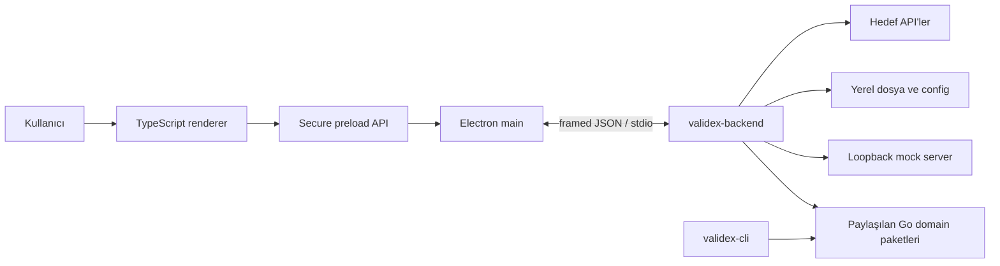
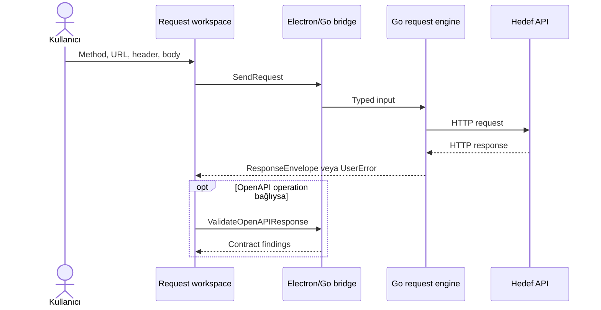

# Validex mimarisi

Bu belge Validex’in bugün çalışan yapısını anlatır. Bir yol haritası veya her
paketin satır satır açıklaması değildir; yeni bir geliştiricinin sistemi
anlayıp doğru yerden değişiklik yapabilmesi için tutulur.

Kullanım ve kurulum bilgisi [README.md](README.md) içinde. Burada süreç
sınırlarına, verinin kimde olduğuna, güvenlik kararlarına ve değişiklik
yaparken korunması gereken sözleşmelere odaklanıyoruz.

## 1. Kısa cevap: Validex nasıl bir uygulama?

Validex üç ana parçadan oluşuyor:

1. Chromium içinde çalışan browser-native TypeScript arayüz,
2. güvenli preload ve main process’ten oluşan Electron masaüstü kabuğu,
3. ağ, dosya ve domain işlerini yapan Go arka uç süreci.

CLI de aynı Go domain paketlerini kullanıyor. Böylece masaüstü arayüzü ve
terminal araçları davranışı kopyalamıyor.



Bu ayrımın üç pratik nedeni var:

- Electron, macOS, Windows ve Linux’a aynı Chromium sürümünü ve render motorunu
  getiriyor. İşletim sistemi font, GPU ve masaüstü entegrasyonu farkları yine
  sürebilir.
- Renderer’a Node veya dosya sistemi yetkisi vermeden masaüstü yetenekleri
  sunabiliyoruz.
- Mevcut Go ağ motorunu, mock server’ı, tanılama araçlarını ve CLI’yi
  koruyabiliyoruz.

### `canbridge` adı neden hâlâ var?

Kodda hem `window.canbridge.Bridge` hem de `internal/canbridge` adını
göreceksiniz. Bunlar eski native WebView render motorunun devam ettiği
anlamına gelmiyor.

- `window.canbridge.Bridge`, frontend sözleşmesini bir anda kırmamak için
  korunmuş preload API adıdır.
- `internal/canbridge`, Electron’dan bağımsız masaüstü adaptörlerini,
  çağrı runtime’ını, dosya seçiciyi ve collection repository’sini barındırır.
- Eski `internal/nativewebview`, CGO glue kodu ve platform WebView motorları
  artık çalışma yolunda yoktur.

İsim ileride değiştirilebilir; fakat Electron renderer ile Go süreci arasındaki
kontrollü köprü ortadan kalkmaz. Bir yeniden adlandırma yapılırsa preload
yüzeyi, frontend tipleri, test fixture’ları ve dokümanlar aynı değişiklikte
güncellenmelidir.

## 2. Temel ilkeler ve kapsam

Mimari karar verirken şu beş ilke öne çıkıyor:

1. Ayrıcalıklı ağ, dosya, process ve native işletim sistemi entegrasyonlarının
   sahibi Go veya Electron main process’tir. Renderer `localStorage` ve
   clipboard gibi izin verilen browser API’lerini kullanabilir.
2. Her kalıcı ya da paylaşılan state’in tek bir kanonik sahibi vardır.
3. Dışarıdan gelen veri boyut, adet ve süre sınırlarıyla kabul edilir.
4. Request, stream ve uzun network işleri iptal/timeout yolu taşır; senkron
   analizler kaynak limitleriyle sınırlandırılır. Uygulama kapanırken her
   kaynağın kapanış yolu bellidir.
5. CLI ve masaüstü aynı işi yapıyorsa domain davranışı ortak Go paketinde
   tutulur.

Şu alanlar mevcut mimarinin bilinçli olarak dışında:

- uzaktan erişilen bir Validex web servisi veya kullanıcı hesabı,
- gRPC ve genel amaçlı WebSocket istemcisi,
- secret vault ya da işletim sistemi keychain entegrasyonu,
- çoklu pencere ve URL tabanlı uygulama router’ı,
- installer, otomatik güncelleme ve release signing hattı,
- platformlar arası cross-build.

Bu alanlardan biri eklenecekse yalnız yeni bir ekran eklenmiş sayılmaz; güven
sınırı, veri ömrü, bağımlılık ve dağıtım kararı da gerekir.

## 3. Çalışma profilleri

| Profil | Arayüz kaynağı | Go arka uç | Kullanım |
| --- | --- | --- | --- |
| Development desktop | Loopback HTTP geliştirme sunucusu | Yerel `validex-backend` | `make dev` |
| Production desktop | `app://validex/` | Uygulama resources içindeki sidecar | Paketli uygulama |
| Frontend-only | Loopback HTTP | Yok | Görsel geliştirme ve bazı frontend testleri |
| Headless CLI | Yok | Domain paketleri aynı process içinde | `validex-cli` |

### Development desktop

`make dev` şu parçaları birlikte ayağa kaldırır:

- frontend geliştirme sunucusu,
- derlenmiş Electron main/preload kodu,
- yerel Go arka uç executable’ı,
- Electron penceresi.

Geliştirme URL’si yalnız `127.0.0.1`, `localhost` veya `::1` üzerinde HTTP(S)
olabilir. Tercih edilen port doluysa script boş bir loopback portu seçer.
`--dev-url`, `VALIDEX_DEV_URL`, `--backend` ve `VALIDEX_BACKEND_PATH`
override’ları yalnız paketlenmemiş geliştirme sürümünde dikkate alınır.

Frontend tek başına da açılabilir; bu durumda desktop API bulunmaz. Saf model,
sunum ve responsive arayüz çalışmaları için kullanışlıdır, fakat gerçek HTTP,
dosya seçici ve collection persistence akışını temsil etmez.

### Production desktop

Paketli uygulama frontend dosyalarını `app://validex/` origin’inden sunar.
Frontend ve Go executable yolu paket içindeki sabit resources alanından
çözülür; geliştirme override’ları yok sayılır.

Electron kendi Chromium’unu taşıdığı için:

- macOS WebKit,
- Windows WebView2,
- Linux WebKitGTK

render motoru olarak kullanılmaz. Linux’ta yine de Electron’ın temel GUI
kitaplıkları ve Go dosya seçici için `zenity` veya `kdialog` gerekir.

### Headless CLI

CLI Electron’a ve Node.js’e bağlı değildir. Collection runner, network
inspection ve OpenAPI lint işlerini doğrudan ortak Go paketleri üzerinden
çalıştırır. CLI katmanı flag, stdin/stdout ve exit code adaptörüdür; domain
algoritmalarını yeniden uygulamaz.

## 4. Kod sınırları ve bağımlılık yönü

Repository’nin ana giriş noktaları:

```text
cmd/
  validex/              Electron npm projesi, frontend ve paketleme
    electron/src/       main, preload, sidecar client, banner
    frontend/src/       browser-native TypeScript arayüz
    scripts/            Electron runtime paketleme
  validex-backend/      Electron'ın başlattığı Go sidecar
  validex-cli/          Go CLI

internal/
  canbridge/            desktop adaptörleri ve invocation runtime
  httpexec/             ortak HTTP yürütücüsü
  core/                 OpenAPI import ve contract drift
  mockserver/           loopback mock server
  protocols/            SSE
  diagnostics/          Actuator, log, thread dump ve environment analizi
  runner/               collection automation
  assertions/           assertion okuma ve karşılaştırma
  netinspector/         DNS/TLS/redirect inceleme
  openapilint/          OpenAPI lint
  cli/                  CLI komut adaptörleri
  httpmedia/            media type sınıflandırma kuralları
  jsonnumber/           sınırlı ve kesin JSON sayı işlemleri

tests/e2e/               Godog + gerçek Chrome kabul testleri
```

Bağımlılık yönü dışarıdan içeri doğrudur:

```text
Electron main → canbridge/adapters → domain packages → policy helpers
CLI adapters ─────────────────────→ domain packages

TypeScript renderer → preload sözleşmesi → Electron IPC
```

Go domain paketleri Electron veya frontend ayrıntılarını bilmez. Renderer da
Go paketlerini doğrudan çağırmaz; iki taraf açık DTO ve IPC sözleşmesiyle
konuşur.

### Paketlerin sorumluluğu

| Paket/alan | Sorumluluk |
| --- | --- |
| Electron main | Pencere, güvenli origin, IPC doğrulama, sidecar process ömrü |
| Electron preload | İzin verilen masaüstü metotlarını renderer’a açmak |
| `internal/canbridge` | Desktop DTO adaptasyonu, persistence, dosya seçici, operation registry ve lifecycle |
| `internal/httpexec` | HTTP request/response limitleri, transport ve content decoding |
| `internal/core` | OpenAPI okuma ve response contract karşılaştırması |
| `internal/mockserver` | Route doğrulama, loopback server ve hit geçmişi |
| `internal/protocols` | SSE bağlantısı ve bounded event okuma |
| `internal/diagnostics` | Spring Boot Actuator, JVM, log ve environment analizleri |
| `internal/runner` + `assertions` | Collection yürütme ve assertion değerlendirme |
| `netinspector` + `openapilint` | CLI ve desktop otomasyon araçları |

Bir adaptörün domain kuralı üretmesi ya da domain paketinin UI mesajı
biçimlendirmesi bu yönü bozar.

## 5. Electron sınırı ve process ömrü

### Başlatma sırası

Electron uygulaması açılırken akış şöyledir:

1. `app://` şeması güvenli ve standart şema olarak kaydedilir; sandbox
   etkinleştirilir.
2. Development URL’si varsa loopback ve protocol kontrolünden geçer.
3. Session permission handler’ları ve tek private IPC channel’ı kurulur.
4. `validex-backend` stdin/stdout/stderr pipe’larıyla başlatılır.
5. Ana pencere oluşturulur ve development URL’si ya da `app://validex/`
   yüklenir.
6. Yükleme tamamlanınca çalışma modu ve gerçek runtime sürümleri terminaldeki
   Validex banner’ına yazılır.

Banner `cmd/validex/electron/src/banner.ts` içinde saf bir formatter olarak
tutulur ve `main.ts` tarafından stderr’e basılır. Go sidecar stdout’u yalnız
protokole ayrıldığı için banner veya log satırı frame akışını kirletemez.
Sidecar stderr çıktısı Electron tarafından `[validex-backend]` önekiyle ana
terminale aktarılır.

Ana pencerenin başlangıç boyutu `1440 × 900`, minimum boyutu `1080 × 700`dür.
Pencere içerik hazır olana kadar gösterilmez.

### Renderer güvenliği

BrowserWindow şu güvenlik ayarlarıyla açılır:

| Ayar | Değer |
| --- | --- |
| `contextIsolation` | `true` |
| `nodeIntegration` | `false` |
| `sandbox` | `true` |
| `webSecurity` | `true` |
| `allowRunningInsecureContent` | `false` |
| `webviewTag` | `false` |
| DevTools | Yalnız development desktop |

Yeni pencere açma, navigation, redirect ve webview attach girişimleri
reddedilir. Session permission istekleri de varsayılan olarak kapalıdır.

Preload, `window.canbridge.Bridge` altında dondurulmuş bir metot kümesi sunar.
Electron main her çağrıda şunları doğrular:

- çağrı ana pencerenin `webContents` nesnesinden mi geliyor,
- gönderen frame top frame mi,
- origin production’da `app://validex`, development’ta seçilmiş loopback
  origin’i mi,
- metot izin listesinde mi,
- argument sayısı beklenen değerle aynı mı.

Bu kontrollerden geçmeyen veri Go sürecine yazılmaz.

### Production asset protokolü

`app://validex/` handler’ı yalnız `GET` ve `HEAD` kabul eder. URL decode
edildikten sonra `resolve/relative` ile istenen path’in frontend kökü içinde
kaldığı sözlüksel olarak doğrulanır. Handler symlink hedefini `realpath` ile
yeniden doğrulamaz; paketlenen resource ağacında güvenilmeyen symlink
bulunmaması build varsayımıdır.

Yanıtlarda dosyaya uygun MIME türüyle birlikte CSP, COOP ve
`X-Content-Type-Options: nosniff` header’ları bulunur. CSP network bağlantısını
renderer için kapatır; gerçek ağ işi Go tarafındadır.

Bilinen dağıtım sınırı: paketleyici şu anda Electron’ın varsayılan fuse
ayarlarını kullanıyor ve uygulama kaynaklarını açık `resources/app` dizininde
taşıyor. Renderer sandbox’ı ve imza doğrulaması bunun yerine geçmez. Fuse
hardening, ASAR bütünlük kontrolü veya release signing eklenirse ayrı bir
dağıtım kararı ve test gerekir.

### Kapanış sırası

Windows ve Linux’ta son pencere kapanınca uygulama quit akışına girer.
macOS’ta son pencere kapansa da uygulama ve sidecar açık kalır; dock’tan
yeniden etkinleştirildiğinde yeni pencere oluşturulur.

Uygulama gerçekten quit olurken Electron önce sidecar stdin’ini kapatır. Go
tarafı yeni çağrı almayı bırakır, kabul edilmiş işleri ve collection kuyruğunu
sınırlı bir süre içinde kapatır, aktif context’leri iptal eder ve kaynakları
serbest bırakır. `shutdownStarted` bayrağı aynı sidecar kapanışının ikinci kez
başlatılmasını önler.

Sidecar zamanında çıkmazsa Electron önce `SIGTERM`, ardından son çare olarak
`SIGKILL` gönderir. Protocol veya stdin yazma hatasında bekleyen promise’ler
hemen ilgili hatayla; child process çıkarsa kalan promise’ler exit code ya da
signal bilgisiyle reddedilir.

## 6. Electron–Go IPC sözleşmesi

### Renderer’dan sidecar’a

Akış dört kapıdan geçer:

```text
frontend backend facade
        ↓
window.canbridge.Bridge
        ↓
Electron IPC doğrulaması
        ↓
SidecarClient → Go InvocationRuntime
```

Frontend private IPC channel adını bilmez. Preload her public metodu
`{ method, args }` nesnesine çevirir. Electron sidecar client çağrı için UUID
üretir ve sonucu aynı ID ile bekleyen promise’e bağlar.

Go tarafındaki command registry metot adı, argument decoder’ı, handler ve
çalıştırma politikasının dispatch kaynağıdır. Electron `bridge.ts`,
`preload.ts` ve sidecar lane listeleri ayrıca tutulduğu için iki process
arasında tek bir otomatik registry yoktur. Mevcut contract testi Go
`bridgeMethodNames` listesini frontend `CanbridgeAPI` adlarıyla karşılaştırır;
Electron bridge/preload kopyaları ve sidecar lane listeleri için tam bir parity
testi bugün yoktur.

### Wire format

stdin/stdout üzerinde her mesaj dört byte big-endian payload uzunluğu ve
ardından UTF-8 JSON taşır:

```json
{"id":"uuid","method":"SendRequest","args":"[{...}]"}
{"id":"uuid","result":{"status":200}}
{"id":"uuid","error":"transport error"}
```

`args`, Go’daki `Bridge.Invoke(method, argumentsJSON)` sözleşmesini koruyan
JSON array string’idir. Bir response tam olarak `result` veya `error`
alanlarından birini taşır.

Decoder:

- frame boyutunu JSON parse işleminden önce denetler,
- request nesnesinde bilinmeyen alan ve trailing JSON değeri kabul etmez,
- ID ve metot uzunluğunu doğrular,
- her metodu kendi concrete Go tipine decode eder,
- panic’i küçük ve ilişkili bir protocol error yanıtına dönüştürür.

Electron’ın frame decoder’ı parçalı stdout chunk’larını artımlı olarak okur.
Büyük frame’lerde her chunk için tüm buffer’ı yeniden birleştirmez.

### Açık metot yüzeyi

| Grup | Metotlar |
| --- | --- |
| Başlangıç ve collection | `Bootstrap`, `LoadCollectionLibrary`, `SaveCollectionLibrary`, `ImportCollectionFile`, `ExportCollectionFile` |
| Requests ve OpenAPI | `SendRequest`, `CancelRequest`, `ImportOpenAPI`, `ValidateOpenAPIResponse` |
| Mock | `GetMockServer`, `UpdateMockRoutes`, `StartMockServer`, `StopMockServer`, `ClearMockHits`, `ImportMockOpenAPI` |
| SSE | `RunSSE` |
| Diagnostics | `InspectActuator`, `CompareEnvironments`, `AnalyzeThreadDump`, `SearchTraceLog`, `AnalyzeEndpointCoverage` |
| Automation | `RunCollection`, `AnalyzeNetwork`, `LintOpenAPI` |
| İptal | `CancelToolOperation` |

Go’da export edilmiş bir metot kendiliğinden renderer’a açılmaz.

### Çalıştırma sırası ve admission

Üç iş sınıfı var:

| Sınıf | Kullanım | Bütçe |
| --- | --- | --- |
| Normal | Çoğu bridge çağrısı | 64 eşzamanlı çağrı, toplam 64 MiB argument |
| İptal | `CancelRequest`, `CancelToolOperation` | 8 çağrı, toplam 1 MiB argument |
| Sıralı | Collection load/save | 128 çağrı, toplam 64 MiB argument |

İptal komutları normal işler doygunken de ilerleyebilsin diye ayrı bütçe
kullanır. Bu bir genel öncelik kuyruğu değildir; yalnız kısa iptal çağrılarına
ayrılmıştır.

Collection load/save işlemleri kabul sırasını korur. Electron sidecar client
önce kendi 128 çağrılık serial admission sınırını uygular; bu sınır dolarsa
promise transport hatasıyla reddedilir. Kabul edilen çağrı Go’ya ulaştığında
Go runtime’ın kendi sıralı kuyruğuna girer. İki sınır bugün aynı olduğundan
normal Electron yolunda 129. çağrı Go’ya yazılmadan reddedilir; Go’nun typed
`collection_library_busy` sonucu doğrudan runtime kullanımı veya iki sınırın
ileride ayrışması için ikinci savunmadır.

### Hata modeli

İki hata kanalı bilerek ayrılır:

- Geçersiz IPC, bilinmeyen metot, protocol bozulması veya kapanmış runtime
  promise’i reject eder.
- Kullanıcının düzeltebileceği domain sorunları çoğunlukla başarılı IPC sonucu
  içinde `UserError` olarak döner.

`UserError` şu alanları taşır:

```text
code · title · message · hint · technical
```

Frontend davranış seçmek için serbest hata metnini parse etmez. Stabil `code`
ve DTO alanlarını kullanır; `message` ve `hint` kullanıcı sunumu içindir.

## 7. Frontend mimarisi

Renderer browser-native TypeScript’tir. React, Vite veya başka bir runtime UI
framework’ü yoktur. TypeScript build sırasında kullanılır; production
renderer’da npm paketi çalışmaz.

Kaynaklar NodeNext modül çözümüyle derlendiği için TypeScript import’ları
çıktıdaki gerçek `.js` uzantısını yazar. Production build geçici alanda
hazırlanıp tamamlandığında `frontend/dist` yerine alınır; yarım çıktı
paketlenmez. Development çıktısı production dizininden ayrı tutulur.

### Kaynak sınırları

```text
frontend/src/
  app/          uygulama komutları ve üst seviye orchestration
  core/         HTML güvenliği, feedback, overlay ve lifecycle primitive'leri
  features/     saf model ve feature mantığı
  native/       DOM controller'ları, shell ve workspace sunumu
  stores/       renderer belleğindeki UI state
  i18n/         Türkçe/İngilizce mesaj sözleşmeleri
  lib/          backend facade, DTO'lar ve ortak yardımcılar
```

Pratik kural:

- `features` mümkün olduğunca DOM ve backend çağrısı bilmez.
- `native` DOM event’ini, focus’u ve ekran ömrünü yönetir.
- `app` birden fazla giriş noktasında kullanılan akışı birleştirir.
- `lib/backend.ts` renderer’ın masaüstü API sınırıdır.

### Kullanılan desenler

Projede desen isimleri amaç değil, somut tekrarları azaltan araçlardır:

- **Application command facade:** Aynı use case toolbar, sidebar ve workspace
  içinden çağrılıyorsa backend/store sırası tek komutta tutulur.
- **Feedback observer:** Geçici başarı ve hata bildirimleri işi yapan
  controller’ı toast sunumuna bağlamaz.
- **Presenter/controller ayrımı:** Büyük request ekranında markup üreten saf
  fonksiyonlarla event ve async akışı yöneten controller ayrıdır.
- **Disposable lifecycle:** Event listener, timer ve observer’ı oluşturan
  controller kapanırken temizler.
- **Registry/catalog:** Kapalı bir metot ya da kural kümesinin adı, handler’ı
  ve politikası birlikte değişiyorsa ayrı switch’ler yerine tek kayıt kullanılır.

Tek ekranda kullanılan küçük bir davranış için yeni sınıf hiyerarşisi kurmak
bu desenlerin amacı değildir.

### Arayüz ve erişilebilirlik

Validex minimum pencere boyutunda ve iki yan panel açıkken ana görevi
tamamlanabilir tutmalıdır. Panel genişlikleri kullanılabilir alana göre
sınırlandırılır; dar ekranda içerik ezilmek yerine uygun panel kapanır veya
yer değiştirir.

Klavye ile resize, focus restore, tab sırası, ARIA label/live region ve boş,
yükleniyor, hata, başarı, çalışan ve iptal durumları ekran davranışının
parçasıdır. Validation kararları çevrilmiş cümlelere değil stabil kodlara
dayanır. Backend veya kullanıcı içeriği DOM’a girmeden HTML escape sınırından
geçer.

## 8. Go servisleri ve ana veri akışları

### HTTP request



Request motoru yalnız açık `http` ve `https` URL kabul eder. URL userinfo ve
fragment’i reddedilir; `{{variable}}` değerleri Go tarafında çözülür.
Redirect otomatik izlenmez, ilk 3xx yanıt kullanıcıya gösterilir. Request ID
üzerinden iptal desteklenir.

Ortak `internal/httpexec.Executor` request/response body ve response header
limitlerini uygular, duplicate header değerlerini korur, gzip/deflate content
decoding yapar ve transport kaynaklarını oturum boyunca yeniden kullanır.
Standart `net/http`, farklı header adlarının raw wire sırasını garanti etmez;
model aynı isimli değerlerin sırasını ve editör round-trip’ini korur.

Response iki ayrı ihtiyacı taşır:

- `rawBody`, kayıpsız kaynak ve contract kontrolü içindir.
- `body`, okunabilir sunum için sınırlı JSON/XML biçimlendirmesi içerebilir.

Binary veya güvenli UTF-8/JSON bütçesine sığmayan cevap Base64 taşınır.
Frontend body’yi yeniden üretmez; yalnız sınırlı syntax token’larıyla
renklendirir. Formatlama başarısızsa istek başarısız sayılmaz, düz metne
düşülür.

OpenAPI contract kontrolü HTTP transport’tan ayrı ikinci aşamadır. Böylece
başarılı HTTP cevabı, sözleşme karşılaştırması hata verdi diye kaybolmaz.

### OpenAPI

Desktop import akışı YAML veya JSON dosyasını platform dosya seçiciyle alır.
Dosya boyutu parse öncesinde sınırlandırılır; uzak `$ref` çözümlemesi açılmaz.
Operasyonlar path ve method’a göre kararlı sırada çıkarılır.

Parse edilmiş spec’ler process belleğinde `specID` ile tutulur ve sınırlı bir
cache kullanır. Endpoint’ten üretilmiş bir request, dönüşte seçilmiş operation
ile missing, extra, type mismatch ve enum violation karşılaştırması yapabilir.

OpenAPI lint bu cache’ten bağımsızdır. Sonuçlar stabil code, severity, JSON
Pointer path, message ve hint taşır; hem CLI hem desktop aynı lint motorunu
kullanır.

### Mock server

Mock server:

- yalnız `127.0.0.1` adresine bind eder,
- port `0` verildiğinde işletim sisteminden boş port alır,
- route listesini server çalışırken güncelleyebilir,
- CORS’u yalnız açık kullanıcı tercihiyle açar,
- hit geçmişini sınırlı ring buffer’da tutar,
- stop sırasında graceful shutdown uygular.

Route ve hit state’i process belleğindedir; uygulama yeniden açıldığında
otomatik geri gelmez. OpenAPI’den mock üretimi de aynı route doğrulama ve boyut
sınırlarından geçer.

### SSE

SSE istemcisi Go standart kütüphanesiyle uygulanır. Event adedi, tek event ve
toplam response byte bütçeleri bağlantı açılmadan normalize edilir. Uzun akış
`CancelToolOperation` ile iptal edilebilir. Mevcut Protocols workspace genel
amaçlı WebSocket veya gRPC bağlantısı sağlamaz.

### Diagnostics

Diagnostics workspace’in Go-backed araçları şunlardır:

- Spring Boot Actuator inceleme,
- environment JSON farkı,
- thread dump analizi,
- trace/log arama,
- endpoint coverage analizi.

Spring error ve JWT inceleme browser içinde saf TypeScript modellerle çalışır;
JSON Lab de frontend özelliğidir. Actuator ve environment network işleri
timeout ile session shutdown context’ine uyar. Thread dump, log search ve
coverage senkron CPU analizleridir; bugün operation ID ile kullanıcı tarafından
iptal edilmez, girdi/traversal/çıktı limitleriyle sınırlandırılır. UI yalnız
typed sonucu sunar.

### Automation ve CLI

Collection runner istekleri sırayla çalıştırır, assertion’ları değerlendirir
ve bounded report üretir. Network inspector DNS, bağlantı, TLS ve redirect
adımlarını inceler. OpenAPI lint kuralları aynı engine üzerinde kararlı sırada
çalışır.

Desktop çağrıları `internal/canbridge` ile, CLI çağrıları `internal/cli` ile bu
paketlere adapte edilir. Ağ, assertion veya lint kuralı iki giriş noktası için
ayrı ayrı yazılmaz.

## 9. State ve persistence

State sahipliğini “ekranda kim gösteriyor?” ve “kalıcı kopyayı kim yazıyor?”
diye ayırmak önemli:

| Veri | Bellekteki sahibi | Kalıcı sahibi / ömrü |
| --- | --- | --- |
| Workspace, tema, açık sekmeler, panel ölçüleri | Frontend store’ları | Chromium `localStorage` |
| Collection çalışma kopyası | Frontend collection store | Desktop’ta Go save API’si; frontend-only profilde `localStorage` |
| Collection revision ve kanonik dosya | Go collection service/repository | `Validex/collection-library.json` |
| OpenAPI spec cache | Go bridge session | Process ömrü |
| Mock route ve hit state’i | Go mock server | Process ömrü |
| Aktif request/tool operation’ları | Go registry’ler | İş veya session ömrü |

### Collection dosyası

Kanonik collection yolu:

```text
os.UserConfigDir()/Validex/collection-library.json
```

Repository:

- document boyutunu 15 MiB ile sınırlar,
- process’ler arası file lock kullanır,
- içerikten SHA-256 revision üretir,
- save sırasında beklenen revision ile compare-and-swap yapar,
- geçici dosya ve atomic replace ile yarım yazmayı önler,
- uygun dosya izinlerini uygular,
- çakışma ve bozuk belge durumunu typed sonuçla bildirir.

İlk save mevcut dosya yoksa yeni belge oluşturabilir. Sonraki save’ler eski
revision ile yapılırsa sessizce üzerine yazmaz.

Eski frontend localStorage collection verisi görülürse migration ancak Go
tarafındaki kalıcı kopya doğrulandıktan sonra browser kopyasını temizler.
WebView’den Chromium’a geçişte collection dosya yolu değişmediği için
koleksiyonlar korunur.

Frontend-only profilde Go repository bulunmadığından aynı storage adaptörü
browser localStorage’a düşer. Bu geliştirme kolaylığıdır; desktop
production’ın kanonik persistence yolu değildir.

### UI tercihleri ve secret’lar

Tema, tab ve panel state’i WebView motoruna ait localStorage’dan Chromium
profiline otomatik taşınmaz. Bu veri kullanıcı tercihi sayılır; collection
dosyasıyla karıştırılmaz.

Frontend collection serializer auth, token ve cookie benzeri header adlarında
literal değeri kaydetmeden önce temizler; güvenli `{{variable}}` referansları
korunabilir. Go repository iç belgeyi yorumlamaz, yalnız kalıcılık ve revision
sınırını uygular. Collection dosyası şifreli değildir ve Validex bir secret
vault değildir. Hassas değerler mümkün olduğunca environment değişkeninden
verilmelidir.

## 10. Concurrency, cancellation ve kaynak sahipliği

Go `InvocationRuntime`, lane kapasitesini kabul etmeden goroutine başlatmaz.
Electron sidecar client ise JSON payload ve sınırlı frame buffer’ını
oluşturduktan sonra lane admission kontrolü yapar; kapasite doluysa frame’i
stdin’e yazmaz. Her iki taraf da byte sınırı uygular, fakat allocation sırası
aynı değildir.

Go bridge session’ı tek bir root context taşır. Request ve uzun tool
operation’ları ayrı ID registry’lerinde tutulur; ilgili cancel metodu yalnız
o işi sonlandırır. Mock server state geçişleri aynı mutex sırasından geçer.

OpenAPI ve mock OpenAPI importu gibi lock dışında uzun süren işler, sonucu
state’e yazmadan önce başladıkları session’ın hâlâ güncel olduğunu kontrol
eder. Böylece eski session’da tamamlanan I/O yeni session state’ini ezmez.

Collection load/save işlemlerinin sıralı olması dosya revision akışını
korur. Diğer bağımsız parse ve network işleri gereksiz yere aynı lock altında
çalıştırılmaz.

Kaynak sahipliği için kullanılan pratik kural:

- Timer, event listener, goroutine, server veya HTTP transport’u kim
  oluşturduysa onu kapatan yol da aynı katmanda görünür olmalıdır.
- Constructor’ın kendi yarattığı HTTP transport kapatılır; çağıranın enjekte
  ettiği client örtük olarak kapatılmaz.
- Frontend controller’ı mount sırasında eklediği listener ve observer’ları
  `dispose` sırasında temizler.
- Shutdown sonsuza kadar beklemez; graceful süre dolduğunda üst katman daha
  sert process sonlandırmaya geçer.

Kullanıcıya görünen map traversal veya eşit öncelikli route eşleşmesi kararlı
bir sort/tie-break kuralına sahip olmalıdır.

## 11. Güven sınırları ve kaynak limitleri

Validex yerel masaüstü uygulamasıdır; renderer içeriği yine de güvenilir kabul
edilmez. Güven akışı şöyledir:

```text
Renderer input
  → preload allowlist
  → sender/origin kontrolü
  → frame ve argument sınırları
  → Go typed decode
  → domain validation
  → ağ / dosya / process kaynağı
```

Ek kurallar:

- Mock server yalnız IPv4 loopback’te dinler.
- `insecureSkipVerify` yalnız bunu açıkça sunan ekran veya CLI flag’iyle
  etkinleştirilebilir.
- File picker çıktısı bounded okunur; shell interpolation kullanılmaz.
- HTML template interpolation varsayılan olarak escape edilir.
- Production renderer’ın doğrudan network bağlantısı CSP ile kapalıdır.

### Seçilmiş limitler

Bu tablo kullanıcı davranışını ve process sınırını etkileyen ana değerleri
özetler. Kesin kaynak her zaman ilgili Go/TypeScript sabitidir.

| Alan | Varsayılan / üst sınır |
| --- | --- |
| Electron–Go protocol frame | 64 MiB |
| Request ID / method adı | 1–256 byte / 1–128 byte |
| Tek IPC çağrısı encoded arguments | 32 MiB |
| Normal IPC admission | 64 çağrı, toplam 64 MiB argument |
| İptal IPC admission | 8 çağrı, toplam 1 MiB argument |
| Collection IPC sırası | 128 çağrı, toplam 64 MiB argument |
| File picker helper stdout | 64 KiB |
| Desktop HTTP request / response body | 16 MiB / 16 MiB decoded |
| Desktop HTTP timeout | 1 ms–5 dakika |
| OpenAPI desktop import | 16 MiB, 10.000 endpoint, 8 cached spec |
| Collection library | 15 MiB |
| SSE | 100 event / 8 MiB varsayılan; 10.000 / 64 MiB üst sınır |
| CLI runner | 8 MiB collection, 100 request varsayılan |
| OpenAPI lint | 16 MiB belge, 200 bulgu varsayılan / 1.000 üst sınır |
| Mock routes | 2.000 route, route başına 1 MiB / toplam 32 MiB body |
| Mock hit geçmişi | 500 varsayılan, 10.000 üst sınır |
| Thread dump ve log metni | Araca göre en fazla 32 MiB |

Yeni bir dış girdi alanı eklenirken yalnız tek field boyutu değil; toplam
retained byte, öğe adedi, nesting/traversal ve timeout etkisi de düşünülür.

## 12. Bağımlılıklar, build ve paketleme

### Go

Dağıtılan Go modülünün doğrudan üçüncü taraf bağımlılıkları:

| Modül | Kullanım |
| --- | --- |
| `github.com/getkin/kin-openapi` | OpenAPI parse, validation ve schema modeli |
| `golang.org/x/sys` | Platform sistem çağrısı yardımcıları |

`tests/e2e` ayrı Go modülüdür. Godog ve chromedp yalnız testte kullanılır;
desktop veya CLI executable’ına link edilmez.

### npm

`cmd/validex/package.json` içindeki doğrudan bağımlılık yüzeyi:

| Paket | Sürüm | Rol |
| --- | --- | --- |
| `electron` | `43.2.0` | Desktop shell ve paketlenmiş Chromium |
| `typescript` | `5.9.3` | Frontend ve Electron build compiler’ı |

İkisi de `devDependencies` altındadır; renderer runtime paketi yoktur.
Transitive graph `cmd/validex/package-lock.json` ile sabitlenir ve `npm ci`
ile kurulur. Yeni doğrudan bağımlılık bakım, lisans ve güvenlik maliyetiyle
birlikte değerlendirilmelidir.

Dağıtılan üçüncü taraf bileşenler [THIRD_PARTY_NOTICES.md](THIRD_PARTY_NOTICES.md)
içinde listelenir. Bu dosya tam bir SBOM olarak görülmemelidir.

### Build akışı

`make build` ana hatlarıyla:

1. kilitli npm bağımlılıklarını doğrular/kurar,
2. host platform için `validex-cli` ve `validex-backend` üretir,
3. production frontend’i derler,
4. Electron main, preload, sidecar client ve banner TypeScript’ini derler,
5. Electron runtime, frontend, Go sidecar ve notice dosyalarını tek çalışır
   uygulama dizininde birleştirir,
6. macOS’ta ikon/bundle metadata’sını uygular, ad-hoc imzalar ve imzayı
   doğrular.

Linux desktop dosyası ve ikon kurulumu `make install-linux` aşamasındadır.
Windows paketi şu anda Electron executable metadata’sını korur.

| Platform | Masaüstü çıktı | CLI |
| --- | --- | --- |
| macOS | `cmd/validex/build/bin/Validex.app` | `cmd/validex/build/bin/validex-cli` |
| Linux | `cmd/validex/build/bin/Validex/` | `cmd/validex/build/bin/validex-cli` |
| Windows | `cmd\validex\build\bin\Validex\` | `cmd\validex\build\bin\validex-cli.exe` |

Build yalnız çalıştırıldığı host işletim sistemi ve CPU mimarisi içindir.
Universal macOS binary, installer, updater, cross-build, Developer ID signing
ve notarization üretmez.

## 13. Test ve CI

Yerel ana komutlar:

```bash
make test
make test-e2e
make test-production
```

`make test`, Electron typecheck/unit testlerini, frontend typecheck/build/unit
testlerini ve Go testlerini çalıştırır.

`make test-e2e`, production frontend’i kurulu gerçek Chrome/Chromium üzerinde
Godog senaryolarıyla açar. Tarayıcı otomatik bulunamazsa executable açıkça
verilebilir:

```bash
VALIDEX_E2E_CHROME=/path/to/chrome make test-e2e
```

Bu test profili deterministic bir `window.canbridge.Bridge` fixture’ı enjekte
eder. Kullanıcı etkileşimini, responsive layout’u ve frontend/backend
sözleşme şekillerini doğrular; gerçek Electron preload’unu, process ömrünü,
paketlenmiş uygulamayı veya işletim sistemi dosya seçicisini test etmez.

`make test-production`, `make test` kapsamına raw-Chrome E2E, Go race detector
ve `go vet` kontrollerini ekler. Paketli runtime build’i bu hedefin parçası
değildir.

Frontend komutlarını tek tek çalıştırırken doğru dizini kullanın:

```bash
cd cmd/validex
npm run frontend:typecheck
npm run frontend:test
npm run electron:typecheck
npm run electron:test
```

CI beş işe ayrılır:

| Job | Ne doğrular? |
| --- | --- |
| `quality` | TypeScript, Go test/vet/race |
| `browser-e2e` | Ubuntu 24.04 üzerinde gerçek Chrome kabul senaryoları |
| `package-macos` | Uygulama/CLI çıktısı, resources ve ad-hoc bundle imzası |
| `package-linux` | Ubuntu 24.04’te uygulama/CLI/resources ve ana Electron executable’ının link-time kitaplıkları |
| `package-windows` | Uygulama/CLI/resources dosya yapısı |

CI release artifact yayımlamaz; Developer ID/release signing, notarization,
installer smoke testi, gerçek file picker otomasyonu veya tam Electron GUI
smoke testi yapmaz.

## 14. Değişiklik yaparken izlenecek rota

Uzun bir kontrol listesi yerine değişikliğin türünden başlayın:

| Değişiklik | Başlanacak yer | Birlikte güncellenecek sınırlar |
| --- | --- | --- |
| Yeni domain aracı | `internal/<domain>` | Limitler, cancellation, unit test; gerekiyorsa canbridge/CLI adaptörü |
| Yeni bridge metodu | `internal/canbridge/invoke.go` | Electron allowlist, preload, frontend API/DTO, lane kararı ve contract testleri |
| Yeni workspace | `frontend/src/features` | DOM controller, shell kaydı, i18n, dar ekran ve E2E |
| Persistence şeması | Collection service/repository | Schema version, migration, redaction, conflict/corrupt/partial-write testleri |
| Yeni CLI komutu | `internal/cli` | Ortak domain API, help/exit code/cancellation testleri |
| Yeni assertion | `internal/assertions` | Target/operator registry, validation ve wire sonucu |
| Yeni lint kuralı | `internal/openapilint` | Stabil code, kararlı sıra, issue bütçesi ve örnek testler |
| Yeni protokol | Önce mimari karar | Session, streaming/backpressure, TLS/proxy, cancellation, CLI ve bağımlılık etkisi |

### Yeni bridge metodu için kısa kontrol

Bir metot process sınırını geçtiği için iki tarafta da açıkça tanımlanır:

1. Go registry’ye concrete decoder/handler ve çalışma politikasıyla eklenir.
2. İş yalnız mevcut operasyonu iptal eden kısa bir komutsa iptal lane’i seçilir.
3. Electron `bridge.ts`, `preload.ts` ve gerekirse sidecar lane listesi
   güncellenir.
4. Frontend `CanbridgeAPI`, backend facade, DTO ve normalizer güncellenir.
5. Kullanıcı hatası typed result; protocol/programlama hatası rejection olarak
   modellenir.
6. Allowlist eşleşmesi, geçersiz argument, kapasite ve kapanış yolu test edilir.

### Her değişiklikte sorulacak sorular

- State’in bellekte ve diskte sahibi belli mi?
- Yeni girdi için byte, adet, süre ve traversal sınırı var mı?
- Network/stream işi iptal veya timeout yolu taşıyor mu; senkron analiz
  kaynak limitleriyle çevrili mi; uygulama kapanırken kaynak bırakılıyor mu?
- Renderer’a yeni Node/Electron yetkisi açılıyor mu?
- Kullanıcı içeriği escape ediliyor, secret persistence’a sızıyor mu?
- Türkçe ve İngilizce mesajlar, loading/error/success/cancel durumları var mı?
- Minimum pencere ve klavye/focus davranışı bozuluyor mu?
- CLI ile desktop aynı davranışı kopyalamaya mı başladı?
- Değişen sözleşme için unit, E2E veya host package testi hangisi gerekli?
- Bağımlılık, lockfile ve third-party notice güncellemesi gerekiyor mu?

## 15. Mimari karar özeti

| Karar | Neden | Bedeli |
| --- | --- | --- |
| Electron + paketli Chromium | Üç platformda aynı Chromium sürümünü ve motorunu kullanmak | Daha büyük paket ve Chromium güncelleme sorumluluğu |
| Browser-native TypeScript | Renderer runtime bağımlılığını küçük tutmak | UI primitive’lerinin bakımını proje yapar |
| Secure preload API | Renderer’a Node yetkisi vermeden desktop özelliği sunmak | İzin listeleri ve DTO’lar iki tarafta birlikte değişir |
| `app://validex` | Production için sabit, güvenli origin | Asset handler ve güvenlik header’ları proje sorumluluğunda |
| Go sidecar + framed JSON | Go domain/CLI yatırımını Electron’la paylaşmak | Process ömrü, korelasyon ve frame limitleri yönetilir |
| Ayrı iptal bütçesi | Normal iş yükü doluyken iptali çalışır tutmak | İkinci bir admission sınıfı test edilir |
| Go collection dosyası + CAS | Yarım yazma ve sessiz çakışmayı önlemek | Lock, revision ve migration gerekir |
| Ortak HTTP executor | Desktop ve runner wire davranışını yakın tutmak | Adaptörler ortak policy’ye uymalıdır |
| Raw Chrome E2E + host package job’ları | UI akışını hızlı, platform paketini ayrı doğrulamak | Tek test Electron’ın tüm sürecini uçtan uca kapsamaz |
| Az doğrudan bağımlılık | Güvenlik, lisans ve bakım yüzeyini sınırlamak | Bazı altyapı proje içinde uygulanır |

Bu kararlar değişmez kurallar değil. Yeni bir bağımlılık, state sahibi, process
sınırı veya dağıtım yüzeyi yaratılıyorsa kodla birlikte bu belge de
güncellenmelidir.
