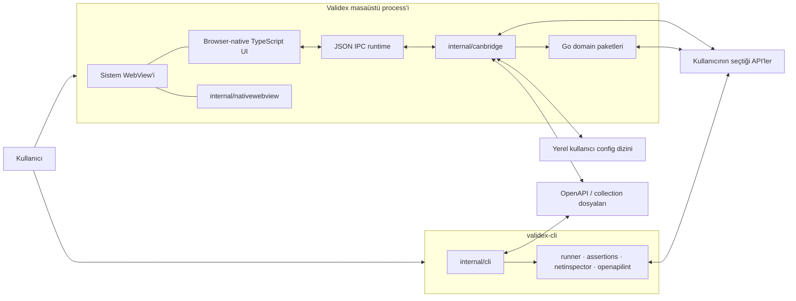
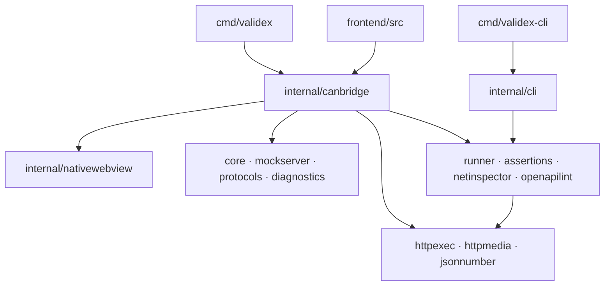
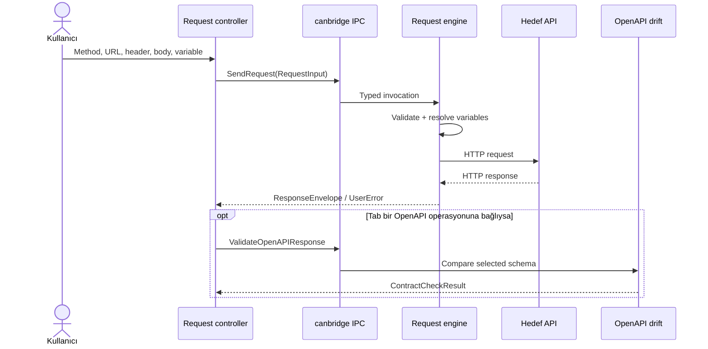

# Validex Teknik Mimarisi

Bu belge Validex'in çalışan kod tabanını tarif eder. Bir roadmap, ürün vaadi
veya idealize edilmiş hedef mimari değildir. Yeni bir domain paketi, native
bridge metodu, kalıcı state alanı ya da build bağımlılığı eklemeden önce bu
belgedeki sınırlar korunmalıdır.

## 1. Mimari ilkeler

Validex aşağıdaki kurallar etrafında tasarlanır:

1. Go tarafı ağ, dosya ve işletim sistemi I/O'sundan sorumludur. Browser
   tarafı sunum, kullanıcı etkileşimi ve JSON/JWT/Spring hata analizi gibi
   browser-local saf dönüşümleri sahiplenebilir.
2. Masaüstü uygulaması ile CLI, ilgili oldukları yerde aynı Go domain
   paketlerini kullanır.
3. Domain paketleri frontend, native pencere veya IPC ayrıntılarını bilmez.
4. Her dış girdi doğrulanır; bellek, gövde, sonuç, timeout ve queue boyutları
   sınırlıdır.
5. Uzun süren işlemler `context.Context` veya eşdeğer bir frontend lifecycle
   ile iptal edilebilir olmalıdır.
6. Native köprü yalnız açıkça kaydedilmiş metotları yayınlar.
7. Kullanıcıya gösterilen hata ile transport/programlama hatası birbirinden
   ayrılır.
8. Frontend runtime bağımlılığı eklenmez; yeni bir paket ancak açık bir mimari
   karar ve ölçülebilir faydayla değerlendirilebilir.
9. Platform motorunun tamamı Go API'sine açılmaz; yalnız Validex'in kullandığı
   dar native yüzey korunur.
10. State'in tek bir sahibi ve tanımlı bir ömrü olmalıdır.
11. Tasarım deseni, isim veya katman sayısını artırmak için değil; gerçek bir
    sahiplik, lifecycle, eşzamanlılık ya da genişletme problemini tek yerde
    çözmek için kullanılmalıdır.

### Bilinçli kapsam dışı alanlar

Mevcut sistem:

- genel amaçlı bir web uygulaması veya uzak web servisi değildir;
- gRPC ya da WebSocket istemcisi içermez;
- kullanıcı secret'ları için şifreli kasa değildir;
- birden fazla native pencere veya URL router kullanmaz;
- platformlar arası cross-compile edilmiş installer üretmez;
- Developer ID, Authenticode veya notarized release pipeline sağlamaz.

Desteklenen ağ protokolleri HTTP(S) ve HTTP(S) üzerinde SSE ile sınırlıdır.

## 2. Sistem bağlamı



Masaüstü ve CLI iki ayrı composition root'tur:

- `cmd/validex`, native pencereyi, frontend asset'lerini ve `canbridge`
  adaptörünü bir araya getirir.
- `cmd/validex-cli`, terminal sinyallerini ve komut satırı girdilerini domain
  paketlerine bağlar; WebView veya `canbridge` kullanmaz.

## 3. Çalışma profilleri

| Profil | Frontend kaynağı | Native bridge | Tipik komut |
| --- | --- | --- | --- |
| Development desktop | Node standart kütüphanesiyle sunulan `.dev-dist` | Var | `make dev` |
| Production desktop | Executable içine gömülü `frontend/dist` | Var | `make build` |
| Frontend-only development | `.dev-dist` | Yok; kontrollü geliştirme fallback'i | `node scripts/dev.mjs` |
| Headless CLI | Frontend yok | Yok | `make build-cli` |

### 3.1 Development desktop

`make dev` şu topolojiyi kurar:

```text
TypeScript compiler + Node stdlib dev server
        127.0.0.1:34116..34215
                    │
                    │ CANBRIDGE_DEV_URL
                    ▼
              Go native process
                    │
                    ▼
               system WebView
```

`make dev` tarafından başlatılan geliştirme sunucusu yalnız loopback üzerinde
çalışır. `scripts/dev.mjs` tek başına çağrıldığında farklı bir `--host`
alabilir; ancak `canbridge`, development URL'si için:

- `http` şeması;
- `localhost` veya loopback IP;
- `34116` ile `34215` arasında bir port

zorunlu tutar. Development build `.dev-dist` ve
`.typescript-build/dev-esm` altında kalır; production `dist` ağacını
değiştirmez. Native debug araçları bu profilde açıktır.

### 3.2 Production desktop

`cmd/validex/main.go`, production frontend çıktısını `go:embed` ile executable
içine alır. Uygulama başlarken asset'ler `file://` ile değil process içindeki
sınırlı bir HTTP sunucusuyla servis edilir:

```text
embedded frontend/dist
          │
          ▼
127.0.0.1:34117
veya boş dinamik loopback port
          │
          ▼
     system WebView
```

Asset sunucusu:

- önce `127.0.0.1:34117` adresini dener, port doluysa dinamik loopback porta
  geçer;
- yalnız beklenen `Host` değerini kabul eder;
- yalnız `GET` ve `HEAD` metotlarına izin verir;
- yalnız gerçekten gömülü dosyaları döndürür, bilinmeyen path'i
  `index.html` ile maskelemez;
- `Cache-Control: no-store` ve `X-Content-Type-Options: nosniff` header'larını
  ekler.

### 3.3 Headless CLI

CLI tek bir Go process'idir:

```text
cmd/validex-cli
      │
      ▼
internal/cli
      ├── internal/runner ──► internal/assertions
      │                   └─► internal/httpexec
      ├── internal/netinspector
      └── internal/openapilint
```

`SIGINT` ve `SIGTERM`, root context'i iptal eder. Komutlar human-readable veya
JSON çıktı üretir. Exit code sözleşmesi:

| Kod | Anlam |
| ---: | --- |
| `0` | Başarılı |
| `1` | Domain çalışması veya kalite kapısı başarısız |
| `2` | Komut/flag kullanımı hatalı |

Dosya/stdin okuma context ile iptal edilir. Unix platformlarında
(`linux`, `darwin` ve BSD ailesi dahil) peer bekleyen named-pipe/FIFO open
işlemi non-blocking bir read-write descriptor ile uyandırılır; cancellation
arkada kalıcı `os.Open` goroutine'i bırakmaz.

## 4. Repository topolojisi

```text
validex/
├── cmd/
│   ├── validex/
│   │   ├── main.go                    # desktop composition root
│   │   ├── frontend/
│   │   │   ├── src/
│   │   │   │   ├── app/               # uygulama komutları ve politikaları
│   │   │   │   ├── core/              # DOM/store/feedback primitive'leri
│   │   │   │   ├── features/          # mümkün olduğunca saf modeller
│   │   │   │   ├── native/            # shell, presenter ve controller'lar
│   │   │   │   └── stores/            # state sahipleri ve migration'lar
│   │   │   ├── public/                # ikon ve statik asset'ler
│   │   │   ├── scripts/               # typecheck/build/dev/test araçları
│   │   │   ├── third_party/typescript # pinli TS compiler paketi
│   │   │   └── dist/                  # üretilen production frontend
│   │   └── build/                     # platform metadata ve çıktılar
│   └── validex-cli/
│       └── main.go                    # CLI composition root
├── internal/
│   ├── assertions/                    # saf assertion motoru
│   ├── canbridge/                     # desktop adapter, IPC ve request orkestrasyonu
│   ├── cli/                           # test edilebilir CLI adaptörü
│   ├── core/                          # OpenAPI ve contract drift
│   ├── diagnostics/                   # backend/JVM analizleri
│   ├── httpexec/                      # ortak bounded HTTP wire executor
│   ├── httpmedia/                     # ortak media-type policy value object'leri
│   ├── jsonnumber/                    # bounded ve exact JSON sayı policy'si
│   ├── mockserver/                    # loopback mock HTTP server
│   ├── nativewebview/                 # dar Go/CGO/native pencere sınırı
│   ├── netinspector/                  # DNS ve redirect analizi
│   ├── openapilint/                   # deterministik OpenAPI lint
│   ├── protocols/                     # SSE istemcisi
│   └── runner/                        # collection runner
├── .github/workflows/ci.yml
├── Makefile
├── collection.sample.json
├── openapi.sample.yaml
└── THIRD_PARTY_NOTICES.md
```

`dist`, `.dev-dist`, `.typescript-build` ve `build/bin` üretilen çıktılardır;
mimari kaynak olarak okunmamalıdır. `third_party/typescript` ve
`internal/nativewebview/third_party` ise checksum ve lisans kayıtlarıyla
version control altında tutulan build girdileridir.

## 5. Katmanlar ve bağımlılık yönü



Oklar compile-time veya runtime kullanım yönünü gösterir. Temel kurallar:

- `cmd/*` yalnız composition root olmalıdır.
- `internal/canbridge` ve `internal/cli` dış yüzey adaptörleridir.
- Domain paketleri `canbridge`, `cli` veya frontend'i import etmez.
- Platform kodu build-tag'li dosyalarda ya da `nativewebview` sınırında kalır.
- Frontend, Go struct ayrıntılarını doğrudan varsaymak yerine
  `lib/backend.ts` ve normalizer katmanını kullanır.
- Aynı domain davranışı UI controller'larında kopyalanmaz.

### Paket sorumlulukları

| Paket | Sorumluluk |
| --- | --- |
| `internal/canbridge` | Desktop lifecycle, IPC, bootstrap, interactive request orkestrasyonu, dosya seçici, collection persistence ve domain adaptasyonu |
| `internal/httpexec` | Sıralı/tekrarlı header modeli, özel wire header'ları, redirect policy, bounded response ve content decoding kullanan ortak HTTP executor |
| `internal/httpmedia` | Parametrelerden arındırılmış media type, JSON/XML structured suffix ve wildcard/suffix range eşleştirme policy'si |
| `internal/jsonnumber` | Byte ve exponent bütçeli, `big.Rat` tabanlı exact JSON/Go sayı dönüşümü |
| `internal/nativewebview` | Native pencere oluşturma, navigate/eval/bind/dispatch ve minimum pencere API'si |
| `internal/core` | Sınırlı OpenAPI yükleme, endpoint çıkarma ve JSON response contract drift |
| `internal/mockserver` | `127.0.0.1` üzerinde deterministic mock route ve bounded hit geçmişi |
| `internal/protocols` | Sınırlı, iptal edilebilir HTTP(S) SSE okuma |
| `internal/diagnostics` | Actuator, environment comparison, thread dump, log ve endpoint coverage analizi |
| `internal/runner` | JSON collection parse etme, variable interpolation ve sıralı request yürütme |
| `internal/assertions` | Status, header, body, JSON path ve süre assertion'larını değerlendirme |
| `internal/netinspector` | DNS çözümleme, HEAD/GET ve redirect zinciri raporlama |
| `internal/openapilint` | Sınırlı, sıralı ve makinece okunabilir OpenAPI bulguları |
| `internal/cli` | Flag, stdin/stdout, JSON çıktı ve exit code adaptasyonu |

Variable çözümleme, kullanıcı hata metni, timeline sunumu, assertion ve rapor
üretimi kendi adapter/domain katmanlarında kalır. Wire-level HTTP davranışı ise
`canbridge` ile `runner` arasında kopyalanmaz; iki akış da
`internal/httpexec` kullanır. `httpexec` hiçbir UI veya runner report tipini
import etmez.

## 6. Desktop lifecycle ve native pencere

### 6.1 Başlatma sırası

1. `cmd/validex`, gömülü frontend ve uygulama ikonunu hazırlar.
2. `canbridge.NewBridge()` application state'ini oluşturur.
3. Development URL yoksa loopback asset listener açılır.
4. İzin verilen origin hesaplanır ve 32 byte kriptografik random capability
   üretilir.
5. Bridge lifecycle context'i başlatılır.
6. Platform uygulama metadata'sı hazırlanır.
7. `internal/nativewebview.New` sistem WebView'ini oluşturur.
8. Uygulama/pencere ikonu platform adaptörüyle uygulanır.
9. İki düşük seviye native binding kaydedilir: dispatcher ve browser log.
10. Origin, capability ve izin verilen metot listesini içeren browser runtime
    script'i enjekte edilir.
11. Başlık, başlangıç boyutu ve minimum boyut ayarlanır.
12. WebView frontend URL'sine yönlendirilir ve native event loop çalışır.

Uygulama başlangıç boyutu `1440×900`, minimum boyutu `1080×700`'dür. Bunlar
responsive frontend davranışının yerine geçmez; yalnız native pencere
sınırıdır.

`Bridge` lifecycle'ı ayrı bir typed state machine ile izlenir:

```text
bridgeLifecycleCreated
        │ Startup
        ▼
bridgeLifecycleRunning
        │ Shutdown
        ▼
bridgeLifecycleStopped
        │ Startup (yeni native runtime session'ı)
        └────────────────────────► bridgeLifecycleRunning
```

`Startup` ve `Shutdown`, `Bridge.lifecycleMu` altında baştan sona serialize
edilir. State yalnız context pointer'ını değil, collection persistence
session'ının start/stop'unu ve shutdown'daki mock stop aşamasını da kapsar.
Böylece bir Shutdown, eşzamanlı yeni Startup'ın kurduğu collection context'ini
sonradan iptal edemez. Tekrarlanan Shutdown stopped state'inde idempotent
döner. Shutdown sonrasında Startup desteklenen bir restart'tır; yeni runtime,
operation ve collection context'leri kurar ve state'i yeniden running yapar.

### 6.2 Native WebView sınırı

`internal/nativewebview.WebView` yalnız şu yetenekleri yayınlar:

```text
Run · Dispatch · Destroy · Window
SetTitle · SetSize · Navigate
Init · Eval · Bind
```

Paket:

- CGO ile pinlenmiş `webview` header'ını kullanır;
- macOS'ta Cocoa/WebKit, Linux'ta GTK/WebKitGTK, Windows'ta Edge WebView2
  backend'ine derlenir;
- native UI thread'ini `runtime.LockOSThread` ile korur;
- yalnız `Dispatch` çağrısının arka plandan güvenli olmasını garanti eder;
- binding ve callback `cgo.Handle` kaynaklarını `Destroy` sırasında serbest
  bırakır.

Yeni bir native özellik önce `canbridge` gereksinimi olarak tanımlanmalı,
ardından bu interface'e mümkün olan en küçük operasyon eklenmelidir.

### 6.3 Kapanış sırası

Pencere event loop'u bittiğinde:

1. yeni IPC kabulü kapatılır ve bekleyen UI callback'leri artık teslim edilmez;
2. application context iptal edilir;
3. concurrent çağrılar için waiter ve üç saniyelik ortak timer başlatılır;
4. kabul edilmiş collection yazıları FIFO kuyruğunda foreground olarak drain
   edilir; kendi süresi aşılırsa persistence context'i iptal edilir;
5. collection drain sonrasında concurrent çağrılar için timer'da kalan süre
   kadar beklenir;
6. `Bridge.Shutdown`, kayıtlı request/tool context'lerini iptal eder ve mock
   server'ı bounded graceful stop ile kapatır;
7. native WebView kaynakları yok edilir;
8. production asset server graceful shutdown ile kapatılır.

Kapanış, süresiz beklemez. Genel IPC ve collection persistence için varsayılan
drain penceresi üçer saniyedir. Context'i dikkate almayan saf CPU işi bu süre
içinde zorla durdurulamaz; runtime kapandıktan sonra ürettiği callback
sessizce düşürülür.

Bu sıra içindeki `Bridge.Shutdown` lifecycle state machine nedeniyle tek
seferlik state geçişidir. Aynı Bridge test veya native runtime restart
senaryosunda yeniden başlatılırsa sonraki `Startup`, stopped session'ın
context/revision sahipliğini yeniden kullanmaz.

Uzun I/O işi state lock'u dışında yürüyebilir; fakat sonucu state'e yazmak
ayrı bir commit aşamasıdır. OpenAPI cache, mock route replacement ve başarılı
request coverage kaydı, işi başlatan cancelable session context'inin halen
güncel olduğunu lock altında doğrular. Eski session'da başlayıp restart
sonrasında tamamlanan iş yeni session state'ine yazamaz.

## 7. Frontend mimarisi

### 7.1 Teknoloji ve build modeli

Frontend application runtime kodu browser-native TypeScript'tir:

- React, JSX, component framework veya runtime paketi yoktur;
- UI, DOM ve browser standart API'leriyle çalışır;
- TypeScript 5.9.3 resmi compiler paketi repository içinde build-only olarak
  vendor edilir;
- build/test araçları Node standart kütüphanesini kullanır;
- üretim artifact'i generated `index.html`, JavaScript ES modülleri, CSS ve
  statik asset'lerden oluşur.

Klasör adındaki `frontend/src/native`, işletim sistemi native katmanı değildir;
frameworksüz DOM ekranlarını ve controller'larını ifade eder. İşletim sistemi
native sınırı yalnız `internal/nativewebview` ve `internal/canbridge` platform
adaptörleridir.

Production pipeline:

```text
src/*.ts
  │ vendored tsc
  ▼
.typescript-build/esm
  │ package-typescript.mjs
  ▼
validated staging tree
  │ atomic promotion
  ▼
dist/
```

Packager:

- yalnız relative `.js`/`.mjs` import'larını kabul eder;
- bare, remote, computed, eksik veya output dışına çıkan import'ları reddeder;
- symlink ve güvenli olmayan output çakışmalarını reddeder;
- production source map ve development bootstrap kodunu reddeder;
- eski artifact'i bozmayacak staging/rollback akışı kullanır.

### 7.2 Kaynak sınırları

```text
frontend/src/
├── app/          uygulama komutları, theme ve uygulama politikaları
├── core/         DOM, icon, overlay, feedback ve store primitive'leri
├── features/     saf feature modelleri
├── i18n/         tr/en mesaj sözleşmesi ve locale state'i
├── lib/          backend facade, DTO, normalizer ve yardımcılar
├── native/       shell, presentation fonksiyonları, controller ve workspace mount'ları
└── stores/       workspace ve collection state'i
```

Kurallar:

- `core` feature adı bilmez.
- `features/*/model.ts` mümkün olduğunca DOM ve bridge'den bağımsızdır.
- `native/*` event delegation, render ve lifecycle orkestrasyonunu yapar.
- Birden fazla controller veya klavye kısayolunun paylaştığı use case,
  DOM'dan bağımsızsa `app` altındaki application command facade'ında
  birleştirilebilir.
- `lib/backend.ts`, native köprünün tek uygulama-facing facade'ıdır.
- `lib/bridge-contract.ts`, Go'dan gelen shape'leri normalize eder ve
  zorunlu collection alanlarını `null` bırakmaz.
- `stores` state sahipliğini ve persistence migration'larını tanımlar.

`core/dom.ts` içindeki `html` template helper'ı dinamik değerleri varsayılan
olarak HTML-escape eder. Yalnız `TrustedHTMLFragment` markup enjekte edebilir.
Backend, dosya, response veya kullanıcı içeriği `trustedHTML` içine doğrudan
verilmemelidir.

### 7.3 Başlatma ve shell

Frontend başlangıç akışı:

1. `main.ts`, `#root` elementine `mountApp` çağırır.
2. Locale ve tema başlatılır.
3. Eşzamanlı bootstrap talepleri aynı in-flight promise'i paylaşır.
4. İlk backend hatası otomatik olarak bir kez yeniden denenir.
5. İki deneme de başarısızsa kullanıcı retry ve teknik ayrıntı ekranını
   görür; kullanıcı Retry'si yeni bir bootstrap çağrısı başlatır.
6. Başarılı bootstrap sonrasında `mountAppShell` chrome ve request
   workspace'ini kurar.
7. Shell, görünür uygulama feedback'ini sunan feedback controller'ını mount
   eder.
8. Tool workspace'leri ilk seçildiklerinde mount edilir; Mock ve Diagnostics
   gibi ağır modüller dynamic import ile yüklenir.

Shell tek pencere içinde:

- top bar;
- activity bar;
- collection/OpenAPI sidebar;
- request workspace;
- context panel;
- status bar;
- command palette

bileşenlerini koordine eder. Sol ve sağ paneller pointer veya klavye ile
boyutlandırılabilir. Dar alanda overlay panele dönüşürler.

### 7.4 Frontend state

State üç ana gruba ayrılır:

| State | Sahip |
| --- | --- |
| Aktif workspace, request tab'leri, panel boyutları, tema | `workspaceStore` |
| Kaydedilmiş collection ve request'ler | `collectionLibraryStore` |
| Tool ekranına özel geçici input/result/busy state'i | İlgili mounted controller |

Custom `createStore` subscribe/get/set primitive'ini sağlar.
`createPersistedStore` version, migration, partialization ve async storage
adaptasyonunu ekler. Controller'lar event listener ve alt controller
kaynaklarını `Lifecycle` ile toplu olarak kapatır.

### 7.5 Application Command Facade

`frontend/src/app/commands.ts` içindeki `applicationCommands`, aynı kullanıcı
niyetini başlatan top bar, command palette, sidebar, context panel ve shell
klavye kısayolunun ortak uygulama use case sınırıdır. Bu facade şu anda yalnız
iki komut yayınlar:

| Komut | Davranış |
| --- | --- |
| `openRequestDraft(overrides)` | `workspaceStore` üzerinde dirty bir request tab'i açar; verilen alanlar tab taslağına uygulanır |
| `importOpenAPI()` | Native dosya seçici/import çağrısını başlatır, aynı anda gelen çağrıları tek in-flight promise'te birleştirir ve başarılı sonucu `workspaceStore`'a bir kez yazar |

Facade DOM elementi, dialog markup'ı veya ekran-local busy state'i sahiplenmez.
Controller kullanıcı etkileşimini ve ekrana özgü sunumu yönetir; command ise
paylaşılan backend/store orkestrasyonunu yönetir. Yalnız tek bir ekrana özgü
basit state değişimi sırf “command pattern” kullanmak için buraya
taşınmamalıdır.

Yeni bir application command eklerken:

1. Aynı use case'in gerçekten birden fazla giriş noktası olduğunu doğrulayın.
2. Parametre ve sonucu TypeScript tipleriyle tanımlayın.
3. Backend sonucunun store'a hangi katmanda ve kaç kez yazılacağını tek yerde
   belirleyin.
4. Dosya seçici gibi üst üste açılamayan işlemlerde in-flight sahipliğini
   açıkça yönetin.
5. DOM, çeviri ve ekran-local feedback kararlarını çağıran controller'da
   bırakın.

### 7.6 Feedback Observer

`frontend/src/core/feedback.ts`, producer'ları belirli bir shell elementine
bağlamadan transient kullanıcı feedback'i yayınlayan küçük bir Observer
primitive'idir:

- `FEEDBACK_TONE`, `info`, `success`, `warning` ve `error` değerlerinin
  `as const` registry'sidir;
- `notify`, boş mesajı düşürür, monoton bir ID verir ve gösterim süresini en
  az 1.500 ms olarak normalize eder;
- `subscribeFeedback`, listener kaydını ve cleanup fonksiyonunu sağlar;
- mesajlar process içi ve geçicidir; history, queue veya persistence değildir.

`frontend/src/native/chrome/feedback.ts` presentation/controller tarafıdır.
Shell'deki `[data-feedback]` host'una yalnız en son mesajı render eder, önceki
timer'ı iptal eder, kullanıcı kapatmasını destekler ve tona göre `status` ya
da `alert` erişilebilirlik semantiği uygular. Domain/controller mesajın
içeriğini ve tonunu seçer; süre, dismiss ve ARIA davranışını chrome katmanı
sahiplenir.

Kalıcı bir form hatası veya kullanıcının karar vermesi gereken uyarı toast ile
modellenmemelidir; ilgili alanın yanında veya dialog içinde kalmalıdır.
Feedback Observer, kaydetme/kopyalama gibi kısa süreli işlem sonucunu tüm
giriş noktalarında tutarlı göstermek içindir.

### 7.7 Request presenter/controller ayrımı

Request ekranı iki dosya arasında bilinçli olarak bölünür:

| Dosya | Sorumluluk |
| --- | --- |
| `frontend/src/native/requests/presentation.ts` | Tab, welcome, composer, editor ve response yerleşimi için typed snapshot'tan escaped `TrustedHTMLFragment` üretmek |
| `frontend/src/native/requests/workspace.ts` | Draft/state sahipliği, event delegation, dialog/menu, backend çağrısı, cancellation, store senkronizasyonu, focus ve lifecycle |

`presentation.ts` doğrudan listener kaydetmez, backend çağırmaz ve store'a
yazmaz. `workspace.ts`, markup ayrıntısını kopyalamak yerine presenter'a
`RequestWorkbenchPresentation` ve ilgili küçük view model'leri verir. Bu bir
class tabanlı MVP framework'ü değildir; DOM üretimini büyük controller'dan
ayıran typed presentation function yaklaşımıdır.

Request ekranını genişletirken:

1. Yalnız görünümü etkileyen hesap/markup'ı presenter'da tutun.
2. Kullanıcı olayı, async orchestration ve cleanup'ı controller'da tutun.
3. Presenter input'una tüm bağımlılıkları açıkça ekleyin; presenter içinden
   store veya backend okumayın.
4. Dinamik kullanıcı/backend içeriğini `html` escape sınırından geçirin.
5. Yeni bölümün loading, empty, error, running/canceling ve dar ekran
   davranışını birlikte tasarlayın.

Request composer'ın birincil sırası Method, URL, Send, Save ve More'dur.
cURL/Bash import gibi daha seyrek komutlar Welcome ve More menüsünde kalır;
aynı komut ana sırada ikinci kez gösterilmez. Response henüz yokken summary ve
sonuç tab'leri render edilmez; boş durum doğrudan gösterilir. Varsayılan
response oranı `features/requests/model/responseLayout.ts` içindeki tek
`responseSizeDefault` sabitinden gelir ve store reset/migration kodu bu değeri
yeniden kopyalamaz.

### 7.8 Stabil validation kodları ve sanal liste focus'u

`lib/schemas.ts` URL doğrulamasını sunum metninden ayırır.
`REQUEST_URL_VALIDATION_CODE` kapalı `as const` registry'si required,
whitespace, scheme, HTTP-only, user-info, fragment ve invalid durumlarını
tanımlar. Saf `requestURLValidationCode` bu machine-readable değeri üretir;
Request controller kodu doğrudan çeviri anahtarına map eder.
`requestURLValidationMessage` yalnız form-schema uyumluluk sınırında eski
insan-okunur mesajı üretir. Presentation kodu hata sınıflandırmak için Türkçe
metin karşılaştırmamalıdır.

OpenAPI sidebar'ı büyük endpoint listelerini fixed-height sanallaştırır.
`native/chrome/sidebarVirtualization.ts` DOM'dan bağımsız iki saf hesap
yayınlar:

- `virtualWindowRange`, viewport, row height ve overscan'den end-exclusive
  render aralığını üretir;
- `virtualNavigationTarget`, ArrowUp/Down/Home/End komutunu yalnız render
  edilmiş DOM diliminde değil tüm mantıksal listede çözer, hedef scroll
  konumunu ve yeni pencereyi birlikte döndürür.

Controller yalnız pencere gerçekten değiştiğinde satır DOM'unu yeniden kurar.
Klavye hedefi pencere dışındaysa önce scroll/window state'i güncellenir, sonra
hedef `data-api-id` ile render edilmiş elemente focus taşınır. Böylece
sanallaştırma performans kazanırken erişilebilir klavye modelini bozmaz.

## 8. Native IPC sözleşmesi

### 8.1 Browser tarafı

WebView'e enjekte edilen runtime:

1. düşük seviye native dispatcher ve logger referanslarını alır;
2. bu global binding'leri `window` üzerinden siler;
3. `window.location.origin` değerini izin verilen origin ile karşılaştırır;
4. yalnız başarılıysa `window.canbridge.Bridge` facade'ını oluşturur;
5. her çağrıya benzersiz callback ID verir ve bir `Promise` döndürür;
6. Go cevabını `window.__canbridgeReceive` üzerinden ilgili promise'e bağlar.

Frontend kaynakları düşük seviye dispatcher'ı çağırmaz.

### 8.2 Go tarafı

Her çağrı şu envelope ile taşınır:

```text
capability
callback ID
method adı
JSON-encoded argument array
```

Kontroller:

- native C callback'i null terminator ararken en fazla 128 MiB tarar ve Go
  string'ini `GoStringN` ile bu mutlak sınır içinde oluşturur;
- dispatcher dış JSON envelope'u decode öncesinde 128 MiB, browser logger
  envelope'u 128 KiB ile sınırlıdır;
- capability constant-time karşılaştırılır;
- callback ID ve metot adı uzunluğu doğrulanır;
- encoded argument boyutu 32 MiB ile sınırlıdır;
- metot, explicit typed `bridgeMethodRegistry` allowlist'inde olmalıdır;
- çağrı, scheduling lane'ine kabul edilmeden goroutine başlatılmaz;
- her descriptor kendi concrete Go tipine decode edilir;
- panic, bridge metot adıyla kontrollü transport hatasına dönüştürülür.

`internal/canbridge/invoke.go` içindeki Command Registry, metot adını,
argument decoder/handler'ını, execution policy'yi, IPC admission lane'ini ve
varsa typed busy result'ını tek descriptor'da tutar. `registerBridgeMethod0` argumentsız,
`registerBridgeMethod1` tek argument'lı concrete `Bridge` metotlarını
reflection kullanmadan generic adapter'a bağlar. Başlangıçta catalog:

- boş veya çevresinde whitespace olan adları;
- duplicate adları;
- handler'ı olmayan descriptor'ları;
- concurrent metoda eklenmiş anlamsız busy result'ı;
- serial metoda eklenmemiş busy result'ı;
- bilinmeyen admission lane'i ve serial metoda eklenmiş kullanılmayan lane'i;
- bilinmeyen execution policy'yi

reddeder. Aynı catalog sıralı `bridgeMethodNames` reklam listesini ve O(1)
`byName` dispatch lookup'ını üretir. Böylece allowlist, decoder, handler ve
scheduling bilgisinin ayrı switch/listelerde birbirinden kopması engellenir.

Go sonucu tekrar JSON envelope'a çevrilir. Marshaled envelope 64 MiB'ı aşarsa
büyük sonuç UI'ya yazılmaz; aynı callback ID ile küçük bir transport error
envelope'u üretilir. Teslimat native UI thread'inde `Eval` ile yapılır.

### 8.3 Metot grupları

| Grup | Metotlar |
| --- | --- |
| Bootstrap/persistence | `Bootstrap`, `LoadCollectionLibrary`, `SaveCollectionLibrary` |
| Requests/OpenAPI | `SendRequest`, `CancelRequest`, `ImportOpenAPI`, `ValidateOpenAPIResponse` |
| Mock | `GetMockServer`, `UpdateMockRoutes`, `StartMockServer`, `StopMockServer`, `ClearMockHits`, `ImportMockOpenAPI` |
| SSE | `RunSSE` |
| Diagnostics | `InspectActuator`, `CompareEnvironments`, `AnalyzeThreadDump`, `SearchTraceLog`, `AnalyzeEndpointCoverage` |
| Automation | `RunCollection`, `AnalyzeNetwork`, `LintOpenAPI` |
| Tool iptali | `CancelToolOperation`; SSE, collection runner ve network inspector tarafından kullanılır |

Export edilmiş yeni bir Go metodu otomatik olarak bridge'e açılmaz.

### 8.4 Result ve error ayrımı

İki hata kanalı vardır:

- JSON decode, bilinmeyen metot veya runtime kapanışı gibi IPC hataları
  promise'i reject eder.
- Kullanıcının düzeltebileceği domain sonuçları çoğunlukla DTO içindeki
  `UserError` alanıyla resolve edilir.

`UserError` alanları:

```text
code · title · message · hint · technical
```

Frontend karar vermek için serbest hata metnini parse etmemeli; stabil `code`
ve tipli result alanlarını kullanmalıdır. Go tarafında `code`,
`UserErrorCode` string-backed tipi ve merkezi sabitlerle tanımlıdır; collection
library'nin kendi stabil kodları da aynı tipe aittir. Başka bir domain'in typed
hata kodu bridge'e adapte edilirken açık type dönüşümü gerekir.

### 8.5 Scheduling

- Collection load/save dışındaki metotlar, bounded admission sonrasında
  background goroutine'lerde concurrent çalışır.
- Normal concurrent lane aynı anda en fazla 64 çağrı ve toplam 64 MiB kabul
  edilmiş encoded argument taşır.
- `CancelRequest` ve `CancelToolOperation`, normal işler doygunken de ilerleme
  şansı bulması için ayrı cancellation fast lane'ine alınır. Bu lane aynı anda
  en fazla 8 çağrı ve toplam 1 MiB encoded argument taşır.
- Her çağrı için 32 MiB argument hard limiti, lane toplam bütçesinden önce de
  uygulanır.
- Lane call/byte bütçesi doluysa dispatch yeni goroutine başlatmadan transport
  error döndürür. Tamamlanan çağrı iki bütçeyi de bırakır.
- Collection işlemleri kabul sırasını koruyan tek tüketicili FIFO kuyruğa
  girer ve concurrent/cancellation lane'lerinden bağımsızdır.
- Queue en fazla 128 bekleyen çağrı ve 64 MiB encoded argument tutar.
- Queue dolduğunda kullanıcıya tipli `collection_library_busy` sonucu döner.
- Request iptali ile tool iptali ayrı operation registry'leridir.
- Native dosya seçici process-global, context-aware tek-slot gate ile
  serialdir; gate arkasında bekleyen eski session çağrısı cancellation ile
  kuyruktan ayrılabilir. Platform helper stdout'u 64 KiB ile sınırlıdır.

Cancellation fast lane bir öncelik kuyruğu değildir; yalnız iptal
komutlarının normal lane kaynaklarını paylaşmamasını sağlar. Yeni bir bridge
metodu bu lane'e yalnız mevcut bir işi sonlandırmak için kısa ve bounded bir
komutsa eklenmelidir.

## 9. Temel veri akışları

### 9.1 HTTP request



Request motoru:

- yalnız açık `http` veya `https` URL kabul eder;
- URL userinfo ve fragment'ini reddeder;
- `{{variable}}` değerlerini Go tarafında çözer;
- etkin header'ları ve tekrar eden header değerlerini request'e ekler;
- redirect'leri otomatik izlemez ve ilk 3xx cevabını kullanıcıya döndürür;
- timeout'u 1 ms ile 5 dakika arasında sınırlar;
- request ID üzerinden iptal sağlar;
- response gövdesini 16 MiB ile sınırlar;
- status, protokol, uzak adres, TLS, trace ID, header, cookie, raw body ve
  ölçülmüş bağlantı fazlarını döndürür.

`ResponseEnvelope.bodyEncoding`, `body` ve `rawBody` alanlarının wire
temsilini açıklar. Açıkça textual bir media type taşıyan veya media type
bildirmeyen, geçerli UTF-8 olan, binary control byte içermeyen ve JSON-escaped
sunumu 48 MiB body bütçesine sığan cevaplar `utf8` olarak taşınır. Diğer
cevaplar byte kaybını, JSON replacement character üretimini ve escape
amplification nedeniyle IPC limitinin aşılmasını önlemek için iki alanda da
Base64 olarak taşınır. Textual media type kararı ortak `internal/httpmedia`
policy'sindedir. UI Base64 durumunu etiketler. Contract kontrolü her zaman
`rawBody` ile birlikte encoding'i gönderir ve Go tarafı şema
karşılaştırmasından önce özgün byte dizisini geri çözer. Eski frontend
sürümleriyle uyumluluk için contract input'unda boş encoding `utf8` kabul
edilir; yeni response envelope her zaman açık encoding döndürür.

UTF-8 sunum kapısından geçen response body'leri için presentation,
transport'tan ayrılmış sıralı bir Strategy catalog'udur.
`responseBodyFormatter` yalnız “bu cevabı tanıyor muyum?” ve “güvenli bütçe
içinde formatlayabildim mi?” kararlarını verir; formatter seçilememesi veya
seçilen formatter'ın reddetmesi request'i başarısız yapmaz. Catalog şu sırayla
çalışır:

1. JSON strategy, `internal/httpmedia.IsJSON` ile tanınan media type'ları veya
   media type'tan bağımsız olarak geçerli JSON byte'larını kabul eder.
   Parse edip yeniden marshal etmek yerine `json.Indent` kullandığı için
   property sırası, duplicate key'ler, sayı lexeme'leri ve string escape'leri
   korunur. Allocation öncesi preflight, kaynak/çıktı için 32 MiB ve nesting
   için 128 seviye sınırı uygular.
2. XML strategy, `internal/httpmedia.IsXML` ile `application/xml`, `text/xml`,
   `image/svg+xml` ve structured `+xml` subtype'larını tanır; Content-Type
   güvenilir değilse baştaki XML markup'ını dar bir içerik sinyali olarak da
   kullanabilir. Go formatter sınıflandırmasını bu ortak policy'den alır;
   `strings.Contains("xml")` gibi geniş ve hataya açık bir kural eklemez.

XML formatter parse edilmiş token'ları yeniden encode etmez. Standart
`encoding/xml` decoder'ı yapısal geçerliliği kontrol ederken input offset'leri
kaydedilir; renderer yalnız özgün response byte'larındaki lexical span'leri
kopyalayıp aralarına indentation ekler. Böylece namespace prefix ve
declaration'ları, attribute sırası ve quote biçimi, entity referansları, CDATA,
comment, processing instruction, directive ve self-closing tag yazımı
değişmez. XML inspection/çıktı 32 MiB, nesting 128 ve token sayısı 250.000 ile
sınırlıdır.

Whitespace'in veri olduğu durumlarda formatter muhafazakâr davranır. Bir
element hem non-whitespace text hem child/markup içeriyorsa veya child'lar
arasında satır sonu içermeyen inline whitespace taşıyorsa mixed content kabul
edilir;
herhangi bir element `xml:space="preserve"` taşıyorsa veya belge malformed,
çok derin, çok geniş ya da formatted çıktı bütçesini aşacak durumdaysa tüm XML
olduğu gibi bırakılır. JSON için de invalid input, depth veya expansion bütçesi
aşımı aynı non-failing fallback'i kullanır. Bu fallback'lerde `body`,
`rawBody` ile aynı metindir.

Formatter yalnız `body` alanının okunabilir görünümünü üretir. `rawBody`,
content decoding sonrasındaki özgün byte dizisini hiçbir formatter'a
uğratmadan korur: UTF-8 sunumda doğrudan metin, binary/Base64 sunumda strict
decode ile aynı byte'lara dönen Base64 değeridir. Base64 yolunda `body` ve
`rawBody` bilinçli olarak aynıdır. Raw sekmesi, copy-raw ve OpenAPI contract
adapter'i `rawBody` üzerinden çalışır; formatted `body` hiçbir zaman contract
girdisi veya kayıpsız kaynak kabul edilmez.

Frontend'in sorumluluğu tekrar formatlamak değil, seçilmiş `body` veya
`rawBody` metnini görsel syntax token'larına ayırmaktır.
`features/requests/model/responsePresentation.ts`:

- encoding ve media type'tan `json`, `xml`, `text` veya `base64` view kind'ını
  türetir; non-structured media type'ta bounded geçerli-JSON kontrolü uygular.
  Backend'in `body` alanını `rawBody`'den farklı biçimlendirdiği durumlarda ya
  da Content-Type boş/`text/plain` olduğunda dar XML başlangıç kontrolüyle
  sonucu tamamlar;
- JSON key/string/number/literal ve XML tag/attribute/comment/CDATA/declaration
  sınıflarını lexical olarak ayırır; token text'lerinin birleşimi kaynak
  metinle byte-for-byte aynı kalır;
- syntax highlighting'i en fazla 256 KiB UTF-8 metin ve 20.000 token için
  uygular; byte/token bütçesi aşılırsa veya anlamlı token sonucu üretilemezse
  tek escaped plain token'a düşer;
- `text` ve `base64` görünümünü tokenize etmez; copy ve contract akışlarına
  presentation token'ı sızdırmaz.

Renderer her token text'ini mevcut escaped `TrustedHTMLFragment` sınırından
geçirir ve yalnız sınıfa göre renk uygular. Response içeriğini HTML olarak
yorumlamak, token'lardan yeni bir body üretmek veya büyük cevaplarda DOM node
sayısını limitsiz büyütmek frontend presentation katmanının sözleşmesine
aykırıdır.

Bu akışta `canbridge` variable, request ID/cancellation, timeline, history ve
`UserError` adaptasyonunun sahibidir. Çözümlenmiş method/URL/body ile etkin
header listesi `internal/httpexec.Executor`'a verilir. Ortak executor:

- Bridge ömrü boyunca paylaşılır; aynı oturumdaki request'ler connection
  pool'u yeniden kullanır ve Shutdown idle bağlantıları kapatır;
- aynı canonical header adına ait tekrarlı değerlerin sırasını korur;
- `Host`, `Content-Length`, `Transfer-Encoding` ve `Trailer` alanlarını
  `net/http` özel alanlarına güvenli biçimde adapte eder;
- normal ve gerektiğinde HTTP/1 transport clone'larını sahiplenir;
- request/response body ile response header limitlerini uygular;
- gzip, x-gzip ve zlib/raw deflate katmanlarını decoded-size sınırıyla açar;
- invalid header, limit ve encoding hatalarını typed sentinel'larla döndürür.

Standart `net/http` farklı header adlarının global wire sırasını garanti etmez.
Modeldeki sıra, aynı isimli değerlerin sırası ve editör round-trip'i içindir;
raw HTTP/1 header order sözleşmesi değildir.

Contract kontrolü request transport'undan ayrı ikinci aşamadır. Bu ayrım,
başarılı HTTP cevabının OpenAPI hatası yüzünden kaybolmamasını sağlar.

### 9.2 OpenAPI

Desktop import akışı:

1. Platform dosya seçici YAML/JSON path'i döndürür.
2. `internal/core` en fazla 16 MiB dosyayı parse ve validate eder.
3. Uzak `$ref` çözümlemesi açılmaz.
4. En fazla 10.000 operasyon, path ve method'a göre deterministik sırada
   çıkarılır.
5. Bridge frontend'e metadata ve endpoint listesini döndürür.
6. Parsed operasyonlar `specID` anahtarıyla process belleğinde tutulur.
7. Cache en fazla sekiz spec saklar; eski kayıtlar sırayla çıkarılır.
8. Endpoint'ten oluşturulan request, response sonrası ilgili operasyonla
   contract drift kontrolü yapabilir.

Drift motoru JSON response için missing, extra, type mismatch ve enum violation
bulguları üretir. Property yolları güvenli identifier'larda `$.name`, nokta,
tırnak veya başka özel karakterlerde `$["..."]` biçiminde kaçırılır. Tip
isimleri Go reflection terimleri değil `object`, `array`, `number`, `string`,
`boolean` ve `null` JSON sözlüğünü kullanır. `RunEndpointDrift*`, route
kimliğine sahip çağıranlar için Method/Path'i korur; yalnız
`openapi3.Operation` alan eski API bu bilgiyi uydurmaz. Body, numeric exponent,
traversal depth, node, finding ve retained byte bütçeleri birbirinden
bağımsızdır.

CLI lint akışı OpenAPI import/cache akışından bağımsızdır. Lint sonucu
deterministik code, severity, JSON Pointer path, message ve hint alanları taşır.
`openapilint` içindeki sıralı Rule Catalog her operation kuralının ID ve
strategy'sini bir descriptor'da tutar. Engine traversal, cancellation,
sayım ve toplam issue byte bütçesini; rule strategy yalnız tek kalite kararını
sahiplenir. Böylece yeni bir kural ana traversal switch'ini büyütmeden
eklenebilir.

### 9.3 Mock Server

Mock server `internal/mockserver.Server` tarafından sahiplenilir:

- yalnız `127.0.0.1` adresine bind eder;
- port `0` ise işletim sistemi boş port seçer;
- route'lar method, path, status, header, body, delay ve enabled alanı taşır;
- path parametreleri desteklenir;
- route listesi server çalışırken güncellenebilir;
- CORS yalnız açık kullanıcı tercihiyle etkinleşir;
- son 500 hit varsayılan olarak ring buffer'da tutulur;
- hit kapasitesi 10.000'e clamp edilir; route tablosu 2.000 kayıt, route başına
  1 MiB body ve toplam 32 MiB body ile sınırlıdır;
- response header adları compile aşamasında canonicalize edilir; büyük,
  case-insensitive duplicate, hop-by-hop ve server tarafından yönetilen
  header'lar reddedilir;
- eşit specificity'li eşleşmeler path ve route ID ile deterministik çözülür;
- route delay en fazla 10 dakikadır;
- stop işlemi context ile graceful çalışır.

Route ve hit state'i process belleğindedir; uygulama yeniden başladığında
otomatik olarak geri yüklenmez.

`internal/canbridge` tarafındaki mock komutları ayrıca Bridge-level serialized
command facade kullanır. `Bridge.mockMu`:

- `GetMockServer`, `UpdateMockRoutes`, `StartMockServer`, `StopMockServer` ve
  `ClearMockHits` state geçişlerini;
- `ImportMockOpenAPI` dosya okumasından sonraki route replacement aşamasını;
- shutdown sırasında aktif instance'ın stop edilmesini

birbirine göre sıralar. Dosya seçici ve OpenAPI parse işi state lock'u
tutulmadan yapılabilir; fakat mevcut server'ı değiştiren bölüm tekrar
`mockMu` içine girer. `StartMockServer`, “çalışıyor mu?” kontrolü, route
kopyalama, yeni listener başlatma ve aktif instance atamasını tek serialized
geçiş olarak yürütür. Böylece eşzamanlı Start/Stop/Update komutları stale
server pointer'ı üzerinde birbirini ezmez.

Bridge lock sırası gerektiğinde `mockMu` → `Bridge.mu` şeklindedir.
`internal/mockserver.Server` kendi route/listener/hit iç durumunu ayrıca kendi
mutex'leriyle korur; Bridge-level lock bunun yerine geçmez, birden fazla
server instance'ı arasındaki application state geçişini korur.

OpenAPI mock import'u endpoint listesinin kopyasını sıralar; çağıranın
slice'ını değiştirmez. Yalnız `null` kabul eden schema `null` örneği üretir.
Route sayısı, tekil/aggregate body ve schema sample node/byte limitleri route
tablosu değiştirilmeden önce uygulanır.

### 9.4 SSE

SSE için harici protokol paketi kullanılmaz. `internal/protocols.ReadSSE`:

- yalnız `http` ve `https` kabul eder;
- `Accept: text/event-stream` ve `Cache-Control: no-cache` varsayılanlarını
  eksikse ekler;
- proxy ayarlarını ortamdan alır;
- TLS minimum sürümünü 1.2 yapar;
- en fazla beş redirect izler ve şema/host değişikliğini reddeder;
- `event`, `id`, çok satırlı `data` ve `retry` alanlarını parse eder;
- başarılı cevabın `Content-Type` değerini `text/event-stream` olarak
  doğrular ve farklı media type'ı typed error ile bildirir;
- newline içermeyen büyük tek satırı bütçenin tamamını belleğe almadan
  artımlı okur;
- context, timeout, event sayısı ve byte limitleriyle durur;
- iptal öncesi tamamlanmış event'leri sonuçta korur.

Varsayılan limitler 100 event, toplam 8 MiB ve event başına 1 MiB'dir. Hard
üst sınırlar 10.000 event, toplam 64 MiB ve 10 dakika timeout'tur.

Geçersiz URL, header, timeout ve limit ayarı
`protocols.ErrInvalidRequest` sentinel'ı ile wrap edilir. `canbridge`
adaptörü `errors.Is` ile bunu stabil `invalid_input` kullanıcı hata koduna
çevirir; hata sınıfını İngilizce/Türkçe mesaj substring'i arayarak tahmin
etmez. Tool operation ID'nin boş, aşırı uzun veya duplicate olması da
`errInvalidToolOperation` üzerinden aynı typed sınıflandırmayı izler.

### 9.5 Diagnostics

Diagnostics araçları iki gruptur:

| Tür | Araçlar |
| --- | --- |
| Uzak hedefe bağlanan | Actuator health/mappings/metrics, environment comparison |
| Verilen metni yerel analiz eden | Spring hata, JWT decode, thread dump, trace log, endpoint coverage |

Spring hata ve JWT araçlarının bir kısmı frontend saf modellerinde çalışır.
JWT decode imza doğrulaması yapmaz. Ağ kullanan işlemler Go tarafında timeout,
URL, response ve collection limitleriyle yürür. Actuator incelemesi varsayılan
olarak read-only endpoint'leri çağırır; diagnostics redirect politikaları
origin değişimini sınırlar.

Environment comparison her hedef için caller client'ın ayrı bir kopyasını
oluşturur ve `CookieJar` paylaşmaz. Baseline response bir kez hazırlanır;
canonical header ve decoded JSON her aday için yeniden hesaplanmaz. Ignore
JSONPath'leri UTF-8, byte, segment ve index bütçelidir; özel property adları
`$["a.b"]` biçiminde kaçırılır. JSON diff traversal'ı depth/node/finding
bütçesi taşır, büyük composite veya scalar değerleri rapora bütünüyle
kopyalamak yerine bounded özet üretir ve JSON sayıları exact karşılaştırır.
`BodyMode`, JSON difference kind ve diagnostics hata kodları string-backed
typed constant'lardır; JSON wire değerleri string kalır.

Endpoint coverage sayaç eklemelerini overflow kontrolüyle yapar. Eşit route
specificity durumunda lexical path ile deterministik seçim yapar ve endpoint
başına 100 farklı observed path sonrasında
`observedPathsTruncated=true` üretir. Log search, kaynak metni `Split` ve
global newline kopyasıyla çoğaltmadan satır cursor'ıyla tarar;
`scannedLines` gerçekten incelenen satır sayısını bildirir.

### 9.6 Automation ve CLI paylaşımı

Desktop Automation workspace ve CLI şu domain paketlerini paylaşır:

- `runner`: collection parse, variable scope, sıralı yürütme ve bounded report;
- `assertions`: assertion değerlendirmesi;
- `netinspector`: DNS, HEAD/GET ve redirect zinciri;
- `openapilint`: OpenAPI kalite kuralları.

Runner bir request başarısız olduğunda raporu korur ve sonraki request'lere
devam eder; parent context iptali tüm çalışmayı durdurur. CLI yalnız input/output
adaptasyonudur, domain kararlarını yeniden uygulamaz.

`assertions` iki ayrı Strategy Registry kullanır: target descriptor'ı değerin
nasıl okunacağını, path doğrulamasını ve kabul ettiği operator'ları; operator
descriptor'ı karşılaştırmayı ve varsa expected-value doğrulamasını sahiplenir.
Registry başlangıçta boş ad, eksik reader/comparator, bilinmeyen operator ve
geçersiz expected-value policy için doğrulanır. Composite equality depth/node
bütçelidir; `Result.exists`, mevcut JSON `null` ile eksik path'i ayırır.

`internal/cli` root dispatch ve usage metnini sıralı Command Catalog'dan
üretir. Komut adı, synopsis ve handler aynı descriptor'dadır; duplicate,
reserved/bozuk ad ve eksik handler başlangıçta reddedilir. OpenAPI lint context
API'si çağıranın goroutine'inde çalıştığı için CLI iptalinde orphan worker
oluşturmaz.

Runner collection wire sözleşmesinin iki sürümü okunabilir:

| Sürüm | Header biçimi | Davranış |
| --- | --- | --- |
| Eksik / `1` | JSON object (`name -> value`) | Geriye uyumluluk için okunur; key'ler deterministik sıralanarak canonical listeye çevrilir |
| `2` | Sıralı `{enabled,key,value}` array'i | Duplicate ad, satır sırası ve disabled durumunu kaybetmez; `literalValues` request seviyesinde taşınır |

Yeni örnekler ve kayıtlı UI collection adaptörü sürüm 2 üretir. Automation
workspace'teki anti-corruption layer, `collectionLibraryStore` modelini runner
JSON'una çevirir; runtime variable'ları definition içine gömmez ve ayrı
`CollectionRunInput.variables` alanında tutar. Persist edilen frontend
collection schema'sı ile runner wire schema'sı iki farklı sözleşmedir; native
collection repository iç dokümanı yorumlamaya devam etmez.

`Collection.MarshalJSON` kaynağı v1 olsa bile her zaman kanonik numeric v2
wire modeli üretir; kaynak `Collection.Version` bellekte değiştirilmez.
`EncodeCollection`, validation ve encoded byte bütçesini birlikte uygulayan
açık persistence sınırıdır. Canonical modelin `encoding/json` boyutunu
allocation yapmadan ve limitte erken durarak hesaplar; ancak çıktı bütçeye
sığıyorsa bounded staging buffer'ı hedef writer'a yazar. Böylece reddedilen
programatik collection büyük bir marshal allocation'ı veya kısmi dosya
bırakmaz. Cycle, aşırı nesting, non-finite sayı ve output'u önceden
hesaplanamayan custom marshaler değerleri reddedilir. Kaynak header object/array
uyumluluğu yalnız decode anti-corruption sınırında kontrol edilir; encode
canonical `[]Header` semantik modeline göre çalışır.

`CollectionVersion` ile runner failure code'ları string-backed typed
constant'lardır; version'ın dış JSON gösterimi geriye uyumlu numeric kalır.
Request wire decoder'ı embedded alias anti-corruption adapter'ı kullandığı için
modele yeni alan eklendiğinde manuel alan kopyalama listesinde unutulmaz;
unknown alanlar yine strict biçimde reddedilir.

Runner shared executor'a açık `FollowRedirects` policy'si verir; interactive
Request ise `StopAtFirstResponse` kullanır. Bu fark örtük client varsayılanı
değil, adapter seviyesinde görünür bir ürün kararıdır. İki akış da implicit
User-Agent/Accept-Encoding eklemez, özel framing kurallarını ve bounded manuel
content decoding'i paylaşır.

## 10. State ve persistence

| Veri | Tek sahibi | Kalıcılık |
| --- | --- | --- |
| Açık tab'ler, panel düzeni, tema, aktif görünüm | `workspaceStore` | WebView origin `localStorage` |
| Aktif arayüz dili | `i18n/locale` | WebView origin `localStorage` |
| Kaydedilmiş collection/request ağacı | `collectionLibraryStore` + Go repository | Kullanıcı config dizininde JSON |
| Parsed OpenAPI operasyonları | `canbridge.Bridge` | Process belleği |
| Mock route/hit/server state'i | `mockserver.Server` | Process belleği |
| Çalışan request/tool cancel fonksiyonları | `canbridge.Bridge` | İşlem ömrü |
| Tool ekranı sonuçları | Mounted frontend controller | Controller ömrü |
| CLI raporu | CLI çağrısı | stdout/çağrı ömrü |

### 10.1 Collection dosyası

Kanonik konum:

```text
os.UserConfigDir()/Validex/collection-library.json
```

Repository adaptörü:

- Unix'te app data/lock dosyalarına dar POSIX izinleri uygular; Windows'ta
  kullanıcı config dizininin ACL davranışını kullanır;
- processler arası lock kullanır;
- dosyayı regular-file ve 15 MiB sınırı açısından doğrular;
- SHA-256 tabanlı revision ile compare-and-swap yapar;
- geçici dosya ve platforma özgü atomic replace uygular;
- çakışmayı sessizce overwrite etmek yerine tipli conflict döndürür;
- mümkün olan platformlarda dosya ve dizin sync'i yapar.

`collectionLibraryService`, repository'nin üstündeki application-service
sınırıdır. Repository operasyonlarını `operationMu` ile sıralar ve son
gözlemlenen CAS revision'ını process session'ı boyunca sahiplenir. Her native
runtime başlangıcında `Start`:

1. önceki persistence context'ini iptal eder;
2. eski lock waiter'ın çıkabilmesi için operation sınırına girer;
3. `revision` ve `revisionKnown` alanlarını sıfırlar;
4. yeni lifecycle context'ini kurar.

Lifecycle ve operation lock'ları bu geçiş sırasında yeni bir çağrının yeni
context ile eski revision'ı birlikte görmesini engeller. Sonuç olarak yeniden
başlatılmış runtime, önceki session'dan kalan CAS gözlemiyle yazamaz. Mevcut
bir dosya varsa yeni session önce onu load ederek revision'ı gözlemlemelidir;
kör ilk save `collection_library_not_loaded` sözleşmesini korur.

Frontend persistence adapter'i eski `localStorage` collection belgesini bir
kez native depoya taşıyabilir. Native kopya onaylanmadan eski kayıt silinmez.

Workspace `localStorage` state'i WebView origin'ine bağlıdır. Production asset
sunucusunun yedek porta geçmesi veya development portunun değişmesi farklı bir
workspace preference alanı görünmesine neden olabilir. Native collection
dosyası porttan bağımsızdır ve bundan etkilenmez.

### 10.2 Workspace state ve secret'lar

Workspace state version'lıdır ve migration fonksiyonuyla okunur. Persistence
öncesinde:

- çalışan request/result state'i atılır;
- imported OpenAPI cache'i atılır;
- secret benzeri environment key'leri çıkarılır;
- literal secret header değerleri boşaltılıp devre dışı bırakılır;
- güvenli `{{variable}}`, `Bearer {{token}}` veya `Basic {{token}}`
  referansları korunabilir.

Collection persistence benzer secret temizleme kuralları uygular. Dosya
şifreli değildir; Validex bir secret vault olarak kabul edilmemelidir.
Heuristik redaction URL ve request body içindeki olası secret'ları otomatik
temizlemez; bu alanlara düz metin secret yazılmamalıdır.

## 11. Concurrency, cancellation ve kaynak sahipliği

### 11.1 Go tarafı

- Uygulamanın root lifecycle context'i vardır.
- Bridge lifecycle geçişleri `created/running/stopped` typed state'i ve
  `lifecycleMu` ile serialdir; shutdown sonrası restart yeni context'ler kurar.
- Runtime dışı I/O sonuçları state'e ancak aynı lifecycle context'i halen
  güncelse commit edilir.
- Her aktif HTTP request kendi request ID ve cancel fonksiyonuna sahiptir.
- SSE, collection runner ve network inspector ayrı tool operation ID kullanır.
- Actuator/environment işlemleri application context ile; thread/log/coverage
  analizleri synchronous bridge çağrısı olarak yürür. Lint ayrı tool ID
  yayınlamaz.
- Aynı ID ile ikinci işlem ilk cancel fonksiyonunun üzerine yazamaz.
- Collection persistence sıralıdır; diğer IPC işleri normal veya cancellation
  admission lane'i içinde bounded concurrent çalışır.
- Mock server'ın iç state'i kendi mutex'leriyle, Bridge-level instance/state
  geçişleri `mockMu` ile korunur.
- Shutdown önce yeni kabulü durdurur, sonra bounded drain uygular.

### 11.2 Frontend tarafı

- Her mounted controller bir `Disposable` döndürür.
- `Lifecycle`, listener ve child controller cleanup'larını ters sırada çalıştırır.
- Async stale-response koruması controller'a göre version/sequence, `disposed`,
  busy state veya tek-operation sahipliğiyle uygulanır; yeni controller kendi
  stratejisini açıkça tanımlamalıdır.
- Workspace değişimi controller state sahibini değiştirmeden görünürlüğü
  yönetir.
- UI busy/error state'i serbest boolean kümeleri yerine açık state alanlarıyla
  tutulmalıdır.

Kaynak sahibi başlatma ve durdurmadan birlikte sorumludur. Başka bir katmanın
oluşturduğu server, timer, listener veya goroutine'i örtük olarak kapatmak
yasaktır.

### 11.3 HTTP transport sahipliği

Standart `http.Transport` kopyaları connection pool ve idle connection
kaynakları yaratır. Bu nedenle transport'u oluşturan katman kapanışını da
sahiplenir:

| Bileşen | Oluşturma | Kapanış sözleşmesi |
| --- | --- | --- |
| Desktop interactive request | `Bridge`, `httpexec.NewExecutor` ile normal ve HTTP/1 default transport clone'larını bir kez oluşturur | `Bridge.Shutdown`, tekrar çağrılması güvenli `Executor.CloseIdleConnections` ile idle pool'ları kapatır; restart aynı executor'ı temiz pool ile kullanabilir |
| SSE | `internal/protocols` kendi transport'unu clone eder | SSE çağrısı sonunda kapatılır |
| Runner | `runner.NewHTTPSender(nil)` ortak executor ve owned transport clone'larını hazırlar | Sahip çağıran `HTTPSender.CloseIdleConnections` kullanır; CLI ve Automation bridge bunu defer eder |
| Network inspector | `netinspector.New` HTTP client verilmediyse transport oluşturur | Paket-level `netinspector.Inspect` otomatik kapatır; doğrudan `New` kullanan sahip `Inspector.CloseIdleConnections` çağırır |

Runner'a standart transport taşıyan client enjekte edildiğinde ortak executor,
compression/header politikasını caller kaynağını mutate etmeden uygulamak için
transport'u clone eder ve yalnız bu clone'u kapatır. Orijinal client/transport
caller-owned kalır. Custom `RoundTripper` as-is kullanılır ve kapatılmaz.
Inspector'a enjekte edilen client da caller-owned kalır. Yeni bir HTTP adapter
eklerken constructor'ın “owned” ve “injected” yolları belgelenmeli, yalnız
kendi oluşturduğu transport için idempotent bir cleanup yüzeyi yayınlamalı ve
composition root bu cleanup'ı çağırmalıdır.

## 12. Güvenlik ve güven sınırları

### 12.1 Trust modeli

Kullanıcı yerel uygulamaya, seçtiği dosyalara ve bağlanmak istediği URL'lere
yetki verir. API cevapları, OpenAPI dosyaları, log metinleri ve browser'a
ulaşan her dış içerik güvenilmez girdidir.

Masaüstü bir geliştirici aracı olduğu için kullanıcının seçtiği localhost ve
intranet hedeflerine bağlanabilir. Bu bir sunucu tarafı SSRF sınırı değildir;
yetki, uygulamayı çalıştıran yerel kullanıcıdadır.

### 12.2 Bridge korumaları

- Production UI yalnız exact loopback origin'de bridge alır.
- Development UI yalnız tanımlı loopback port aralığında bridge alır.
- Her process başlangıcında yeni 256-bit capability üretilir.
- Capability native çağrıda constant-time doğrulanır.
- Düşük seviye binding referansları alındıktan hemen sonra, origin kontrolü ve
  facade kurulumundan önce global'lerden silinir.
- Metot listesi explicit allowlist'tir.
- Typed JSON decode ve size limiti uygulanır.
- Kapanmış runtime callback teslim etmez.

Bu önlemler bridge'i rastgele yüklenen web içeriğine açmamak içindir. Native
WebView genel amaçlı güvenlik sandbox'ı olarak değerlendirilmemelidir.

### 12.3 Girdi ve ağ korumaları

- URL şemaları özelliğe göre `http`/`https` ile sınırlıdır.
- Header ad ve değerlerinde satır kırılması reddedilir.
- Request, response, OpenAPI, collection, SSE ve diagnostics girdileri
  bounded okunur.
- Timeout değerlerinin hard üst sınırları vardır.
- `insecureSkipVerify` yalnız bunu yayınlayan ekran/CLI flag'inde açık opt-in
  ile kullanılabilir.
- Mock server yalnız IPv4 loopback'e bind eder.
- HTML template interpolation varsayılan olarak escape edilir.

### 12.4 Seçilmiş kaynak limitleri

| Alan | Varsayılan / hard sınır |
| --- | --- |
| Native binding / dispatcher dış envelope | 128 MiB hard |
| Browser log binding envelope | 128 KiB hard |
| Native file-picker helper stdout | 64 KiB hard |
| IPC tek çağrı encoded arguments | 32 MiB hard |
| IPC normal concurrent lane | 64 in-flight çağrı, toplam 64 MiB accepted arguments |
| IPC cancellation fast lane | 8 in-flight çağrı, toplam 1 MiB accepted arguments |
| IPC marshaled response envelope | 64 MiB hard |
| Desktop HTTP request body | 16 MiB hard |
| Desktop HTTP response body | 16 MiB decoded byte; UTF-8/Base64 sunum çiftine 48 MiB encoded JSON bütçesi |
| Desktop HTTP timeout | 1 ms–5 dakika |
| OpenAPI import | 16 MiB, 10.000 endpoint, 8 cached spec |
| Collection dosyası | 15 MiB |
| Collection IPC queue | 128 bekleyen çağrı, 64 MiB |
| SSE | 100 event / 8 MiB varsayılan; 10.000 / 64 MiB hard |
| CLI runner | 8 MiB collection, 100 request varsayılan |
| OpenAPI lint | 16 MiB document, 200 bulgu varsayılan / 1.000 hard, 4 MiB issue text varsayılan / 16 MiB hard |
| Contract drift | 16 MiB body, 10.000 traversal node, 4 MiB finding text |
| Mock route tablosu | 2.000 route, route başına 1 MiB / toplam 32 MiB body |
| Mock hit geçmişi | 500 varsayılan, 10.000 hard |
| Environment JSON diff | 128 path segment, 10.000 traversal node, 1.000 finding |
| Thread dump ve log metni | İlgili araca göre 32 MiB hard |

Bu tablo seçilmiş kullanıcı etkili limitleri özetler. Kesin ve eksiksiz
kaynak, ilgili paketteki exported/default/hard limit sabitleridir.

## 13. Bağımlılık ve vendor politikası

### 13.1 Go modülleri

Doğrudan Go bağımlılıkları:

| Modül | Kullanım |
| --- | --- |
| `github.com/getkin/kin-openapi` | OpenAPI parse, validation ve schema modeli |
| `golang.org/x/sys` | Platforma özgü sistem çağrısı yardımcıları |

HTTP, SSE, mock server, IPC JSON, CLI ve test altyapısının geri kalanı ağırlıklı
olarak Go standart kütüphanesiyle uygulanır.

### 13.2 Vendor edilen kaynaklar

| Kaynak | Konum | Runtime rolü |
| --- | --- | --- |
| TypeScript 5.9.3 resmi compiler paketi | `cmd/validex/frontend/third_party/typescript` | Build-only |
| `webview` 0.11.0 header | `internal/nativewebview/third_party/webview` | Native desktop |
| WebView2 1.0.1150.38 header | `internal/nativewebview/third_party/webview2` | Windows native desktop |
| Türetilmiş Go/C wrapper lisansı | `internal/nativewebview/third_party/webview_go` | Kaynak kökeni |

Her snapshot version, lisans ve SHA-256 kayıtlarıyla birlikte güncellenir.
Native kaynak prosedürü [internal/nativewebview/UPSTREAM.md](internal/nativewebview/UPSTREAM.md),
frontend prosedürü
[cmd/validex/frontend/TYPESCRIPT_ONLY_TOOLCHAIN.md](cmd/validex/frontend/TYPESCRIPT_ONLY_TOOLCHAIN.md)
içindedir.

`THIRD_PARTY_NOTICES.md` vendor edilen bu kaynakları kapsar; Go modül
graph'ındaki her lisans için eksiksiz bir SBOM olduğu varsayılmamalıdır.

## 14. Build ve paketleme

`make build`:

1. host platform için `validex-cli` üretir;
2. vendored TypeScript compiler ile production frontend'i derler ve paketler;
3. `canbridge` build tag'iyle masaüstü executable'ını derler;
4. frontend `dist` ve uygulama ikonunu executable/bundle'a ekler;
5. `THIRD_PARTY_NOTICES.md` dosyasını desktop artifact yanına kopyalar;
6. platform metadata ve ikon kaynaklarını uygular.

Platform sonuçları:

| Platform | Native motor | Paketleme |
| --- | --- | --- |
| macOS | Cocoa + WebKit | `.app`, ICNS, ad-hoc codesign, deep/strict verification |
| Linux | GTK 3 + WebKitGTK 4.1 | executable + optional `.desktop`/SVG kullanıcı kurulumu |
| Windows | Edge WebView2 | GUI `.exe` + `windres` icon resource |

macOS ad-hoc imza yerel bundle bütünlüğü içindir; Developer ID, hardened
runtime veya notarization yerine geçmez. Windows build Authenticode ile
imzalanmaz.

Build host işletim sistemi ve host CPU mimarisi içindir. Repository universal
macOS binary veya cross-platform installer oluşturmaz.

## 15. Test ve CI mimarisi

### 15.1 Go testleri

Domain paketleri:

- saf unit testleri;
- `httptest` ile bounded network davranışı;
- cancellation ve partial-result testleri;
- queue, lock, CAS ve shutdown concurrency testleri;
- malformed input, body/header limit ve deterministic ordering testleri

ile doğrulanır.

Native bridge testleri `canbridge` build tag'iyle çalışır:

```bash
go test -tags canbridge \
  ./internal/nativewebview \
  ./internal/canbridge \
  ./cmd/validex
```

### 15.2 Frontend testleri

Frontend kalite zinciri:

```bash
node scripts/typecheck.mjs
node scripts/build.mjs
node --test
```

Testler Node'un yerleşik `node:test` ve `node:assert` modüllerini kullanır.
Emitted saf modelleri/store helper'larını ve build, packager, dev server,
dependency policy sınırlarını test eder.

Mevcut suite gerçek WebView/browser DOM smoke testi değildir. Görsel veya
platform etkileşimli değişikliklerde native uygulama ayrıca açılıp
doğrulanmalıdır.

### 15.3 CI

`.github/workflows/ci.yml` dört iş tanımlar:

| İş | Doğrulama |
| --- | --- |
| `quality` | Vendored TS checksum, frontend typecheck/build/test, `go test`, `go vet`, native checksum |
| `native-macos` | Tagged test/vet, `make build`, desktop notice kontrolü |
| `native-linux` | Frontend build, GTK/WebKitGTK kurulumu, tagged test/vet ve native `go build` |
| `native-windows` | Frontend build, MinGW doğrulaması, tagged test/vet ve native `go build` |

CI şu anda artifact yayınlama, düzenli race detector matrisi veya gerçek
browser E2E işi içermez; belge bunları varmış gibi kabul etmez.

## 16. Yeni özellik ekleme kuralları

### 16.1 Yeni domain aracı

1. Input, result ve stabil hata kodlarını domain paketinde tanımlayın.
2. Varsayılan ve hard limitleri açıkça belirleyin.
3. `context.Context` gerekiyorsa public API'ye taşıyın.
4. Deterministik unit testleri ve limit/cancellation testlerini ekleyin.
5. Desktop gerekiyorsa ince bir `canbridge` adapter'i yazın.
6. CLI gerekiyorsa davranışı kopyalamadan `internal/cli` adaptörüne bağlayın.

### 16.2 Yeni bridge metodu

1. `invoke.go` içinde `bridgeMethod...` sabitini ekleyin.
2. Metodu concrete imzasına göre `registerBridgeMethod0` veya
   `registerBridgeMethod1` ile `bridgeMethodRegistry`'ye bir kez kaydedin.
   Ayrı dispatch switch'i ya da reklam listesi eklemeyin.
3. Varsayılan concurrent veya collection-library serial execution policy'sini
   bilinçli seçin. Serial policy seçiliyorsa typed busy result factory'sini
   aynı descriptor'a ekleyin.
4. Metot yalnız mevcut bir operasyonu iptal eden kısa bir komutsa aynı
   descriptor'a `withBridgeAdmissionLane(ipcAdmissionCancellation)` ekleyin.
   Ayrı lane switch'i oluşturmayın.
5. Domain hatasını typed result, IPC/programlama hatasını rejection olarak
   modelleyin.
6. Frontend `CanbridgeAPI`, `backend` facade ve DTO/normalizer katmanını aynı
   değişiklikte güncelleyin.
7. Catalog validation, allowlist, invalid argument, lane saturation, result
   shape ve shutdown testlerinden ilgili olanları ekleyin.

### 16.3 Yeni workspace

1. `WorkspaceView` union'ını ve `workspaceDefinitions` listesini güncelleyin.
2. Saf model davranışını `features/<name>/model.ts` altında tutun.
3. Controller'ı `native/features` altında `Disposable` olarak uygulayın.
4. App shell mount/lazy import kaydını ekleyin.
5. Türkçe ve İngilizce tüm mesajları birlikte ekleyin.
6. Loading, empty, error, success, cancellation ve dar ekran durumlarını
   tasarlayın.
7. Dependency-policy ve frontend testlerini güncelleyin.

### 16.4 Persistence değişikliği

1. State sahibini ve kalıcılık gereksinimini gerekçelendirin.
2. Şema version'ını artırın.
3. Eski state için deterministik migration yazın.
4. Secret redaction kurallarını uygulayın.
5. Partial write, conflict, retry ve corrupt document davranışlarını test edin.
6. Native ve browser fallback kaynaklarının hangisinin kanonik olduğunu açıkça
   belirtin.

### 16.5 Yeni protokol

WebSocket veya gRPC eklemek yalnız UI sekmesi eklemek değildir. Aşağıdaki
konular için ayrı mimari karar gerekir:

- connection/session lifecycle;
- streaming backpressure;
- message ve toplam bellek limitleri;
- TLS, proxy ve redirect davranışı;
- cancellation ve shutdown;
- CLI paylaşımı;
- yeni bağımlılığın bakım/lisans maliyeti.

Bu karar alınmadıkça Protocols workspace yalnız SSE olarak kalır.

### 16.6 Yeni assertion target/operator

Assertion motorunda target ile operator iki bağımsız değişim eksenidir.

Yeni target eklerken:

1. `models.go` içinde string-backed `Target` sabitini tanımlayın.
2. `registry.go` içinde değeri okuyan küçük bir reader yazın. Reader yalnız
   input'tan `(actual, exists, error)` üretmeli; operator kararı vermemelidir.
3. Path gerekiyorsa `validatePath` fonksiyonunu descriptor'a bağlayın.
4. Desteklenen operator → `expectedValueKind` matrisini aynı target
   descriptor'ında bildirin.
5. Mevcut ve eksik değer, invalid path, body/regex/numeric limitleri ile wire
   `exists` davranışını test edin.

Yeni operator eklerken:

1. `models.go` içinde string-backed `Operator` sabitini tanımlayın.
2. Comparator'ı `assertionOperators` catalog'una bir kez ekleyin.
3. Regex gibi önceden derlenebilir/validate edilebilir expected değer varsa
   `validateExpected` stratejisini aynı descriptor'a ekleyin.
4. Operator'ı kabul eden target descriptor'larının matrisini açıkça
   güncelleyin.
5. `Validate` ile `Evaluate` arasında ikinci bir switch eklemeyin; registry
   başlangıç doğrulaması eksik comparator ve bilinmeyen operator bağını
   yakalar.

### 16.7 Yeni CLI komutu

1. `commands.go` içinde typed `commandName` sabitini ekleyin.
2. Flag/I/O adaptörünü kendi dosyasında `commandHandler` imzasıyla yazın.
3. Ad, usage synopsis ve handler'ı `cliCommands` içine tek descriptor olarak
   kaydedin.
4. Root usage veya dispatch için ayrı switch/list eklemeyin; catalog ikisini
   de üretir.
5. Usage exit code, `--help`, unknown command, cancellation ve JSON/human
   output testlerini ekleyin.

Komutun uzun işi varsa context-aware domain API'sini aynı goroutine'de çağırın.
Yalnız iptal cevabı beklemek için arka planda durmaya devam eden “wrapper
goroutine” oluşturmayın.

### 16.8 Yeni OpenAPI lint kuralı

1. Stabil `Code` ve internal `operationRuleID` sabitlerini ekleyin.
2. Tek kalite kararını veren strategy fonksiyonunu yazın; traversal, sort,
   cancellation veya truncation'ı rule içinde tekrar uygulamayın.
3. Descriptor'ı `defaultOperationRules` içindeki bilinçli rapor sırasına bir
   kez ekleyin.
4. Rule'un olumlu/olumsuz örneklerini, code/severity/path/hint sözleşmesini ve
   catalog duplicate/eksik strategy validation'ını test edin.
5. Üretilen kullanıcı metninin alan ve aggregate issue byte bütçelerinden
   geçtiğini koruyun.

### 16.9 Ortak policy value package'i

İki veya daha fazla domain aynı saf normalize/eşleştirme kuralına sahipse,
transport/UI bağımlılığı olmayan küçük bir policy paketi kullanılabilir:

- `httpmedia`, media type parse, textual/JSON/XML sınıflandırması ve
  wildcard/suffix eşleştirmesinin tek sahibidir;
- `jsonnumber`, exact sayı dönüşümü ile byte/exponent limitinin tek sahibidir.

Yeni policy paketi mutable state, I/O veya feature DTO'su taşımamalı; çağıran
paket kendi ürün limitini `Limits` benzeri explicit parametreyle vermelidir.
Bir helper yalnız bir pakette kullanılıyorsa sırf ortak görünmesi için yeni
pakete çıkarılmamalıdır.

### 16.10 Tasarım deseni kullanım rehberi

Desen seçimi “ileride lazım olabilir” tahminine değil, bugün görülen değişim
eksenine dayanır. Validex'te kullanılan desenlerin sınırları:

| Problem | Uygun desen | Mevcut örnek | Kullanılmaması gereken durum |
| --- | --- | --- | --- |
| Aynı use case birden fazla UI giriş noktasında tekrarlanıyor | Application Command Facade | `frontend/src/app/commands.ts` | Tek controller'daki basit alan güncellemesi |
| Producer, shell presentation lifecycle'ını bilmemeli | Observer | `core/feedback.ts` → `native/chrome/feedback.ts` | Kalıcı form validation veya onay gerektiren karar |
| Büyük controller'da markup ile orchestration birbirine karışıyor | Typed presentation function | `native/requests/presentation.ts` + `workspace.ts` | İki satırlık statik markup için yeni class hiyerarşisi |
| Allowlist, decode, handler ve policy birlikte değişmeli | Typed Command Registry | `internal/canbridge/invoke.go` | Dinamik plugin discovery; registry yalnız compile-time metotları içerir |
| Target ve operator bağımsız büyürken validation/execution ayrışıyor | Strategy Registry | `internal/assertions/registry.go` | Değişim ekseni olmayan tek karşılaştırma |
| Aynı traversal üzerinde bağımsız kalite kuralları sıralı çalışıyor | Rule Catalog + engine | `internal/openapilint/rules.go` | Rule'un kendi traversal/limit motorunu kurması |
| Eski ve yeni wire şekilleri tek canonical domain modeline çevrilmeli | Anti-corruption adapter | `internal/runner/wire.go` | Domain modelini iki wire sürümüne bölmek |
| Tek kaynağın state geçişleri paralel komutlarla yarışıyor | Serialized command facade | Bridge `mockMu` ile mock komutları | Uzun, state'ten bağımsız parse/I/O işini gereksiz yere lock altında tutmak |
| Process-global UI kaynağı tek seferde bir çağrı kabul ediyor | Context-aware serial gate | Native file picker | İptal edilemeyen mutex kuyruğu veya bağımsız kaynakları gereksiz serialize etmek |
| Lock dışında biten I/O eski lifecycle state'ine yazabilir | Session-scoped commit guard | OpenAPI/mock/coverage commit aşamaları | Uzun parse/ağ işini state lock'u altında tutmak |
| Aynı response birçok adayla karşılaştırılıyor | Prepared value + bounded comparator | Environment comparison | Tek adaylı küçük karşılaştırmada gereksiz cache katmanı |
| Birden fazla domain aynı saf normalize/eşleştirme kuralını kopyalıyor | Policy value package | `httpmedia`, `jsonnumber` | Yalnız tek caller'ı olan yardımcı |
| Persistence revision ve lifecycle transport'tan bağımsız sahiplenilmeli | Application service + Repository | `collectionLibraryService` + repository | Repository içine UI/IPC result kararı taşımak |
| Constructor bazen kaynak yaratıyor, bazen dependency alıyor | Explicit ownership + cleanup | `HTTPSender` ve `Inspector` | Enjekte edilmiş caller-owned client'ı örtük kapatmak |

Uygulama rehberi:

1. Önce state'i, kaynağı veya değişim eksenini adlandırın.
2. Desenin tek sahibini ve cleanup yolunu belirleyin.
3. Aynı bilginin iki registry, iki facade veya iki state kopyasında tutulup
   tutulmadığını kontrol edin.
4. TypeScript'te kapalı değer kümeleri için `as const` registry + türetilmiş
   union; Go'da dış JSON sözleşmesi gerektirmeyen policy/state için typed
   constant kullanın.
5. Tek implementasyonlu interface'i yalnız test seam'i, platform sınırı veya
   sahiplik ayrımı gerçekten gerekiyorsa ekleyin.
6. Pattern katmanının domain error'ını string parse etmediğini ve limitleri
   saklamadığını doğrulayın.
7. Yeni geliştiricinin akışı takip edebilmesi için public olmayan kritik
   invariant'ı kısa yorum ve bu belgeyle açıklayın.

Yeni bir pattern eklemek, mevcut application command/registry/service
sınırlarından biriyle çözülemeyen somut problemi ve kaldırdığı tekrar ya da
yarışı change açıklamasında belirtmeyi gerektirir.

## 17. Değişiklik kontrol listesi

Her değişiklikte yalnız ilgili grupları uygulayın; fakat sahiplik ve güven
sınırı maddelerini atlamayın.

### 17.1 State ve desen

- [ ] State'in tek sahibi, başlangıcı, reset koşulu ve ömrü belli mi?
- [ ] Lifecycle restart destekliyorsa eski session context/revision/cancel
      state'i yeni session'a taşınmıyor mu?
- [ ] Seçilen desen somut tekrar, yarış veya lifecycle problemini çözüyor mu?
- [ ] Aynı invariant ikinci bir switch, registry, store ya da facade'a
      kopyalanmadı mı?
- [ ] Compile-time catalog/registry duplicate ad, eksik handler/strategy ve
      geçersiz policy bağlarını başlangıçta reddediyor mu?
- [ ] Application command yalnız paylaşılan use case'i, controller yalnız
      etkileşim/sunumu sahipleniyor mu?
- [ ] Presenter backend/store okumadan typed input ile markup üretiyor mu?
- [ ] Observer mesajı gerçekten transient mi; kalıcı hata yanlışlıkla toast'a
      taşınmadı mı?
- [ ] Yeni enum-benzeri değer kümesi magic string yerine `as const`/typed
      constant ile tanımlandı mı?

### 17.2 Frontend ve kullanıcı deneyimi

- [ ] Loading, empty, error, success, running ve cancellation durumları var mı?
- [ ] Dar ekran ve iki yan panel açıkken ana görev hâlâ tamamlanabiliyor mu?
- [ ] Klavye focus'u, tab sırası, ARIA label/live region ve focus restore
      davranışı tanımlı mı?
- [ ] Görsel feedback yalnız screen-reader announcement'a bağlı kalmıyor mu?
- [ ] Türkçe ve İngilizce mesaj sözleşmeleri birlikte güncellendi mi?
- [ ] Backend ve kullanıcı içeriği `html` escape sınırından geçiyor mu?
- [ ] Secret değerleri DOM, persistence veya teknik hata metninde gereksiz
      tutulmuyor mu?
- [ ] Runtime dependency eklenmeden mevcut browser-native primitive'lerle
      çözülebiliyor mu?

### 17.3 Bridge, concurrency ve kaynaklar

- [ ] Input/result DTO'ları ve machine-readable hata kodları iki tarafta da
      tanımlı mı?
- [ ] Yeni bridge metodu tek typed registry descriptor'ıyla kayıtlı mı?
- [ ] Normal concurrent, cancellation fast lane veya serial queue politikası
      bilinçli seçildi mi?
- [ ] Byte, adet, timeout, queue ve response limitleri tanımlı mı?
- [ ] Admission reddi yeni goroutine/kaynak yaratmadan gerçekleşiyor mu?
- [ ] Cancellation komutu normal iş doygunken ilerleyebiliyor mu?
- [ ] Paylaşılan resource state geçişi gerekiyorsa lock sahibi ve lock sırası
      açık mı?
- [ ] Constructor'ın yarattığı timer, listener, goroutine, server ve HTTP
      transport'u aynı sahip tarafından kapatılıyor mu?
- [ ] Enjekte edilmiş caller-owned dependency örtük olarak kapatılmıyor mu?
- [ ] Cancellation, saturation, panic ve bounded shutdown yolları test edildi
      mi?
- [ ] Lock dışında biten işlem state'e yazmadan önce aynı session'ın halen
      current olduğunu atomik olarak doğruluyor mu?
- [ ] Map traversal'ı veya eşit öncelikli eşleşme kullanıcıya görünüyorsa
      deterministic sort/tie-break tanımlı mı?

### 17.4 Persistence ve oturum geçişi

- [ ] Kanonik storage ve fallback/migration kaynağı belli mi?
- [ ] Schema version ve deterministik migration güncellendi mi?
- [ ] Yeni runtime/session başlangıcında önceki revision ve geçici state
      sıfırlanıyor mu?
- [ ] CAS conflict, blind first save, corrupt document ve partial commit
      davranışları korunuyor mu?
- [ ] Secret redaction kuralları yeni alanları kapsıyor mu?

### 17.5 Teslimat

- [ ] Domain katmanı frontend/native ayrıntılarından bağımsız mı?
- [ ] Frontend typecheck/build/test ve ilgili Go unit/race/tagged testleri
      geçti mi?
- [ ] Değişen native yüzey için host platform build/vet doğrulandı mı?
- [ ] README yalnız kullanıcı-facing ürün/çalıştırma/build bilgisini koruyor,
      teknik detaylar bu belgede mi?
- [ ] Bu belge, third-party notice ve vendor checksum kayıtlarından ilgili
      olanları güncellendi mi?

## 18. Mimari karar özeti

| Karar | Gerekçe | Sonuç |
| --- | --- | --- |
| Browser-native TypeScript | Runtime bağımlılığını ve bundle zincirini küçültmek | UI primitive'leri ve lifecycle proje içinde sahiplenilir |
| Vendored TypeScript compiler | npm/registry kurulumu olmadan tekrarlanabilir build | Snapshot checksum ve lisans bakımı gerekir |
| Sistem WebView'i | Ayrı browser runtime dağıtmamak | Platform WebView gereksinimleri native build'in parçasıdır |
| Dar `internal/nativewebview` | Kullanılmayan wrapper API'sini ve Go modülünü kaldırmak | Upstream header ve CGO sınırı proje tarafından bakım görür |
| Loopback asset server | Güvenilir HTTP origin ve standart modül yükleme | Port, Host ve server lifecycle yönetilir |
| Explicit JSON IPC | Küçük, test edilebilir ve tiplenebilir native API | DTO değişiklikleri iki tarafta birlikte yapılır |
| Typed Command Registry | Allowlist, decoder, handler ve scheduling bilgisini tek kaynakta tutmak | Yeni bridge metodu typed adapter ve catalog validation ile kaydedilir |
| Assertion Strategy Registry | Target okuma ile operator karşılaştırmasını bağımsız genişletmek | Destek matrisi descriptor'larda, validation ve execution aynı catalog'lardadır |
| OpenAPI Rule Catalog | Lint traversal'ını bağımsız kalite kararlarından ayırmak | Rule sırası deterministik; engine cancellation ve çıktı bütçesini sahiplenir |
| Runner anti-corruption serializer | Legacy input'u canonical v2 output'tan ayırmak | V1 okunabilir; her yeni persistence çıktısı sıralı header'lı numeric v2'dir |
| Saf shared policy paketleri | Media type ve exact sayı kurallarının domainler arasında ayrışmasını önlemek | `httpmedia` ve `jsonnumber` I/O/DTO bağımlılığı taşımadan tekrar kullanılır |
| Bounded IPC admission lane'leri | Normal iş yükünün goroutine/belleği sınırsız tüketmesini ve iptali bloke etmesini önlemek | Normal ve cancellation bütçeleri ayrı, collection persistence queue'su bağımsızdır |
| Origin + random capability | Bridge'i beklenmeyen web içeriğine açmamak | Capability her process'te yeniden üretilir |
| Application Command Facade | Aynı UI use case'inin chrome giriş noktalarında kopyalanmasını önlemek | Paylaşılan backend/store orkestrasyonu DOM controller'larından ayrılır |
| Feedback Observer | İşlem sonucunu producer'ı shell sunumuna bağlamadan göstermek | Mesajlar transient'tir; timer, dismiss ve ARIA chrome katmanındadır |
| Request presentation function'ları | Markup'ı event/async/lifecycle yüklü controller'dan ayırmak | Presenter typed snapshot alır; workspace state ve orchestration sahibi kalır |
| Serialized mock command facade | Birden fazla mock server instance'ı arasındaki geçiş yarışlarını önlemek | Bridge mock komutları ve shutdown aynı `mockMu` sırasını izler |
| Typed Bridge lifecycle state'i | Startup/Shutdown ve restart context sahipliğini yarışsız kılmak | Geçişler serialize, tekrarlanan shutdown idempotent ve restart yeni session'dır |
| Session-scoped commit guard | Eski oturumda tamamlanan I/O'nun yeni state'e yazmasını önlemek | Parse/ağ işi lock dışında, state commit'i current-context kontrolüyle yapılır |
| Explicit response body presentation | Binary veya escape-heavy HTTP cevabını JSON IPC'de byte kaybı ve amplification olmadan taşımak | Media type, byte içeriği ve encoded bütçe Strategy kararı verir; contract adapter özgün byte'ları geri çözer |
| Go standart kütüphanesi SSE | Protokol bağımlılığını kaldırmak ve limitleri sahiplenmek | Yalnız ihtiyaç duyulan SSE yüzeyi desteklenir |
| Native collection dosyası + CAS | Çakışmayı ve yarım yazmayı görünür kılmak | Lock, revision, atomic replace ve migration gerekir |
| Explicit HTTP transport sahipliği | Idle connection kaynaklarını constructor/caller arasında belirsiz bırakmamak | Yalnız internally-created transport owner tarafından kapatılır |
| Ortak policy-driven HTTP executor | Interactive ve runner wire davranışının ayrışmasını, duplicate header kaybını ve string hata sınıflandırmasını önlemek | Adapter'lar variable/report/UI işini korur; header, framing, limit, compression ve typed transport hataları `internal/httpexec` içinde tek kaynaktır |
| CLI için paylaşılan domain paketleri | CI ve desktop davranışını yakın tutmak | CLI ince bir I/O adaptörü olarak kalır |

Bu kararların değiştirilmesi mümkündür; ancak değişiklik yeni bağımlılık,
güven sınırı veya state sahibi yaratıyorsa kodla birlikte bu belge de
güncellenmelidir.
